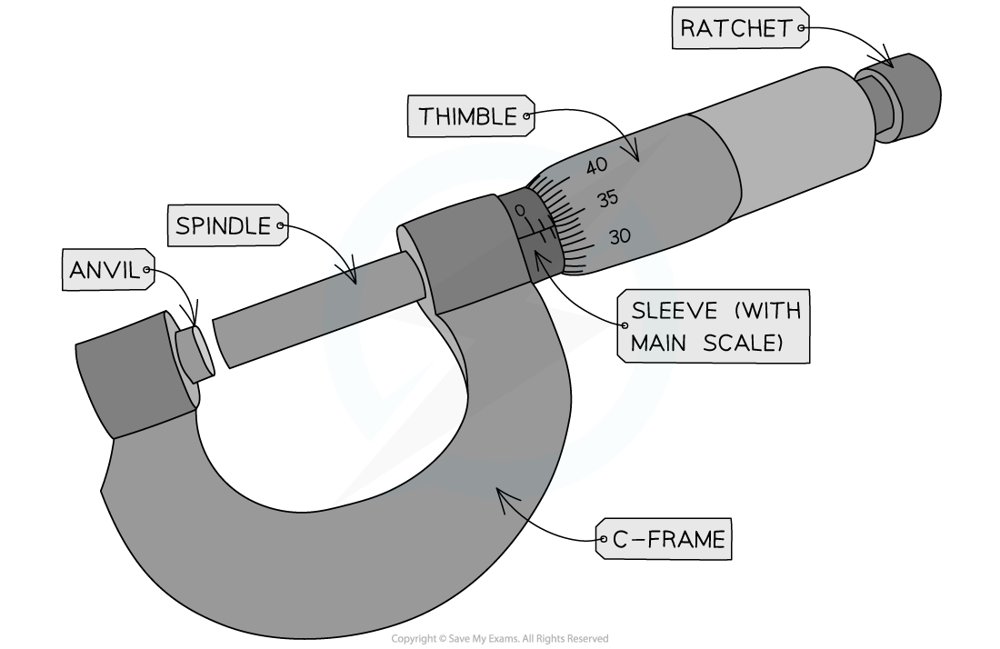
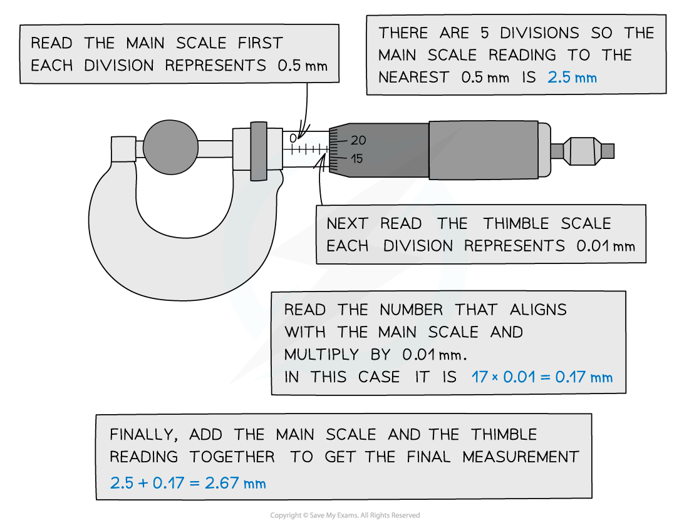

# Using a Micrometer

## Using a Micrometer

> **Spec point** — `spcpt_jvzy74xpKCrjYrvs`

## Using a Micrometer

- A micrometer, or a micrometer screw gauge, is a tool used for measuring small widths, thicknesses or diameters

  - For example, the diameter of a copper wire
- It has a resolution of **0.01 mm**
- The micrometer is made up of two scales:

  - The main scale - this is on the sleeve (sometimes called the barrel)
  - The thimble scale - this is a rotating scale on the thimble

***Components of a micrometer***

- The spindle and anvil are clamped around the object being measured by rotating the ratchet

  - This should be tight enough so the object does not fall out but not so tight that it is deformed
  - **Never** tighten the spindle using the **barrel**, only using the **ratchet**. This will reduce the chances of overtightening and zero errors
- The value measured from the micrometer is read where the thimble scale aligns with the main scale

  - This should always be recorded to 2 decimal places (e.g. 1.40 mm not just 1.4 mm)

***The micrometer reading is read when the thimble scale aligns with the main scale***

> **Exam Hint**
> The most common mistake in exam answers when reading from a micrometer is not giving the reading to the correct number of significant figures! For a micrometer, this is always **3 significant figures**. This is especially important for values such as '2.30 mm' where the 0 must be on the end to make it 3 sf instead of just 2 s.f (which would be 2.3 mm).
