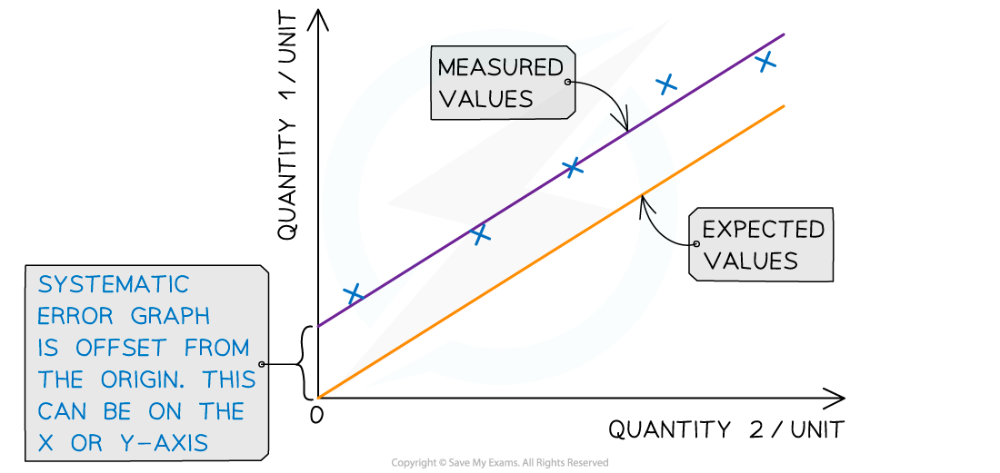
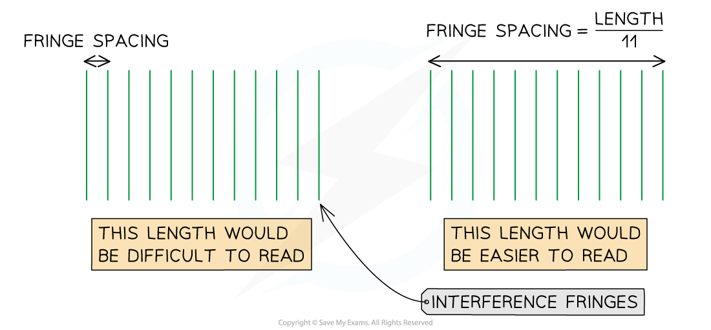

# Uncertainty & Systematic Errors

## Predicting Uncertainty & Systematic Errors

> **Spec point** — `spcpt_gfBb3Hf8ptP8vXKY`

## Predicting Uncertainty & Systematic Errors

#### Predicting Uncertainties

- The uncertainty is an estimate of the difference between a measurement reading and the *true value*

  - In other words, it is the interval within which the true value can be considered to lie with a given level of **confidence** or **probability**
  - Any measurement will have some uncertainty about the result, this will come from variation in the data obtained and be subject to systematic or random effects
- In reality, it is impossible to obtain the true value of any quantity as there will always be a degree of **uncertainty**

  - This can be seen when you repeat a measurement and you often get different results
- Uncertainties are **not** the same as errors
- An error is the difference between the measurement result and the true value if a true value is thought to exist

  - This is not a mistake in the measurement
  - The error can be due to both systematic and random effects and an error of unknown size is a source of uncertainty.
  - They can be thought of as issues with equipment or methodology that cause a reading to be different from the true value
- The uncertainty is a range of values around a measurement within which the true value is expected to lie, and is an **estimate**

  - For example, if the true value of the mass of a box is 950 g, but a systematic error with a balance gives an actual reading of 952 g, the uncertainty is ±2 g
- The most common ways to reduce uncertainties are:

  - Take repeat readings (about 3 – 5) and calculate the mean of a value
  - For a wire, measure the diameter in different places, to make sure it's fully uniform
  - Use the appropriate piece of apparatus for the measurement e.g., do not use a ruler for a very small distance of a few mm, a micrometer or vernier scale would be better for this

#### Systematic errors

- Systematic errors arise from the use of faulty instruments or from flaws in the experimental method
- This type of error is repeated consistently every time the instrument is used or the method is followed, which affects the **accuracy** of all readings obtained

- Systematic errors can clearly be seen on graphs

  - If the line of best fit of a straight-line graph is expected to go through the origin (0,0) but the results collected actually pass through the *y* or *x* axis instead, then all the points are offset by the same amount
  - The amount they are offset by is the amount of systematic errors

***Systematic errors on graphs are shown by the offset of the line from the origin***

- To **reduce** systematic errors:

  - Instruments should be **recalibrated**, or different instruments should be used
  - Corrections or adjustments should be made to the technique
- An example of a systematic error is a *zero error*

- A common method for measuring small distances, such as the fringe spacing on an interference pattern, is measuring a larger distance (multiple fringe spacings) and **divide** by the number of fringe spacings

  - A fringe spacing is a very small measurement and it is often difficult to see the middle of each bright fringe (the maxima can be broad)
- The same can be done for oscillations

  - Measuring the time for 10 oscillations, then dividing by 10 is more accurate than just timing 1 oscillation

***Measuring the distance between multiple fringes reduces the uncertainty in the fringe spacing***

> **Exam Hint**
> Extremely small or large measurements tend to have the largest uncertainties. When evaluating an experiment, think of which measurements are the most subjective, as these will provide the largest uncertainties e.g. trying to distinguish between two lines of a diffraction pattern when it is blurry or, the instrument used that has the worst resolution
