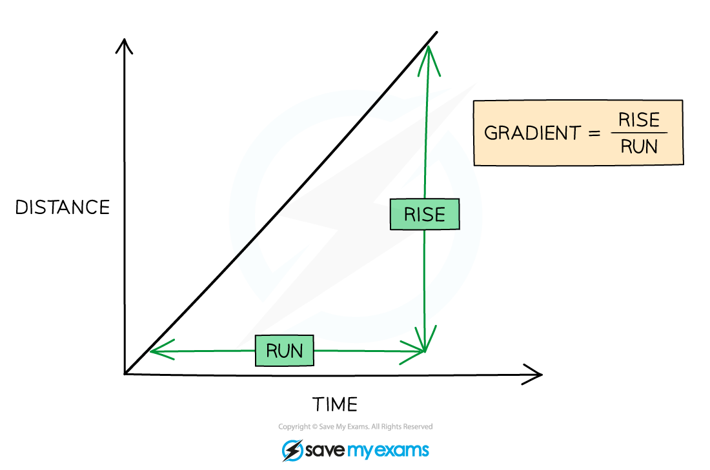

# Interpreting Graphs

## Relationships between Variables

> **Spec point** — `spcpt_ghjk49RqwgkHnzk2`

## Relationships between Variables

- Identifying the relationship between two variables shows **how** one variable **changes** with another

  - This is best figured out from an equation that links both variables together
- Two variables can be:

  - Directly proportional
  - Inversely proportional

- For two variables, *y* and *x* that are directly proportional, their relationship looks like:

y ∝ x

- This means that as *y* increases, *x* also increases at the same rate (and vice versa)
- An example of this is

*F* = *ma*

- Since *m* is a constant, *F* and *a* are directly proportional

  - If *a* is doubled, then so is *F*
- For two variables, *y* and *x* that are inversely proportional, this looks like:

y ∝ $\frac{1}{x}$

- This means that as *y* increases, *x* decreases at the same rate (or vice versa)
- An example of this is

**R = **$\frac{V}{I}$

- If *V* is constant, then *R* and *I* are inversely proportional

  - *If* I is doubled, the *R* is halved
- It is important to note that in both of these examples, the remaining variable is **constant**, this is important to consider and check before stating the relationship between two variables

  - In *F* = *ma*, if *m* changed as well with *a* then *F* would not increase by the same amount as *a* (i.e. it would no longer be directly proportional)
- Therefore, the directly proportional relationship can be turned into an equation by replacing '∝' with an '=' sign, and adding a constant *k*

*y* = *kx*

- This now means that as *y* increases, *x* increases with the amount determined by the constant *k*

  - If *k* is 3 then *y = 3x *so the both increase by a factor of 3
- The same happens for an inversely proportional relationship

*y* = $\frac{k}{x}$

- This now means that as *y* increases, *x* increases with the amount determined by the constant *k*

  - If *k* is 3 then *y = *$\frac{3}{x}$* *so *y* decreases by a factor of 3
- Another common relationship is the **inverse square law**
- For two variables, *y* and *x* that are related by the inverse square law, this looks like:

*y* ∝ $\frac{1}{x^{2}}$

- This means that if *x* **increases** by a factor of 2, then *y* **decreases** by a factor of 22 = 4!
- An example of this is

***F***** = **$\frac{L}{4\mathrm{πd}^{2}}$

- If *L* is constant, then *d* and *F* are inversely proportional

  - If the distance *d* is 3 times larger, then the flux intensity, *F* is 32 = 9 times smaller

> **Worked Example**
> A student collects the following data of the count rate on a geiger counter increasing in distance from a gamma ray source.
> 
> | **Distance *****d***** / cm** | **Count rate *****C***** / counts min****-1** |
> |---|---|
> | 10 | 512 |
> | 20 | 128 |
> | 30 | 57 |
> | 40 | 32 |
> 
> Show that the relationship between distance and count rate is an inverse square law relationship.
> 
> **Answer:**
> 
> **Step 1: State the inverse square law relationship**
> 
> - The count rate is inversely proportional to the distance **squared**
> 
> *C* ∝$\frac{1}{d^{2}}$
> 
> **Step 2: Change relationship into an equation**
> 
> ***C***** = **$\frac{k}{d^{2}}$
> 
> **Step 3: Rearrange for constant, *****k***
> 
> *k = Cd*2
> 
> **Step 4: Show all pairs of *****C***** and *****d***** have the same constant, *****k***
> 
> Row 1: *k* = 512 × (10)2 = 51200
> 
> Row 2: *k* = 128 × (20)2 = 51200
> 
> Row 3: *k* = 57 × (30)2 = 51300
> 
> Row 4: *k* = 32 × (40)2 = 51200
> 
> **Step 5: Comment on constant and refer back to relationship**
> 
> - Since all values have the same constant *k* to 2 significant figures (51000), *C* and *d* have an inverse square law relationship

> **Exam Hint**
> When you're comparing two variables you **must **check whether the other variables are constant before declaring that they're inversely or directly proportional. Otherwise, one will not increase at the same rate as the other, which goes against the definition!

## Determining Constants from Graphs

> **Spec point** — `spcpt_52mwCwmPP224skD9`

## Determining Constants from Graphs

- Straight line graphs (linear relationships) are common in A-level physics

  - These graphs are useful because we can calculate a **constant** value from them
  - This is the **gradient**
- The gradient can be calculated by dividing the **rise** (change in y) by the **run** (change in x)

- The full calculation of the gradient needs to be shown in the working out, including the correct substitution of identified plotted points from the axes into the equation
- The triangle used to calculate the gradient should be drawn on the graph and it needs to be **as large as possible**

  - Small triangles are **not** acceptable for working out a gradient
- When using the results from a table of values, the triangle that is used to obtain the gradient can utilise points that lie on the line of best fit but **not** values that lie away from the line

  - Try to avoid using data points to calculate this where possible

- The units of the gradient will be the ratio of the units of the *y* variable and units of the *x* variable

  - E.g., For a graph for extension *x* (in m) against force *F* (in N) the units of the gradient would be N m-1

> **Worked Example**
> Calculate the gradient of the following graph.
> 
> 
> 
> **Answer:**
> 
> **Step 1: Draw a large gradient triangle**
> 
> 
> 
> **Step 2: Use the gradient equation**
> 
> Gradient = **= **$\frac{27.00-5.00}{1.7-0.3}$**= **15.7 Ω m-1

> **Exam Hint**
> The general rule is to draw a gradient triangle that takes up **more than half** of the graph. Drawing triangles too small, even if you get the correct answer, will not achieve full marks in the practical paper!
> 
> There is normally a range of answers accepted in the mark scheme for gradients, as everyone's line of best fit may be slightly different, but don't count on this! This range will often be very small so always use a sharp pencil and ruler to draw lines where possible. Show your working out on the paper always to help this.
> 
> Remember to always check the **units** and **scale** when reading values from a graph! Don't just assume that all lengths are in m or that forces will be in N. They could be in mm or kN. Also watch out for the powers of ten e.g., Force *F* × 103 / N which means a value of '5' on the graph will actually be 5 × 103 N (or 5 kN).
