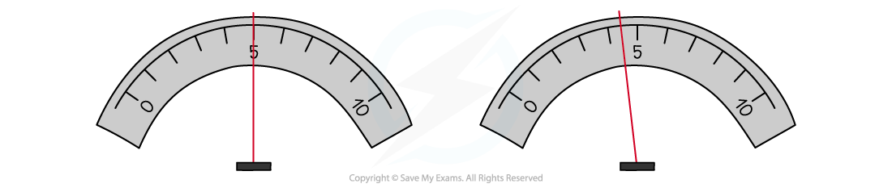

# Reducing Errors

## Reducing Errors

> **Spec point** — `spcpt_QjZBB9DvzqtsPtjv`

## Reducing Errors

- Reducing errors in an experiment is vital for obtaining more accurate results

- Even if the experimental result is close to the true value, there are always potential limitations of experimental methods such as the presence of *random errors*
- Random errors cannot be completely removed but their effect can be reduced by taking as many **repeats** as possible and using the **average** of the repeats
- There are always opportunities to identify limitations of the procedure, some common examples include:

  - **Parallax error** when reading scales
  - Not using a **fiducial marker **(eg. when measuring the time period of a pendulum using a stopwatch)
  - Not repeating measurements to reduce random errors
  - Not checking for zero errors to reduce *systematic errors*
  - The equipment not working properly or not checking beforehand with small tests
  - Equipment with poor *precision* and *resolution* (eg. using a ruler over a micrometer)
  - Difficult to control variables (eg. the temperature of the classroom)
  - Unwanted **heating effects** eg. in circuits
- Parallax error is minimised by reading the value on a scale only when the line of sight is perpendicular to the scale readings (i.e.. at eye level)
- Examples of where parallax error is common are:

  - Determining the volume of liquid
  - Making sure two objects are aligned
  - Reading the temperature from a thermometer
- If it makes it easier, use a marker to help where possible

***Reading the value of the needle head-on (left image) looks different to reading it from the right (right image). This is parallax error ***

- A **fiducial marker** is a useful tool to act as a clear reference point, such as when measuring the time period of a pendulum using a stopwatch
- This improves the accuracy of a measurement of periodic time by:

  - Making timings by sighting the pendulum as it passes the fiducial marker
  - Sighting the pendulum as it passes the fiducial marker at its highest speed. The pendulum swings fastest at its lowest point and slowest at the top of each swing

***A fiducial marker is used to mark the centre of the oscillation of the pendulum***

- Zero errors must be checked for in both digital and analogue instruments

  - E.g., If there is no current through the circuit, an ammeter must read 0 A
- The common way to reduce unwanted heating effects in circuits is to **turn off** the power supply in between readings

  - As the temperature of a component increases, so does its resistance (e.g., in wires). This will affect the experiment and produce an error in your final result

> **Worked Example**
> A student wants to determine the radius of a wire for an experiment to calculate its Young Modulus. They measure the radius using a ruler from one part of the wire.
> 
> Discuss ways in which the student can reduce the error in this reading.
> 
> **Step 1: Comment on the instrument used**
> 
> - Since the radius of a wire is on the order of < 1 mm, and has a circular cross section, a micrometer screw gauge should have been used instead
> 
> **Step 2: Comment on the method**
> 
> - The student did not take any repeat readings
> 
>   - They should take between 3-5 repeat readings for each value of the radius from the micrometer
> 
> **Step 3: Suggest improvements to the method**
> 
> - The experiment assumes the wire is uniform the whole way through (i.e. has the same radius)
> 
>   - This can be checked by measuring the radius at **different points** on the wire
