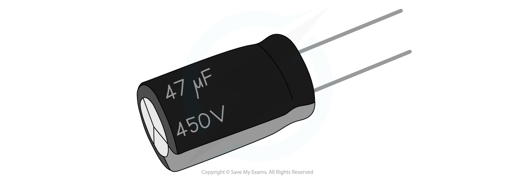

# Capacitance

## Capacitance

> **Spec point** — `spcpt_b7BXzRF5Zyr7BW3H`

## Capacitance

- Capacitors are electrical devices used to store energy in electronic circuits, commonly for a backup release of energy if the power fails
- Capacitors do this by storing electric **charge**, which creates a build up of electric **potential** **energy**
- They are made in the form of two conductive **metal** **plates** connected to a voltage supply (parallel plate capacitor)

  - There is commonly a ***dielectric*** in between the plates, to ensure charge does not flow across them
- The capacitor circuit symbol is:

***The capacitor circuit symbol is two parallel lines***

- Capacitors are marked with a value of their **capacitance**
- Capacitance is defined as: ***The charge stored per unit potential difference (between the plates)***
- The greater the **capacitance**, the greater the **charge stored** in the capacitor

- The capacitance of a capacitor is defined by the equation:

- Where:

  - *C* = capacitance (F)
  - *Q* = charge stored (C)
  - *V* = *potential difference* across the capacitor plates (V)

***A capacitor used in small circuits***

- Capacitance is measured in the unit **Farad (F)**

  - In practice, 1 F is a very large unit
  - Often it will be quoted in the order of micro Farads (μF), nanofarads (nF) or picofarads (pF)

- If the capacitor is made of parallel plates, *Q* is the charge on the plates and *V* is the potential difference across the capacitor

  - The charge *Q* is **not** the charge of the capacitor itself, it is the charge stored **on** the plates
- This capacitance equation shows that an object’s capacitance is the **ratio of the charge stored by the capacitor to the potential difference between the plates**

> **Worked Example**
> A parallel plate capacitor has a capacitance of 1 nF and is connected to a voltage supply of 0.3 kV.
> 
> Calculate the charge on the plates.
> 
> **Answer:**
> 
> **Step 1: Write down the known quantities**
> 
> - Capacitance, *C* = 1 nF = 1 × 10-9 F
> - Potential difference, *V* = 0.3 kV = 0.3 × 103 V
> 
> **Step 2: Write out the equation for capacitance**
> 
> 
> 
> **Step 3: Rearrange for charge *****Q***
> 
> *Q* = *CV*
> 
> **Step 4:** **Substitute in values**
> 
> *Q* = (1 × 10-9) × (0.3 × 103) = 3 × 10-7 C = 300 nC

> **Exam Hint**
> The ‘charge stored’ by a capacitor refers to the magnitude of the charge stored **on** each plate in a parallel plate capacitor or **on** the surface of a spherical conductor. The letter ‘C’ is used both as the symbol for capacitance as well as the unit of charge (coulombs). Take care not to confuse the two!
