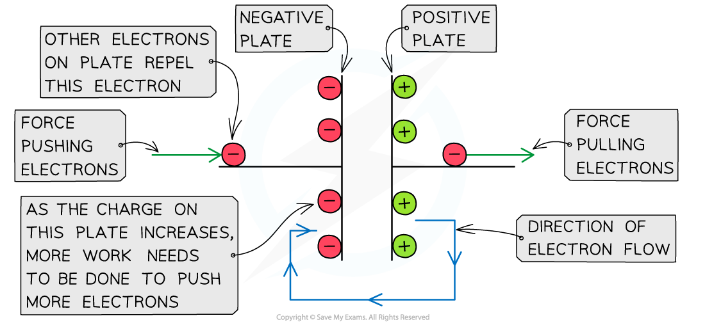
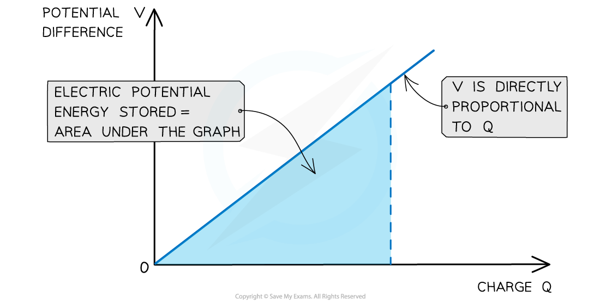

# Energy Stored by a Capacitor

## Energy Stored by a Capacitor

> **Spec point** — `spcpt_YhshGv5NpnRVGz3B`

## Energy Stored by a Capacitor

- When charging a capacitor, the power supply 'pushes' electrons to one of the metal plates

  - It therefore does **work** on the electrons and **electrical energy** becomes stored on the plates
- The power supply 'pulls' electrons off of the other metal plate, attracting them to the positive terminal

  - This leaves one side positively charged, while the other side becomes negatively charged
  - Hence, in this way, charge is 'stored' by the capacitor

- Gradually, this stored charge builds up

  - Adding more electrons to the negative plate at first is relatively easy since there is little repulsion
- As the charge of the negative plate increases, i.e., becomes more negatively charged, the force of repulsion between the electrons on the plate and the new electrons being pushed onto it increases
- This means a greater amount of work must be done to increase the charge on the negative plate or in other words: **The potential difference across the capacitor increases as the amount of charge increases**

***As the charge on the negative plate builds up, more work needs to be done to add more charge***

#### Alternative Equations for Energy Stored

- The energy stored by a capacitor is given by:

$W=\frac{1}{2}QV$

- Substituting the charge *Q* with the ***capacitance*** equation *Q* = *CV*, the energy stored can also be calculated by the following equation:

$W=\frac{1}{2}CV^{2}$

- By substituting the potential difference *V*, the energy stored can also be defined in terms of just the charge stored *Q* and the capacitance, *C*:

$W=\frac{Q^{2}}{2C}$

> **Worked Example**
> Calculate the change in the energy stored in a capacitor of capacitance 1500 μF when the potential difference across the capacitor changes from 10 V to 30 V.
> 
> **Answer:**
> 
> **Step 1: Write down the equation for energy stored in terms of capacitance C and p.d V**
> 
> $W=\frac{1}{2}CV^{2}$
> 
> **Step 2: The change in energy stored is proportional to the change in p.d**
> 
> `increment W space equals space 1 half C V subscript 2 squared space minus space 1 half C V subscript 1 squared space equals space 1 half C open parentheses V subscript 2 squared space minus space V subscript 1 squared close parentheses`
> 
> **Step 3: Substitute in values**
> 
> `increment W space equals space 1 half space cross times space open parentheses 1500 cross times 10 to the power of negative 6 end exponent close parentheses space cross times space left parenthesis 30 squared space minus space 10 squared right parenthesis`
> 
> $\DeltaW=0.6J$

> **Exam Hint**
> Energy stored or work done are used interchangeably (and sometimes written as *E* or *W* as shown above). You should be comfortable linking the two equivalent ideas - the energy stored *in* the capacitor is equal to the work done *on* it, by the power supply which charges it. Make sure you can apply each of the three equations given above!

## Area Under a Potential Difference-Charge Graph

> **Spec point** — `spcpt_jqgN9RS2bCSmS5Tv`

## Area Under a Potential Difference-Charge Graph

- The charge stored *Q* on the capacitor is given by the equation *Q* = *CV*

  - Therefore, the charge stored *Q *is **directly proportional** to the potential difference across the plates *V*
- The graph of charge against potential difference is therefore a straight line graph through the origin
- The gradient of the graph represents $\frac{1}{capaci\mathrm{tan}ceC}$, which is a constant
- The electrical (potential) energy stored in the capacitor can be determined from the** area under the potential-charge graph **which is equal to the **area** of a right-angled triangle:

Area = $\frac{1}{2}$ × base × height

***The area under a potential difference-charge graph represents the energy stored by a capacitor***

- Therefore the work done, or **energy stored *****W*** in a capacitor is defined by the equation:

$W=\frac{1}{2}QV$

- Where:

  - *W* = energy stored (J)
  - *Q* = charge stored (C)
  - *V* = *potential difference* across the plates (V)

> **Worked Example**
> The variation of the potential *V* of a charged isolated metal sphere with surface charge *Q* is shown on the graph below.
> 
>  <!-- asset download failed -->
> 
> Using the graph, determine the electric potential energy stored on the sphere when charged to a potential of 100 kV.
> 
> **Answer:**
> 
> **Step 1: Determine the charge on the sphere at the potential of 100 kV**
> 
>  <!-- asset download failed -->
> 
> - From the graph, the charge on the sphere at 100 kV is** 1.8 μC**
> 
> **Step 2: Calculate the electric potential energy stored**
> 
> - The electric potential energy stored is the area under the graph at 100 kV
> - The area is equal to a right-angled triangle, so, can be calculated with the equation:
> 
>  <!-- asset download failed -->
> 
> - Substituting in the values gives:
> 
> 
> 
> 

> **Exam Hint**
> Remember to always check the **units** of the charge–potential difference graphs. The charges can often be in µC or the potential difference in kV! The units must be in C and V to get a work done in J.
