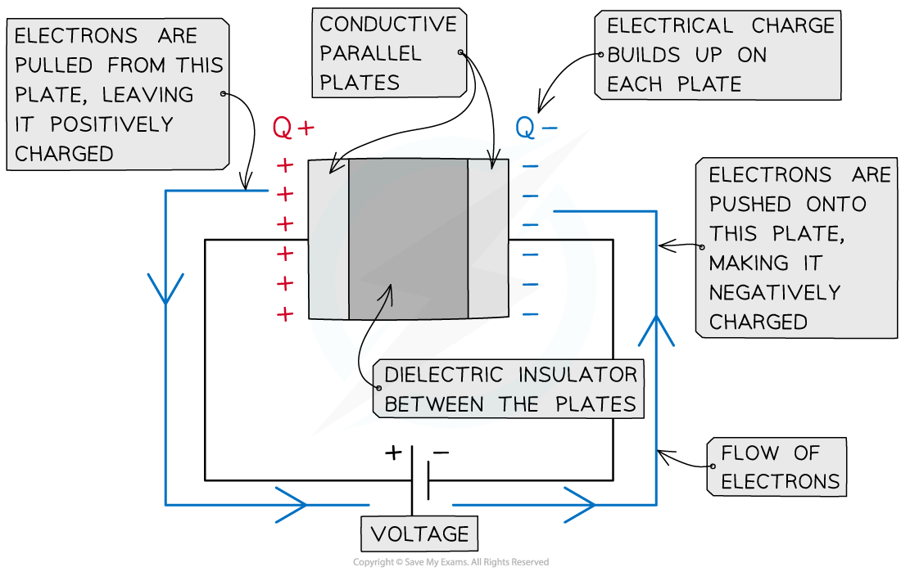
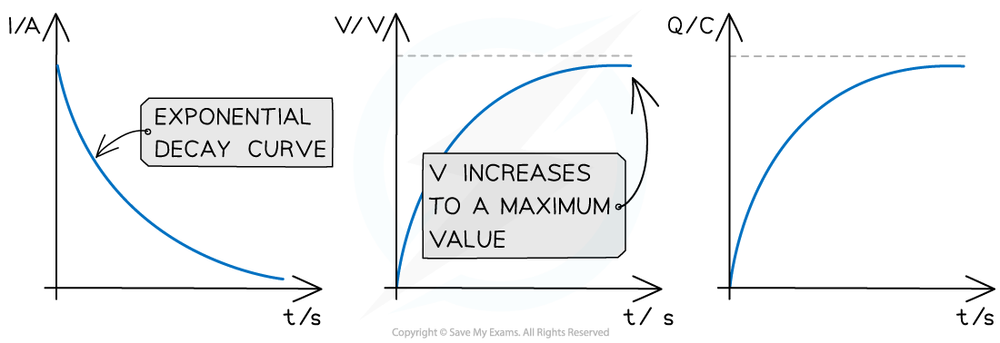
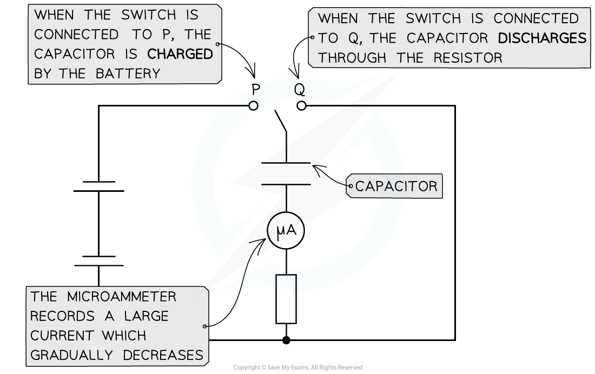
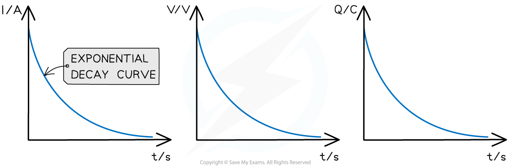
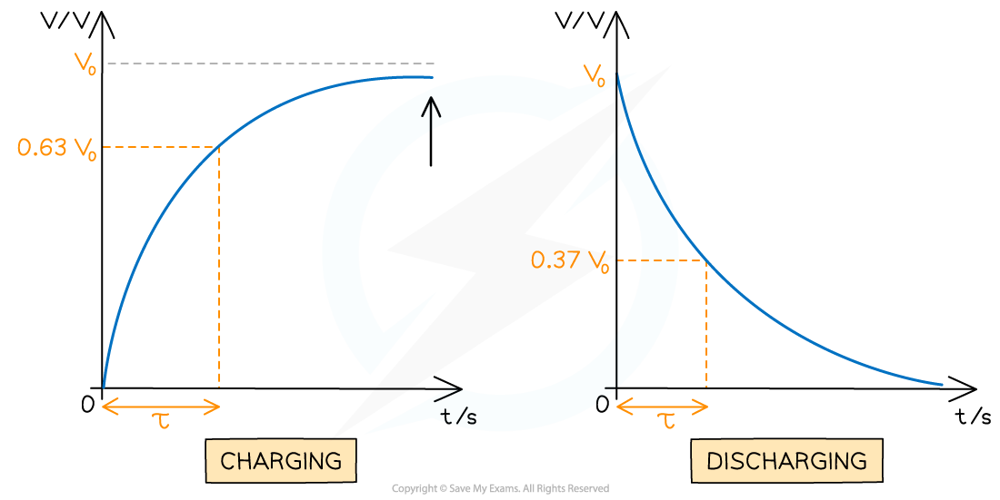

# Charge & Discharge Curves

## Charge & Discharge Curves

> **Spec point** — `spcpt_fSHnQ4c2kNd2RCKw`

## Charge & Discharge Curves

### Charging Curves

- Capacitors are charged by a **power supply **(e.g. a battery)
- When charging, electrons are 'pulled' from the plate connected to the positive terminal of the power supply

  - Therefore, the plate nearest the positive terminal is **positively charged**
- Oppositely, electrons are 'pushed' onto the plate connected to the negative terminal

  - Therefore, the plate nearest the negative terminal is **negatively charged**
- As the negative charge builds up, fewer electrons are pushed onto the plate due to electrostatic repulsion from the electrons already on the plate
- When no more electrons can be pushed onto the negative plate, the charging stops

***A parallel plate capacitor is made up of two conductive plates with opposite charges building up on each plate***

- At the start of charging, the current is large and gradually falls to zero as the electrons stop flowing through the circuit

  - The current decreases **exponentially**
  - This means the rate at which the charge increases is proportional to the amount of charge still to be gained
- Since an equal but opposite charge builds up on each plate, the potential difference between the plates slowly increases until it is the same as that of the power supply

  - Therefore, the charge stored on the capacitor plates increases until the potential difference across the plates matches that of the power supply

***Graphs of variation of current, p.d and charge with time for a capacitor charging through a battery***

- **The key features of the charging graphs are:**

  - The shapes of the p.d. and charge against time graphs are identical
  - The current against time graph is an ***exponential decay*** curve
  - The initial value of the current starts on the y-axis and decreases exponentially
  - The initial value of the p.d and charge starts at 0 up to a maximum value

### Discharging Curves

- Capacitors are **discharged** through a resistor with **no** power supply present
- The electrons now flow back from the negative plate to the positive terminal of the power supply until there is no potential difference across the capacitor plates
- Charging and discharging is commonly achieved by moving a switch that connects the capacitor between a power supply and a resistor

***The capacitor charges when connected to terminal P and discharges when connected to terminal Q***

- At the start of discharge, the current is **large** (but in the opposite direction to when it was charging) and gradually falls to zero
- As a capacitor discharges, the current, p.d and charge all decrease **exponentially**

  - This means the rate at which the current, p.d or charge decreases is proportional to the amount of current, p.d or charge it has left
- The graphs of the variation with time of current, p.d and charge are all identical and follow a pattern of ***exponential decay***

***Graphs of variation of current, p.d and charge with time for a capacitor discharging through a resistor***

- **The key features of the discharge graphs are:**

  - The shape of the current, p.d. and charge against time graphs are identical
  - Each graph shows exponential decay curves with decreasing gradient
  - The initial values (typically called *I**0*, *V**0* and *Q**0* respectively) start on the y-axis and decrease exponentially
- The rate at which a capacitor discharges depends on the **resistance** of the circuit

  - If the resistance is **high**, the current will decrease **more slowly**, and charge will flow from the capacitor plates more slowly, meaning the capacitor will take **longer** to discharge
  - If the resistance is** low**, the current will decrease **quickly**, and charge will flow from the capacitor plates quickly, meaning the capacitor will discharge **faster**

> **Exam Hint**
> Make sure you're comfortable with sketching and interpreting charging and discharging graphs, as these are common exam questions. A quick summary to help you remember:
> 
> - Discharging curves are all identical
> - ***C***urrent decreases for the ***C***harging curve (but increases for potential difference and charge stored!)

## Time Constant

> **Spec point** — `spcpt_gVkh93ZxDdpKD4xq`

## The Time Constant

- The time constant of a capacitor discharging through a **resistor** is a measure of how long it takes for the capacitor to discharge
- The definition of the time constant for a **discharging** capacitor is:

**The time taken for the charge, current or potential difference of a discharging capacitor to decrease to 37% of its original value**

- Alternatively, for a **charging** capacitor:

**The time taken for the charge or potential difference of a charging capacitor to rise to 63% of its maximum value**

- 37% is 0.37 or 1 / e (where e is the exponential function) multiplied by the original value (*I**0*, *Q**0* or *V**0*)
- This is represented by the Greek letter tau, $τ$, and measured in units of **seconds **(s)
- The time constant provides an easy way to compare the rate of change of similar quantities eg. charge, current and p.d.
- It is defined by the equation:

$τ$** = *****RC***

- Where:

  - $τ$ = time constant (s)
  - *R* = resistance of the resistor (Ω)
  - *C* = *capacitance* of the capacitor (F)

- For example, to find the time constant for a **discharging** capacitor:
- Calculate 0.37*V**0**, *where *V*0 is the **initial **potential difference across it

  - Determine the corresponding time taken for the potential difference to decrease to that value

- To find the time constant for a **charging **capacitor:

  - Calculate 0.63*V**0**, *where *V*0 is the **maximum **potential difference across it
  - Determine the corresponding time taken for the potential difference to rise to that value

***The time constant shown on a charging and discharging capacitor***

> **Worked Example**
> A capacitor of 7 nF is discharged through a resistor of resistance R. The time constant of the discharge is 5.6 × 10-3 s.
> 
> Calculate the value of *R*.
> 
> **Answer:**
> 
> 

> **Exam Hint**
> Remember to check the context of an exam question, i.e., whether the capacitor is **charging** or **discharging**. The definition of the time constant depends on it!
> 
> - For a **charging** capacitor, the time constant refers to the time taken to reach 63% of its **maximum **potential difference or charge stored
> - For a **discharging** capacitor, the time constant refers to the time take to discharge to 37% of its **initial** potential difference or charge stored
