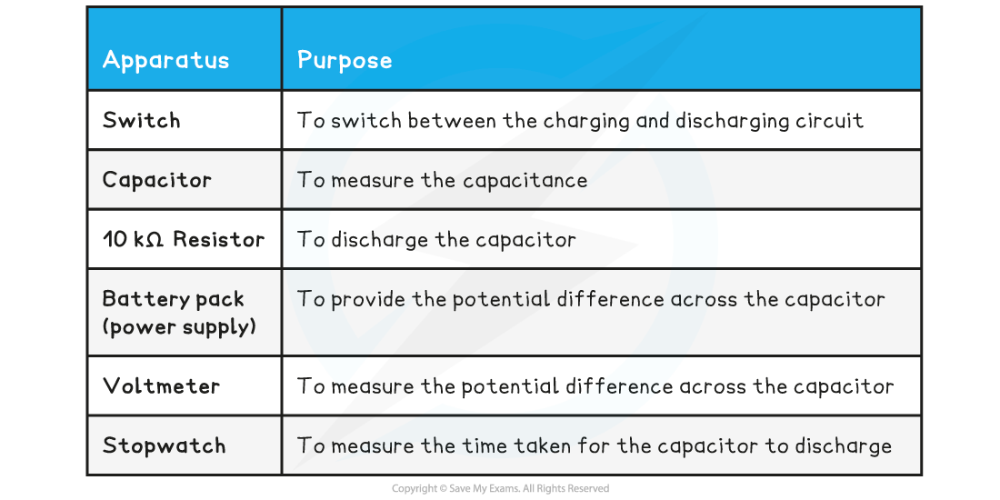
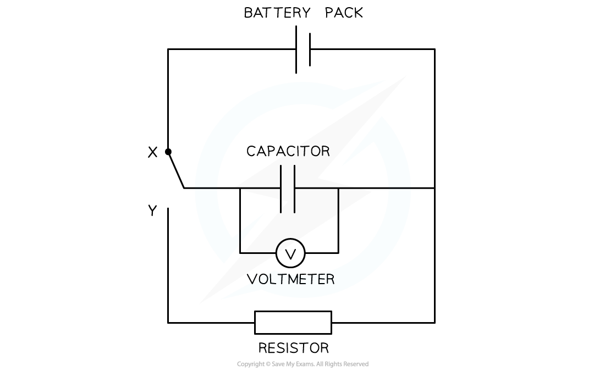
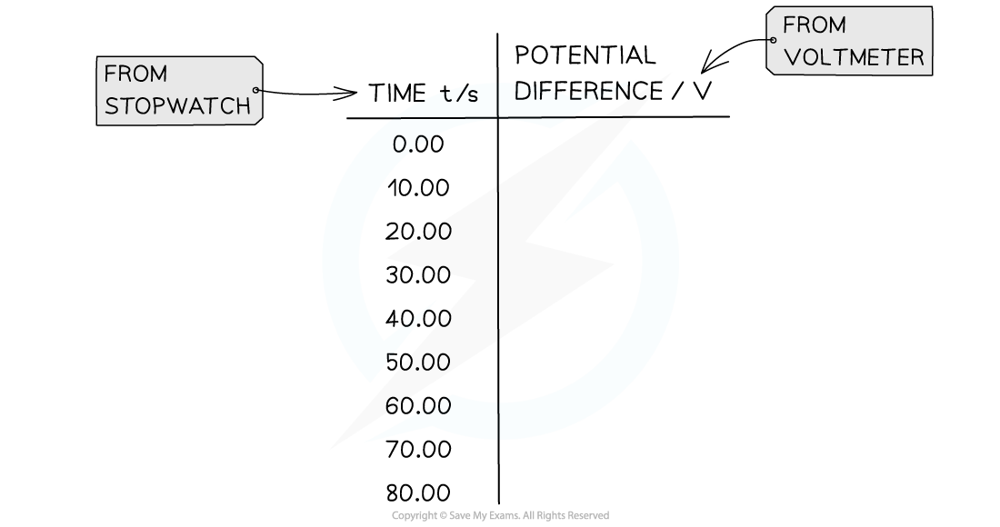
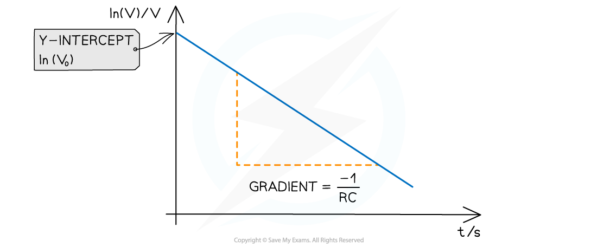

# Core Practical 11: Investigating Capacitor Charge & Discharge

## Core Practical 11: Investigating Capacitor Charge & Discharge

> **Spec point** — `spcpt_sQ4dX9gNh5TB9hms`

## Required Practical: Charging & Discharging Capacitors

#### Aim of the Experiment

- The overall aim of this experiment is to calculate the capacitance of a capacitor. This is just one example of how this required practical might be carried out

**Variables**

- *Independent variable* = time, *t *
- *Dependent variable*= potential difference, *V*
- Control variables:

  - Resistance of the resistor
  - Current in the circuit

#### Equipment List

- ***Resolution*** of measuring equipment:

  - Voltmeter = 0.1 V
  - Stopwatch = 0.01 s

#### Method

1. Set up the apparatus like the circuit above, making sure the switch is not connected to **X** or **Y** (no current should be flowing through)
2. Set the battery pack to a potential difference of 10 V and use a 10 kΩ resistor. The capacitor should initially be fully discharged
3. Charge the capacitor fully by placing the switch at point **X**. The voltmeter reading should read the same voltage as the battery (10 V)
4. Move the switch to point **Y**
5. Record the voltage reading every 10 s down to a value of 0 V. A total of 8-10 readings should be taken

- An example table might look like this:

#### Analysing the Results

- The potential difference (p.d) across the capacitance is defined by the equation:

- Where:

  - *V* = p.d across the capacitor (V)
  - *V*0 = initial p.d across the capacitor (V)
  - *t* = time (s)
  - *e* = exponential function
  - *R* = resistance of the resistor (Ω)
  - *C* = capacitance of the capacitor (F)

- Rearranging this equation for ln(V) by taking the natural log (ln) of both sides:

- Comparing this to the equation of a straight line: y = mx + c

  - *y* = ln(V)
  - *x* = t
  - gradient = -1/RC
  - c = ln(V0)

1. Plot a graph of ln(*V*) against *t* and draw a line of best fit
2. Calculate the gradient (this should be negative)
3. The capacitance of the capacitor is equal to: 

#### Evaluating the Experiment

***Systematic Errors***:

- If a digital voltmeter is used, wait until the reading is settled on a value if it is switching between two
- If an analogue voltmeter is used, reduce parallax error by reading the p.d at eye level to the meter
- Make sure the voltmeter starts at zero to avoid a zero error

***Random Errors***:

- Use a resistor with a large resistance so the capacitor discharges slowly enough for the time to be taken accurately at p.d intervals
- Using a datalogger will provide more accurate results for the p.d at a certain time. This will reduce the error in the speed of the reflex needed to stop the stopwatch at a certain p.d
- The experiment could be repeated by measuring the time for the capacitor to charge instead

#### Safety Considerations

- Keep water or any fluids away from the electrical equipment
- Make sure no wires or connections are damaged and contain appropriate fuses to avoid a short circuit or a fire
- Using a resistor with too low a resistance will not only mean the capacitor discharges too quickly but also that the wires will become very hot due to the high current
- Capacitors can still retain charge after power is removed which could cause an electric shock. These should be fully discharged and removed after a few minutes

> **Worked Example**
> A student investigates the relationship between the potential difference and the time it takes to discharge a capacitor. They obtain the following results:
> 
> 
> 
> The capacitor is labelled with a capacitance of 4200 µF. Calculate:
> 
> (i) The value of the capacitance of the capacitor discharged.
> 
> (ii) The relative percentage error of the value obtained from the graph and this true value of the capacitance.
> 
> **Answer:**
> 
> **Step 1: Complete the table**
> 
> - Add an extra column ln(V) and calculate this for each p.d
> 
> 
> 
> **Step 2: Plot the graph of ln(*****V*****) against average time *****t***
> 
> 
> 
> - Make sure the axes are properly labelled and the line of best fit is drawn with a ruler
> 
> **Step 3: Calculate the gradient of the graph**
> 
> 
> 
> - The gradient is calculated by:
> 
> 
> 
> **Step 4: Calculate the capacitance, *****C***
> 
> 
> 
> 
> 
> **Step 5: Calculate the relative percentage error of the value obtained**
> 
> 
