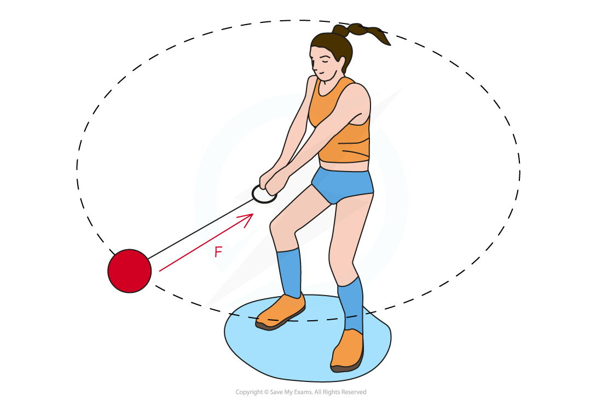
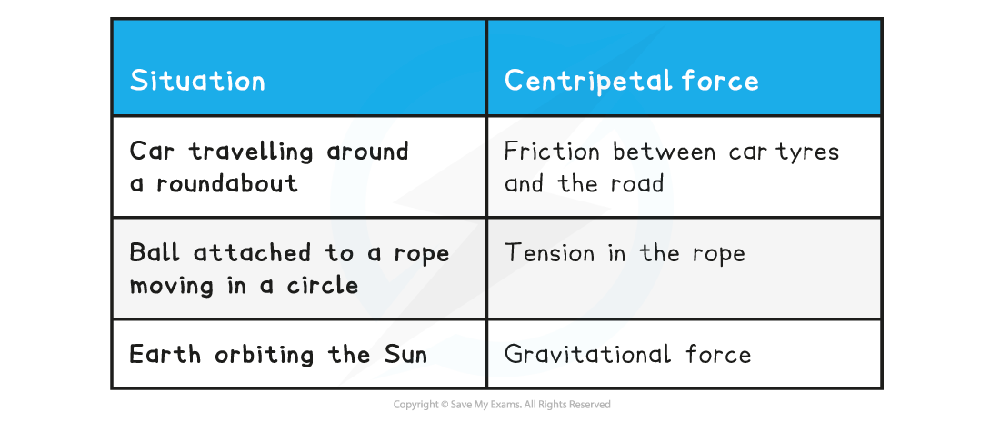

# Maintaining Circular Motion

## Maintaining Circular Motion

> **Spec point** — `spcpt_WDZmNvMdkkYkFncm`

## Maintaining Circular Motion

- An object moving in a circle is not in equilibrium, it is constantly changing direction

  - Therefore, in order to produce circular motion, an object requires a **resultant force **to act on it
  - This resultant force is known as the **centripetal force** and is what keeps an object moving in a circle

- The centripetal force *F* is defined as: **The resultant force towards the centre of the circle required to keep a body in uniform circular motion. It is always directed towards the centre of the body's rotation.**

***The tension in the string provides the centripetal force F to keep the hammer in circular orbit***

- **Note:** centripetal force and centripetal acceleration act in the **same direction**

  - This is due to *Newton’s Second Law*
- The centripetal force is **not** a separate force of its own

  - It can be any type of force, depending on the situation, which keeps an object moving in a circular path

**Examples of centripetal force**

> **Exam Hint**
> Make sure you are able to give examples of centripetal forces, understanding that many types of familiar forces (e.g., gravity, electric) can act as centripetal forces.
> 
> A classic example that often comes up in your magnetic fields topic is the magnetic force on a charged particle, which is always centripetal. This is because the force acts at 90° to the charged particle's velocity, causing it to move in a circle.
