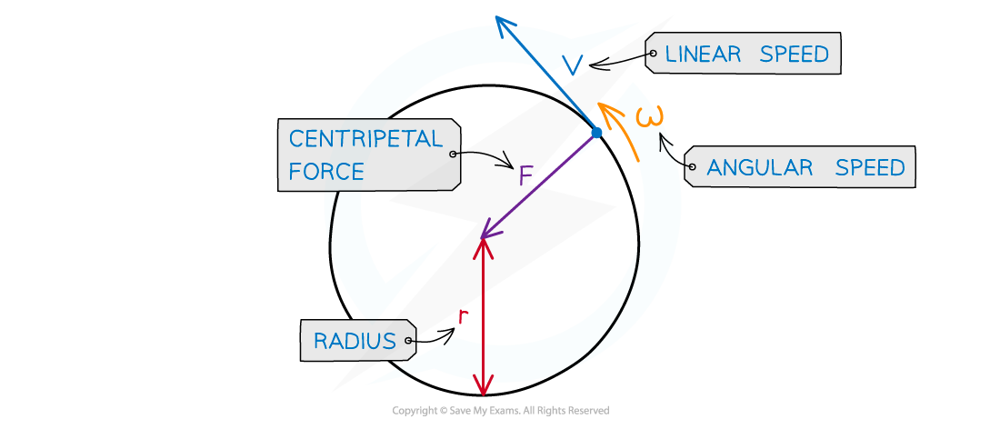
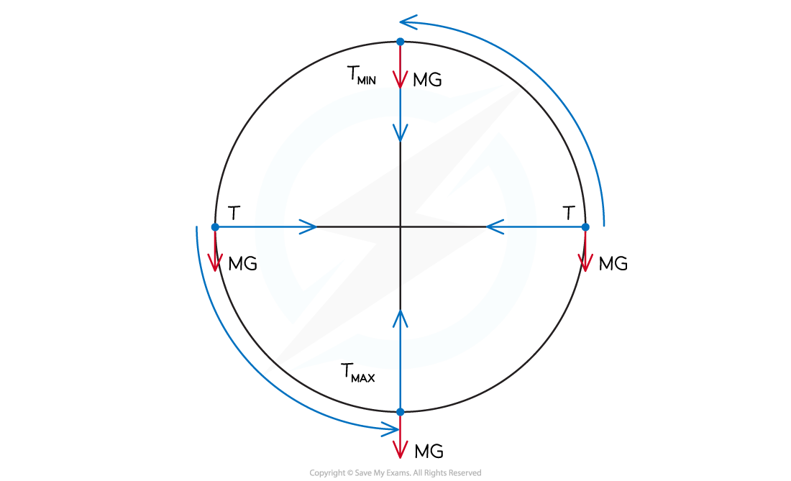

# Centripetal Force

## Centripetal Force

> **Spec point** — `spcpt_FTkybBJtQbRxNy7Q`

## Centripetal Force

- *** ***Centripetal force can be calculated using any of the following equations:

$F=\frac{mv^{2}}{r}=mrω^{2}=mvω$

- Where:

  - *F* = centripetal force (N)
  - *v* = linear velocity (m s-1)
  - ⍵ = angular speed (rad s-1)
  - *r* = radius of the orbit (m)

***Centripetal force is always perpendicular to the direction of travel***

- The centripetal force is the **resultant** force on the object moving in a circle

  - This is particularly important if there are multiple forces on the object, such as weight

#### Vertical Circular Motion

- An example of vertical circular motion is swinging a ball on a string in a vertical circle
- The forces acting on the ball are:

  - The **tension** in the string
  - The **weight** of the ball downwards

- As the ball moves around the circle, the **direction** of the tension will change continuously
- The **magnitude** of the tension will also vary continuously, reaching a **maximum** value at the **bottom** and a **minimum** value at the **top**

  - This is because the direction of the weight of the ball never changes, so the resultant force will vary depending on the position of the ball in the circle

- At the bottom of the circle, the tension must overcome the weight, this can be written as:

$T_{max}=\frac{mv^{2}}{r}+mg$

- As a result, the acceleration, and hence, the **speed** of the ball will be **slower** at the top
- At the top of the circle, the tension and weight act in the same direction, this can be written as:

$T_{min}=\frac{mv^{2}}{r}-mg$

- As a result, the acceleration, and hence, the **speed** of the ball will be **faster** at the bottom

> **Worked Example**
> A bucket of mass 8.0 kg is filled with water and is attached to a string of length 0.5 m.
> 
> 
> 
> What is the minimum speed the bucket must have at the top of the circle so no water spills out?
> 
> **Answer:**
> 
> **Step 1: Draw the forces on the bucket at the top**
> 
> 
> 
> **Step 2: Write an expression for the centripetal force**
> 
> - The weight of the bucket = mg
> - At the top of the circular path, the weight and tension act in the same direction, so the centripetal force is
> 
> $\frac{mv^{2}}{r}=T+mg$
> 
> - The minimum speed *v* is when the string is taut but not stretched, so the tension here is zero (*T* = 0)
> 
> $\frac{mv^{2}}{r}=mg$
> 
> **Step 3: Rearrange for velocity *****v *****and calculate**
> 
> - *m* cancels from both sides
> 
> $v=\sqrt{gr}$
> 
> $v=\sqrt{9.81\times0.5}=2.2ms^{-1}$
