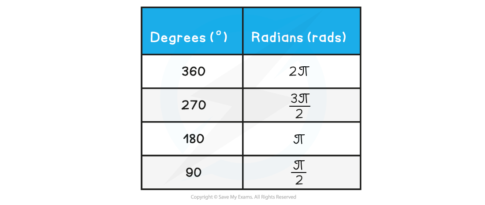

# Radians & Angular Displacement

## Radians

> **Spec point** — `spcpt_tPnpGW59rp8J7pD2`

## Radians

- A **radian** (rad) is defined as: **The angle subtended at the centre of a circle by an arc equal in length to the radius of the circle**
- Radians are used whenever describing the angular displacement of objects in circular motion

- Angular displacement can be calculated using the equation:

- Where:

  - Δ*θ* = angular displacement, or angle of rotation (radians)
  - *s* = length of the arc, or the distance travelled around the circle (m)
  - *r* = radius of the circle (m)

- Radians are commonly written in terms of π
- The angle in radians for a complete circle (360**o**) is equal to:

#### Radian Conversions

- If an angle of 360**o**** **= 2π radians, then 1 radian in degrees is equal to:

- Use the following equation to convert from degrees to radians:

**Table of common degrees to radians conversions**

> **Worked Example**
> Convert the following angular displacement into degrees:
> 
> 
> 
> **Answer:**
> 
> 

> **Exam Hint**
> - You will notice your calculator has a degree (Deg) and radians (Rad) mode
> - This is shown by the “D” or “R” highlighted at the top of the screen
> - Remember to make sure it’s in the right mode when using **trigonometric** functions (sin, cos, tan) depending on whether the answer is required in **degrees** or **radians**
> - It is extremely common for students to get the wrong answer (and lose marks) because their calculator is in the wrong mode when using trigonometric functions - make sure this doesn’t happen to you!
> 
> 

## Angular Displacement

> **Spec point** — `spcpt_Svf4CcPsHz5WSRHH`

## Angular Displacement

- The **angular displacement** Δ*θ* is the ratio of:

- Angular displacement describes the **change** **in** **angle**, in **radians**, of a body as it moves in a circle

  - This angle is measured with respect to the centre of orbit

***When the angle is equal to one radian, the length of the arc (*****Δ*****s) is equal to the radius (r) of the circle***

> **Exam Hint**
> Since the equation for angular displacement gives the angle in **radians**, make sure you're comfortable with then converting to degrees if you need to for the question!
