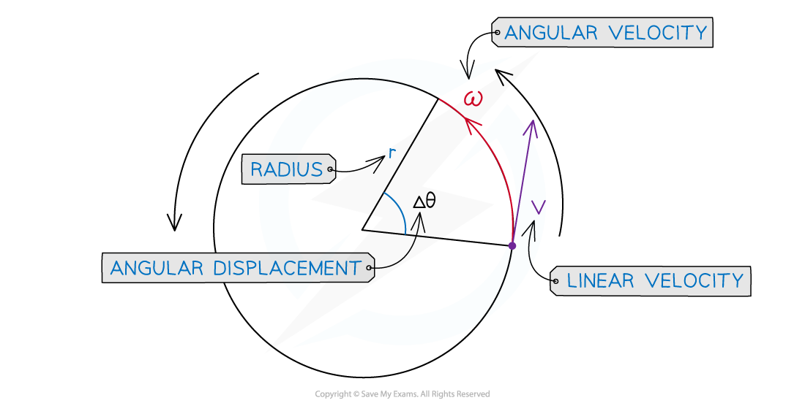

# Angular Velocity

## Angular Velocity

> **Spec point** — `spcpt_xx5mRvcvpjKZyJT5`

## Angular Velocity

- The **angular velocity*** ω* of a body in circular motion is defined as: **The rate of change of angular displacement**
- In other words, angular velocity is the angle swept out by an object in circular motion, per second
- Angular velocity is a **vector quantity** and is measured in rad s–1

  - Since it is a vector, it has a magnitude (angular **speed**) and direction

- Angular velocity is calculated using:

***ω =**** *$\frac{Δθ}{Δt}$

- Where:

  - Δ*θ* = change in *angular displacement* (*radians*)
  - Δ*t* = time interval (s)
- It is related to linear speed, *v* by the equation

***v***** = *****ωr***

- Where:

  - *v* = linear speed, *v* (m s-1)
  - *ω = *angular speed (rad s-1)
  - *r* = radius of orbit (m)

***When an object is in uniform circular motion, velocity constantly changes direction, but the speed stays the same***

- Taking the angular displacement of a complete orbit or revolution as 2π radians, the angular velocity *ω* an be calculated using the equation:

- Where:

  - *T = *the *time period* (s)
  - *f *= *frequency* (Hz)
- This equation shows that:

  - The greater the rotation angle *θ* in a given amount of time *T*, the greater the angular velocity ω
  - An object travelling with the same linear velocity, but further from the centre of orbit (larger *r*) moves with a smaller angular velocity (smaller *ω*)

> **Worked Example**
> A bird flies in a horizontal circle with an angular speed of 5.25 rad s−1 of radius 650 m.
> 
> Calculate:
> 
> a) The linear speed of the bird
> 
> b) The angular frequency of the bird
> 
> **Answer:**
> 
> 

> **Exam Hint**
> Try not to be confused by similar sounding terms like "angular velocity" and "angular speed". Just like in regular linear motion, you have linear velocity and linear speed: one is a scalar (speed) and the other is a vector (velocity).
> 
> In this worked example, the equation *v* = *rω *is used to calculate the linear speed. This is fine, because *v* in this context is just the **magnitude** of the linear velocity (and similarly, *ω* is the magnitude of the angular velocity).
> 
> Finally, you may sometimes come across *ω* being labelled as 'angular frequency', because of its relationship to linear frequency *f* as given by the alternative equation *ω* = 2*πf. *Remember, the units of *ω *are rad s–1, whereas the units of *f *are Hz.
