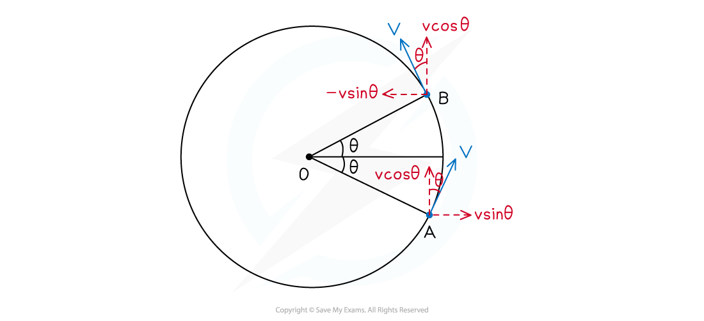
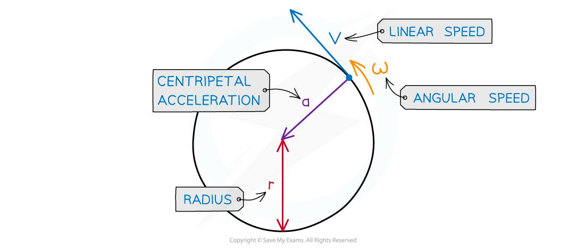

# Centripetal Acceleration

## Deriving Equations for Centripetal Acceleration

> **Spec point** — `spcpt_wkfCjtjk7yrtdQxK`

## Deriving Equations for Centripetal Acceleration

- An object moving in **uniform circular motion **travels with a constant **angular velocity **and **angular speed**
- However, its **direction** is always changing

  - Therefore, its **linear velocity** changes, so it must be **accelerating**
  - This is called a **centripetal acceleration**
- An object in circular motion is thus always accelerating
- This acceleration is called 'centripetal' because it is directed toward the **centre of orbit**

- To derive an equation for the magnitude of centripetal acceleration, consider an object in uniform circular motion between point A and B on a circle, as shown below:

***An object in uniform circular motion is accelerating toward the centre of orbit, O. Between A and B, the horizontal component of motion changes from v sinθ***** *****to –v sinθ***

- At A and B, by resolving the horizontal and vertical components of linear velocity *v, *it can be seen that:

  - Initial vertical component of *v* = final vertical component of *v* which is *v *cos*θ *
  - Initial horizontal component of *v* is *v *sin*θ*
  - Final horizontal component of *v* is –*v* sin*θ*

- This means the acceleration of the object is only horizontal, given by:

$a=\frac{\Deltav}{\Deltat}=\frac{(-v\mathrm{sin}θ)-(v\mathrm{sin}θ)}{t}=\frac{-2v\mathrm{sin}θ}{t}$

- Recalling the equations for angular velocity *ω *= θ /*t* and *v* = *rω*, then:

`t equals theta over omega equals fraction numerator theta over denominator open parentheses v over r close parentheses end fraction equals fraction numerator r theta over denominator v end fraction`

- The object's angular displacement is actually 2*θ,* therefore, the time *t* is given by $t=\frac{2rθ}{v}$
- Therefore, substituting this into the equation for acceleration gives:

`a equals fraction numerator negative 2 v space sin theta over denominator open parentheses fraction numerator 2 r theta over denominator v end fraction close parentheses end fraction equals fraction numerator negative v squared space sin theta over denominator r theta end fraction`

- This equation is the acceleration of the object between points A and B

  - To find the **instantaneous acceleration** at an exact point on the circle, say point C, reduce the size of the angular displacement *θ *so it becomes infinitesimally small
  - This is shown in the image below:

***By taking the limit of angular displacement as zero, we can derive an equation for the instantaneous centripetal acceleration of the object at point C***

- In the limit *θ *→ 0 radians

  - The value of sin *θ *is approximately equal to *θ*
  - Therefore, $\frac{\mathrm{sin}θ}{θ}\approx1$ (for very small angles)
  - This is known as the **small angle approximation**

- Therefore, the **instantaneous acceleration** is the centripetal acceleration:

$a=-\frac{v^{2}}{r}=-rω^{2}$

- Where:

  - *a* = centripetal acceleration (m s–2)
  - *v* = linear velocity (m s–1)
  - *r* = radius of orbit (m)
  - *ω = *angular velocity (rad s-1)

- The negative sign indicates that the centripetal acceleration is directed toward the **centre of orbit **

> **Exam Hint**
> This seems like a complicated derivation, but there is no maths in there that you haven't been introduced to already. It is important you know how to use the **vector diagrams** to reach the final equations for angular accelerations, understanding every step along the way. Try and do it without the notes to help memorise and see how far you get!

## Using Equations for Centripetal Acceleration

> **Spec point** — `spcpt_SjnJZKnyDVz9PwW5`

## Using Equations for Centripetal Acceleration

- Centripetal acceleration is defined as: **The acceleration of an object towards the centre of a circle when an object is in motion (rotating) around a circle at a constant speed**
- Its magnitude is calculated using the radius *r *and linear speed *v*:

- Using the equation relating angular speed ω and linear speed *v*:

** v = r⍵**

- These equations can be combined to give another form of the centripetal acceleration equation:

- This equation shows that centripetal acceleration is equal to the radius times the square of the angular speed
- Alternatively, rearrange for *r:*

- This equation can be combined with the first one to give us another form of the centripetal acceleration equation:

- This equation shows how the centripetal acceleration relates to the linear speed and the angular speed

***Centripetal acceleration is always directed toward the centre of the circle, and is perpendicular to the object’s velocity***

*** ***

- Where:

  - a = centripetal acceleration (m s−2)
  - v = *linear* speed (m s−1)
  - ⍵ = angular speed (rad s−1)
  - r = radius of the orbit (m)

> **Worked Example**
> A ball tied to a string is rotating in a horizontal circle with a radius of 1.5 m and an angular speed of 3.5 rad s−1.
> 
> Calculate its centripetal acceleration if the radius was twice as large and angular speed was twice as fast.
> 
> **Answer:**
> 
> 

> **Exam Hint**
> Make sure you understand both the derivation and how to use the equation for centripetal acceleration. The most crucial step is to remember the **small angle approximation, **that sin *θ *is approximately equal to *θ *when the angle is very very small. Try this in your calculator (in radians!) and see for yourself!
