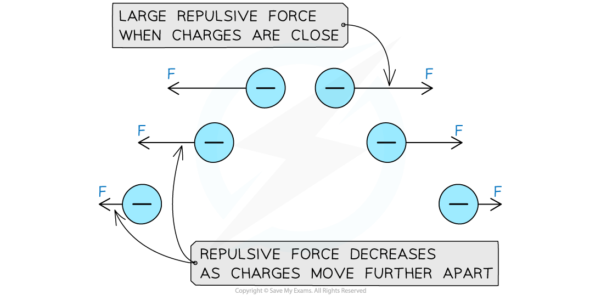

# Defining an Electric Field

## Defining an Electric Field

> **Spec point** — `spcpt_4rq8HH6gFFjQ5Nqc`

## Defining an Electric Field

- An electric field is defined as a region of space in which a **charged** particle experiences a **force**

  - Hence, electric fields are a type of **force field**
- The charged particle could be stationary or moving, and will experience an electric force in that field

- All charged particles create their own electric fields

  - These fields exert an electrostatic force, *F*E on other charged particles

***The electrostatic force between two charges***

- Like charges (positive and positive, or negative and negative) **repel** each other

  - This means the force on each charge are away from the other charge
- Opposite charged (positive and negative) **attract** each other

  - This means the force on each charge is towards the other charge
- The size of the force changes with distance

***A repulsive force decreases with distance***

> **Exam Hint**
> Electric fields are slightly different in that a charged particle will experience a force in this field whether it's stationary or moving. Don't get this mixed up with a **magnetic** field, where a charged particle only experiences a force if it's **moving**.
