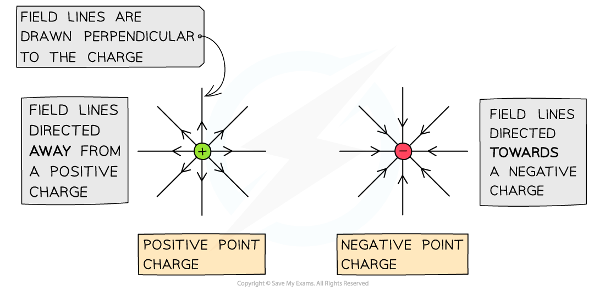

# Electric Field Strength

## Electric Field Strength

> **Spec point** — `spcpt_2PpZRb75b222BF7w`

## Electric Field Strength

- The** electric field strength** at a point is defined as: **The force per unit charge acting on a positive test charge at that point**
- The electric field strength can be calculated using the equation:

- Where:

  - *E* = electric field strength (N C–1)
  - *F* = electrostatic force on the charge (N)
  - *Q* = charge (C)

- It is important to use a positive *test charge* in this definition, as this determines the direction of the electric field
- Recall, the electric field strength is a **vector** quantity, it is always directed:

  - **Away **from a positive charge
  - **Towards **a negative charge

- This direction is also denoted by the direction of the electric field

***Electric field lines are directed away from a positive point charge and towards a negative point charge***

> **Worked Example**
> A charged particle is in an electric field with electric field strength 3.5 × 104 N C-1 where it experiences a force of 0.3 N.
> 
> Calculate the charge of the particle.
> 
> **Answer:**
> 
> 

> **Exam Hint**
> While the defining equation for electric field strength, *E* = *F / Q* is defined for a positive test charge, it is still useable for negative charges in an electric field. You will find that, if you substitute a negative charge in for *Q*, the electric field strength *E* is also negative. This simply means that the vector representing the field points in the **opposite direction** than it would for a positive charge, as you should expect. Make sure you can interpret the direction of electric field lines for your exam!
