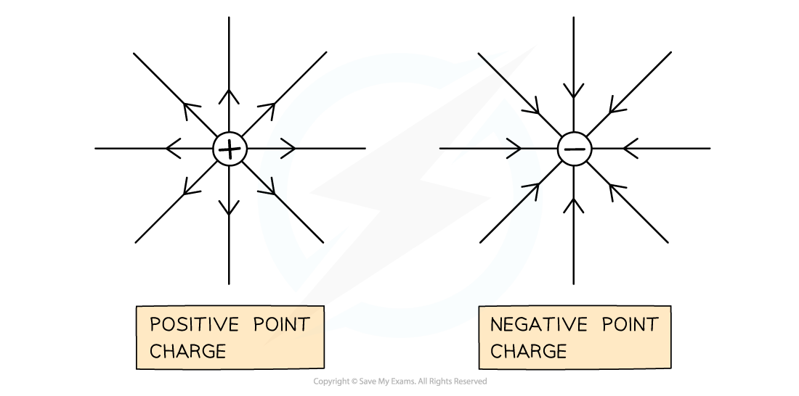
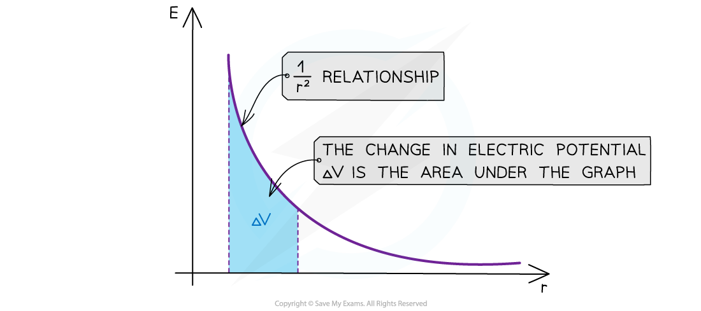

# Electric Field due to a Point Charge

## Electric Field due to a Point Charge

> **Spec point** — `spcpt_SccJkXSZW9q28bJV`

## Electric Field due to a Point Charge

- The ***electric field strength*** describes how strong or weak an electric field is at that point
- A ***point charge*** produces a **radial **field

  - A charge sphere also acts like a point charge
- The electric field strength *E* at a distance *r* due to a point charge *Q* in free space is defined by:

- Where:

  - *Q* = the point charge producing the radial electric field (C)
  - *r* = distance from the centre of the charge (m)
  - ε0 = ***permittivity of free space*** (F m-1)

- This equation shows:

  - Electric field strength in a radial field is **not constant**
  - As the distance from the charge *r* increases, *E* decreases by a factor of 1/r2

- This is an ***inverse square law*** relationship with distance

  - This means the field strength *E* decreases by a factor of **four** when the distance *r* is **doubled**
- **Note:** this equation is only for the field strength around a ***point charge*** since it produces a radial field

***Positive and negative point charges and the direction of the electric field lines***

- The electric field strength is a **vector** Its direction is the same as the electric field lines

  - If the charge is negative, the E field strength is negative and points **towards** the centre of the charge
  - If the charge is positive, the E field strength is positive and points **away** from the centre of the charge
- This equation is analogous to the ***gravitational field strength*** around a point mass

  - The only difference is, gravitational field lines are always **towards** the mass, whilst electric field lines can be towards **or** away from the point charge

- The graph of *E* against *r* for a charge is:

***The electric field strength E has a 1/r******2****** relationship***

*** ***

- **The key features of this graph are**:

  - The values for *E* are all positive
  - As *r* increases, *E* against *r* follows a 1/*r**2* relation (***inverse square law***)
  - The **area** under this graph is the change in electric potential Δ*V*
  - The graph has a steep decline as *r* increases

> **Worked Example**
> Calculate the strength of the electric field at a distance of 2 m away from an electron, and state its direction.
> 
> **Answer:**
> 
> **Step 1:** **Write out the equation for electric field strength**
> 
> 
> 
> **Step 2: Substitute quantities for charge, distance and permittivity of free space**
> 
> - The charge on an electron *Q* = –1.6 × 10–19 C
> - The distance *r* = 2 m
> - Permittivity of free space *ε*0 = 8.85 × 10–12
> - Therefore:
> 
> *E* = $\frac{-1.6\times10^{-19}}{4π\times(8.85\times10^{-12})\times2^{2}}$= –3.6 × 10–10 N C–1
> 
> **Step 3: State the direction of the field**
> 
> - The negative sign indicates the electric field is directed **towards the electron**

> **Exam Hint**
> Remember to **square** the distance in the electric field strength equation! Don't get this mixed up with the electric force between two charges equation, which has **two** charges (*Q*) in the equation, whilst the equation for *E* only has 1 *Q*, which is the one producing the electric field.
