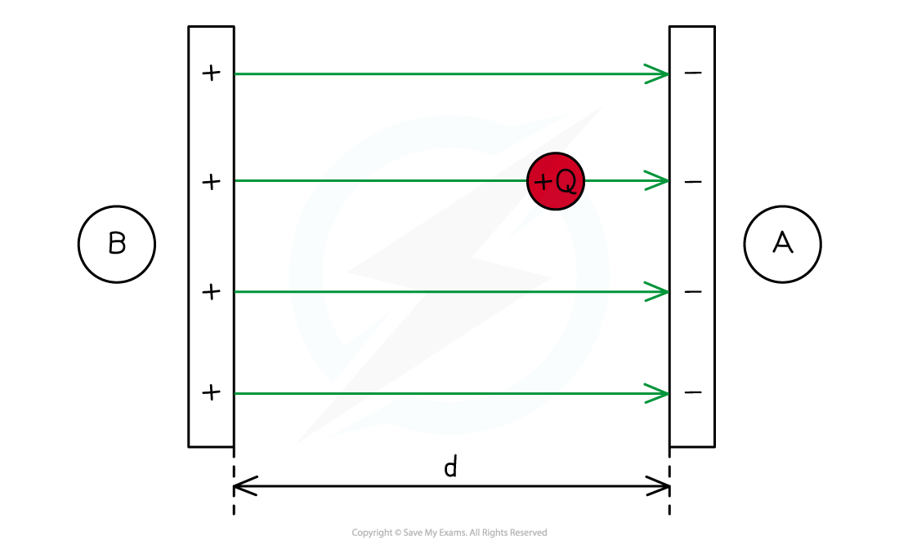
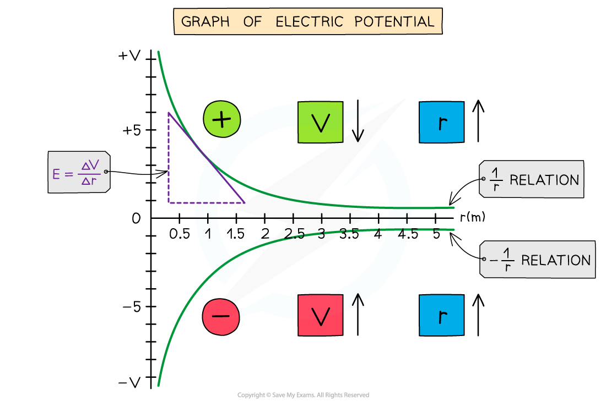

# Electric Field & Potential

## Electric Field & Potential

> **Spec point** — `spcpt_ZnBPb3ZDkdTnxksv`

## Electric Field & Potential

- A positive test charge has electric **potential** **energy** due to its position in an electric field
- The amount of electric potential energy depends on:

  - The magnitude of charge
  - The value of the **electric potential** in the field

***Work is done on a positive test charge Q to move it from the negatively charged plate A to the positively charged plate B. This means its electric potential energy increases***

- Electric potential is defined as the amount of work done per unit of charge at that point
- A stronger electric field means the electric potential changes **more rapidly **with distance as the test charge moves through it
- Hence, the relationship between the electric field strength and the electric potential is summarised as: **The electric field strength is proportional to the gradient of the electric potential**
- This means:

  - If the electric potential changes very rapidly with distance, the electric field strength is large
  - If the electric potential changes very gradually with distance, the electric field strength is small

- An electric field can be defined in terms of the variation of ***electric potential*** at different points in the field**:** **The electric field at a particular point is equal to the gradient of a potential-distance graph at that point**
- The potential gradient in an electric field is defined as: **The rate of change of electric potential with respect to displacement in the direction of the field**
- The graph of potential *V* against distance *r* for a negative or positive charge is:

***The electric potential around a positive charge decreases with distance and increases with distance around a negative charge***

- **The key features of this graph are:**

  - The values for *V* are all negative for a negative charge
  - The values for *V* are all positive for a positive charge
  - As *r* increases, *V* against *r* follows a 1/*r* relation for a positive charge and -1/*r* relation for a negative charge
  - The **gradient** of the graph at any particular point is the value of *E* at that point
  - The graph has a shallow increase (or decrease) as *r* increases

- The electric potential changes according to the charge creating the potential as the distance *r* increases from the centre:

  - If the charge is **positive**, the potential **decreases **with distance
  - If the charge is **negative**, the potential **increases **with distance

> **Worked Example**
> An electric field is set up between two pairs of oppositely charged plates, set X and set Y.
> 
> A graph showing how the electric potential *V *varies with distance *d* is shown for both set X and set Y.
> 
> 
> 
> State and explain which set creates the largest electric field strength.
> 
> **Answer:**
> 
> **Step 1: Recall the relationship between electric field strength and electric potential**
> 
> - The electric field strength is proportional to the **gradient** of the electric potential
> 
> **Step 2: Interpret the gradient of the potential-distance graph**
> 
> - Set X has a larger gradient than set Y
> 
> 
> 
> **Step 3: State and explain the conclusion**
> 
> - Set X creates a larger electric field strength
> - This is because the **gradient** of the potential between the plates is larger than it is for set Y

> **Exam Hint**
> Remember that whether the electric potential increases or decreases depends on the charge that is producing the potential!
