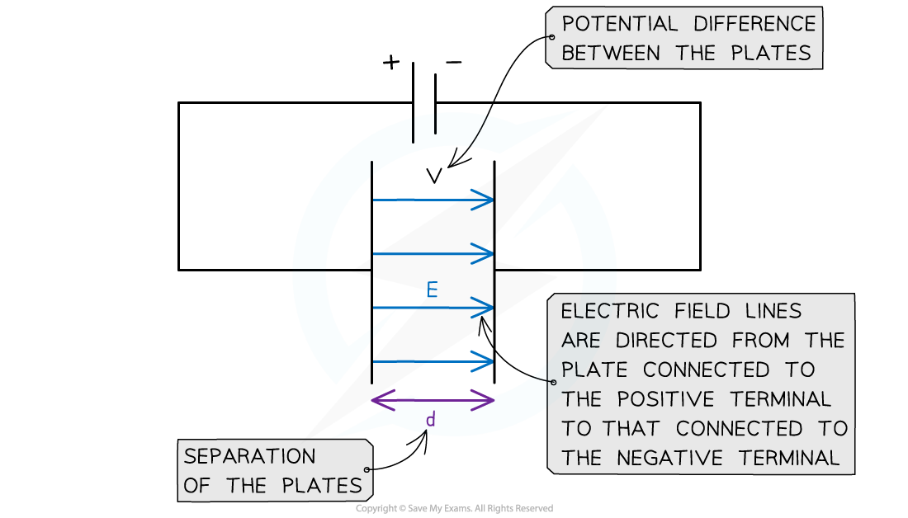

# Electric Field between Parallel Plates

## Electric Field between Parallel Plates

> **Spec point** — `spcpt_kcD5jd2jjzpGZpdv`

## Electric Field between Parallel Plates

- The magnitude of the electric field strength in a **uniform **field between two charged parallel plates is defined as:

- Where:

  - *E* = *electric field strength* (V m-1)
  - *V* = potential difference between the plates (V)
  - *d* = separation between the plates (m)

- The electric field strength is now defined by the units **V m****–1**** **

  - Therefore, the units V m–1 are equivalent to the units **N C****–1**

- The equation shows:

  - The greater the **voltage** (potential difference) between the plates, the **stronger** the field
  - The greater the **separation** between the plates, the **weaker** the field

- Remember this equation **cannot** be used to find the electric field strength around a *point charge* (since this would be a radial field)
- The direction of the electric field is from the plate connected to the **positive** terminal of the cell to the plate connected to the **negative** terminal

***The E field strength between two charged parallel plates is the ratio of the potential difference and separation of the plates***

- **Note:** if one of the parallel plates is **earthed**, it has a voltage of 0 V

> **Worked Example**
> Two parallel metal plates are separated by 3.5 cm and have a potential difference of 7.9 kV.
> 
> Calculate the electric force acting on a stationary charged particle between the plates that has a charge of 2.6 × 10-15 C.
> 
> **Answer:**
> 
> **Step 1: Write down the known values**
> 
> - Potential difference, *V* = 7.9 kV = 7.9 × 103 V
> - Distance between plates, *d* = 3.5 cm = 3.5 × 10-2 m
> - Charge, *Q* = 2.6 × 10-15 C
> 
> **Step 2:** **Calculate the electric field strength between the parallel plates**
> 
> 
> 
> 
> 
> **Step 3:** **Write out the equation for electric force on a charged particle**
> 
> *F* = *QE*
> 
> **Step 4: Substitute electric field strength and charge into electric force equation**
> 
> *F* = *QE* = (2.6 × 10-15) × (2.257 × 105) = 5.87 × 10-10 N = 5.9 × 10-10 N (2 s.f.)

> **Exam Hint**
> Remember the equation for electric field strength with V and d is only used for **parallel plates**, and not for point charges (where you would use *E* = *F*/*Q*)
