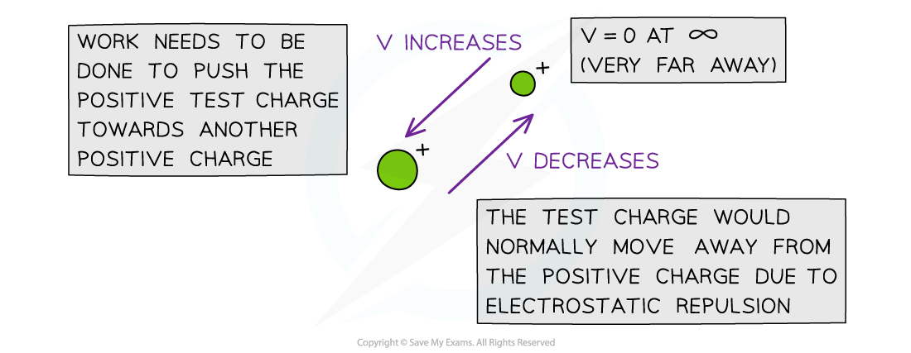
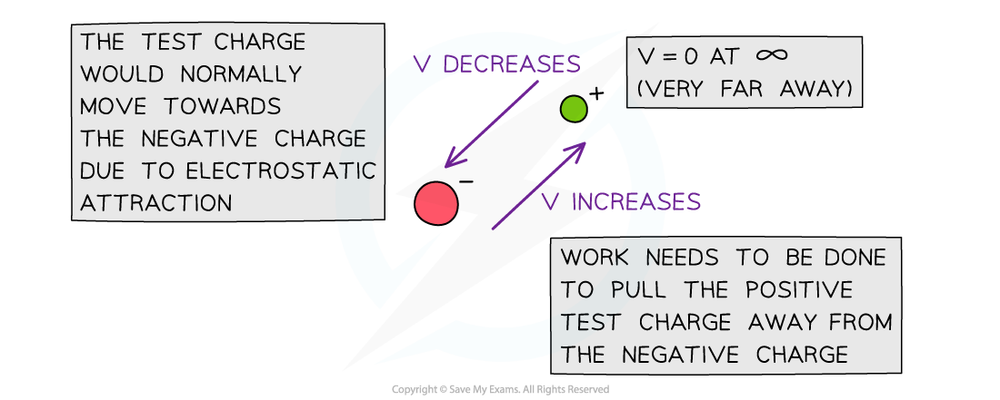

# Electric Potential for a Radial Field

## Electric Potential for a Radial Field

> **Spec point** — `spcpt_QZvd9b2YBHgtbpmB`

## Electric Potential for a Radial Field

### Electric Potential Energy

- In order to move a positive charge closer to another positive charge, work must be done to overcome the force of repulsion between them

  - Similarly, to move a positive charge away from a negative charge, work must be done to overcome the force of attraction between them
- Energy is therefore transferred to the charge that is being pushed upon

  - This means its **potential energy** increases
- If the positive charge is free to move, it will start to move away from the repelling charge

  - As a result, its potential energy decreases back to 0
- This is analogous to the gravitational potential energy of a mass increasing as it is being lifted upwards and decreasing as it falls
- The electric potential at a point is defined as: **The work done per unit charge in bringing a positive test charge from infinity to that point**
- Electric potential is a **scalar** quantity

  - This means it doesn’t have a direction
- However, you will still see the electric potential with a positive or negative sign. This is because the electric potential is:

  - **Positive** around an isolated positive charge
  - **Negative **around an isolated negative charge
  - **Zero** at infinity
- Positive work is done to move a positive test charge from infinity to a point around a positive charge and negative work is done to move it to a point around a negative charge. This means:

  - When a positive ***test charge*** moves closer to a **negative** charge, its electric potential **decreases**
  - When a positive test charge moves closer to a **positive** charge, its electric potential **increases**

***The electric potential V decreases in the direction the test charge would naturally move in due to repulsion or attraction***

### Electric Potential due to a Point Charge

- The ***electric potential*** in the radial field due to a ***point charge*** is defined as:

- Where:

  - *V* = the electric potential (V)
  - *Q* = the point charge producing the potential (C)
  - *ε**0** *= *permittivity of free space* (F m-1)
  - *r* = distance from the centre of the point charge (m)

- This equation shows that for a positive test charge:

  - As the distance *r* from the charge *Q* **decreases**, the potential *V ***increases **(becomes more positive)
  - This is because more work has to be done on the positive test charge to overcome the repulsive force of *Q*
- For a negative test charge:

  - As the distance from the charge *r* **decreases**, the potential *V* **decreases** (becomes more negative)
  - This is because less work has to be done on the negative test charge since the attractive force becomes stronger the nearer it gets to *Q*

- Unlike the ***gravitational potential*** equation, the electric potential can be positive or negative, because *Q* can be positive or negative
- The electric **potential** varies according to 1 / r

  - Note, this is different to electric **field** **strength**, which varies according to 1 / r2

> **Worked Example**
> The electric potential at a distance *r *from a proton is *V*.
> 
> What is the value of the electric potential at a distance three-times farther?
> 
> **Answer:**
> 
> **Step 1: Write the equation for electric potential**
> 
> - The electric potential is given by the equation:
> 
> $V=\frac{Q}{4\mathrm{πε}_{0}r}$
> 
> **Step 2: Write the transformed equation for a distance three times as large**
> 
> - The charge *Q* remains constant (due to the proton)
> - The potential *V* becomes *V' *
> - The distance *r* becomes 3*r*
> - Hence the transformed equation becomes:
> 
> $V'=\frac{Q}{4\mathrm{πε}_{0}(3r)}=\frac{1}{3}\frac{Q}{4\mathrm{πε}_{0}r}=\frac{1}{3}V$
> 
> **Step 3: Write a conclusion**
> 
> - Therefore, when the distance from a charge *Q* gets three times larger, the value of the electric potential decreases by a factor 1/3, because the potential is inversely proportional to distance *r*

> **Exam Hint**
> - Electric **potential** *V* is inversely proportional to radial distance, $V\propto\frac{1}{r}$
> - Electric **field** **strength** *E* is inversely proportional to radial distance squared, $E\propto\frac{1}{r^{2}}$
> - Make sure you remember these variations and that you can describe them in words!
> 
> One way to remember whether the electric potential increases or decreases with respect to the distance from the charge is by the direction of the electric field lines. The potential always **decreases** in the **same** direction as the field lines and vice versa.
