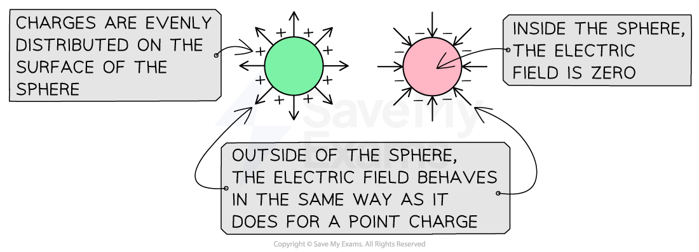
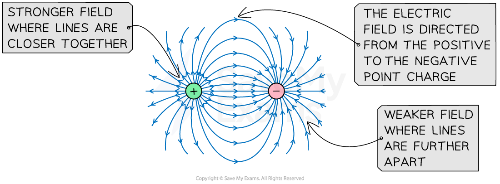
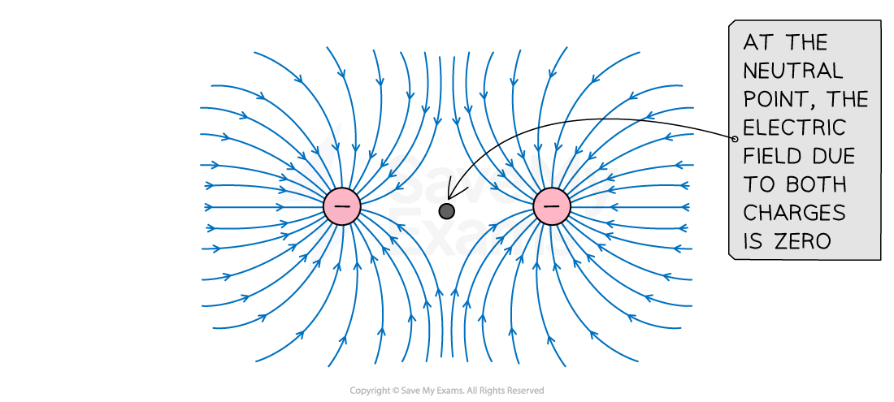
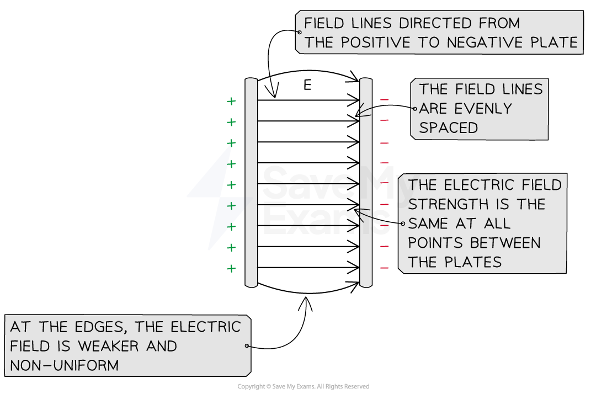
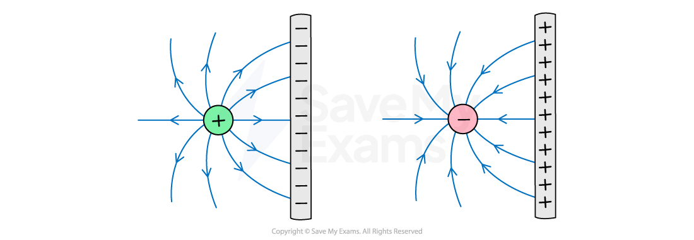
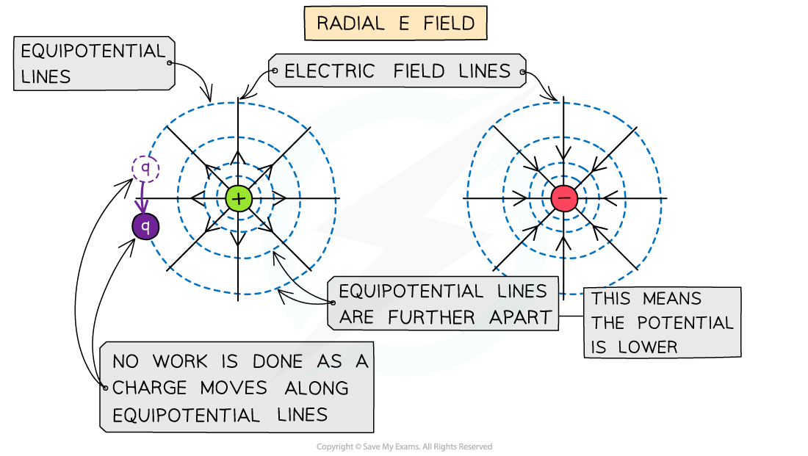
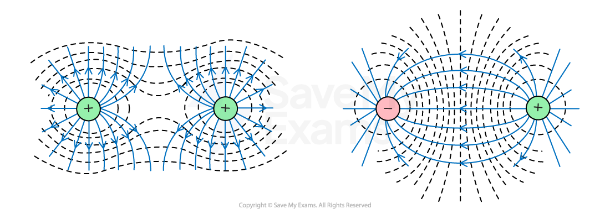
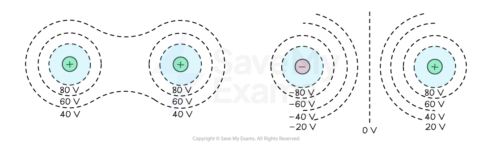
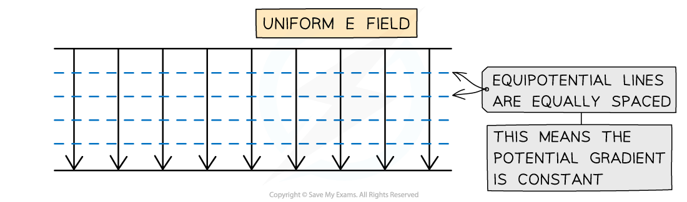

# Representing Radial & Uniform Electric Fields

## Using Field Lines & Equipotential Diagrams

> **Spec point** — `spcpt_WNQ32NVK9cPnqMhT`

## Using Field Lines & Equipotential Diagrams

### Electric field lines

- Field lines are used to represent the **direction **and **magnitude **of an electric field

  - In an electric field, field lines are always directed from the positive charge to the negative charge

- In a **uniform **electric field:

  - the field lines are **equally spaced** at** all **points
  - electric field strength is **constant **at all points in the field
  - the force acting on a test charge has the **same **magnitude and direction at all points in the field

- In a **radial** electric field:

  - the field lines are equally spaced as they exit the surface of the charge but the distance between them **increases **with distance
  - the electric field strength **decreases **with distance from the charge producing the field
  - the magnitude of the force acting on a test charge **decreases **with distance

#### Electric field around a point charge

- Around a *point charge*, the electric field is **radial** and the lines are directly radially inwards or outwards

  - If the charge is **positive **(+), the field lines are radially **outwards**
  - If the charge is **negative **(-), the field lines are radially **inwards**

***Electric field lines around a point charge are directed away from a positive charge and towards a negative charge***

- A radial field spreads uniformly to (or from) the charge in all directions, and the strength of the field is indicated by the spacing of the field lines

  - The electric field is **stronger **where the lines are **closer **together
  - The electric field is **weaker **where the lines are **further **apart

- This shares many similarities to radial gravitational field lines around a point mass

  - Since gravity is only an attractive force, the field lines will look similar to the negative point charge, whilst electric field lines can be in either direction

#### Electric field around a conducting sphere

- When a conducting sphere becomes charged, the electric field around it is the **same** as it would be if all the charge was concentrated at the **centre**

  - This means that a charged sphere can be treated in the same way as a **point charge **in calculations

***Electric field lines around a charged conducting sphere are similar to the field lines around a point charge***

- **Note:** field lines are **always perpendicular **to the surface of a conducting sphere

#### Electric field between two point charges

- For two **opposite** charges:

  - the field lines are directed from the positive charge to the negative charge
  - the **closer **the charges are brought together, the stronger the **attractive **electric force between them becomes

***The electric field lines between two opposite charges are directed from the positive to the negative charge. The field lines connect the surfaces of the charges to represent attraction***

- For two charges of the **same **type:

  - the field lines are directed **away **from two positive charges or **towards **two negative charges
  - the **closer **the charges are brought together, the stronger the **repulsive **electric force between them becomes
  - there is a **neutral point **at the midpoint between the charges where the resultant electric force is zero

***The electric field lines between two like charges are directed away from positive charges or towards negative charges. The field lines do not connect the surfaces of the charges to represent repulsion***

#### Electric field between two parallel plates

- When a potential difference is applied between two parallel plates, they become charged

  - The electric field between the plates is **uniform**
  - The electric field beyond the edges of the plates is **non-uniform**

***Electric field lines between two parallel plates are directed from the positive to the negative plate. A uniform electric field has equally spaced field lines***

#### Electric field between a point charge and parallel plate

- The field around a point charge travelling between two parallel plates combines

  - the field around a point charge
  - the field between two parallel plates

***The electric field lines between a point charge and a parallel plate are similar to the field between two opposite charges. The field lines become parallel when they touch the plate***

### Equipotential diagrams

- Equipotential lines (2D) and surfaces (3D) join together points that have the **same** ***electric potential***
- These are always:

  - **perpendicular** to the electric field lines in both radial and uniform fields
  - represented by **dotted** lines (unlike field lines, which are solid lines with arrows)
  - an **equal distance** from the source charge

- Equipotential surfaces can be drawn to represent a fixed electric potential for a number of scenarios, such as

  - for a point charge
  - for two or more charges
  - between two oppositely charged parallel plates

#### Equipotential surface for a point charge

- In a **radial **field, such as around a point charge, the equipotential lines:

  - are concentric circles around the charge
  - become progressively further apart with distance

***Equipotential lines for a radial electric field are concentric circles which increase in radius and are perpendicular to the field lines***

- If a charged conducting sphere replaced a point charge, the equipotential surface would be the **same **

#### Equipotential surface for multiple charges

- The equipotential surfaces for a **dipole** (two opposite charges) and for two like charges are shown below:

***The equipotential surface for multiple charges can be obtained by drawing curves which are perpendicular to the field lines***

- An equipotential surface between two **opposite **charges can be identified by a central line at a potential of 0 V

  - This is the point where the opposing potentials cancel

- An equipotential surface between two **like **charges can be identified by a region of empty space between them

  - This is the point where the resultant field is zero

***Equipotential lines show that the potential has the greatest value near the charge and decreases with distance***

#### Equipotential surface between parallel plates

- In a **uniform **field, such as between two parallel plates, the equipotential lines are:

  - horizontal straight lines
  - parallel
  - equally spaced

***The equipotential lines for a uniform field are evenly spaced parallel lines which are perpendicular to the field lines***

- The spacing between equipotential lines indicates the strength of the electric field

  - This is because they represent **potential gradient**

- Hence, equally spaced equipotential lines indicate a region of **constant **electric field strength

> **Worked Example**
> Sketch the electric field lines between the two point charges in the diagram below.
> 
> 
> 
> **Answer:**
> 
> - Electric field lines around point charges have arrows which point radially outwards for positive charges and radially inwards for negative charges
> - Arrows (representing force on a positive test charge) point **from the positive charge to the negative charge**
> 
> 

> **Worked Example**
> In the following diagram, two electric charges are shown which include the electric field lines
> 
> 
> 
> (a) Draw the lines of equipotential including at least four lines and at least one that encircles both charges
> 
> (b) By considering the field lines and equipotentials from part (a), state what can be assumed about the two charges
> 
> **Answer:**
> 
> **Part (a)**
> 
> - The lines of equipotential need to be perpendicular to the field lines at all times
> - These lines are almost circular when they are near the charges
> - And when moving out further the lines of equipotential cover both charges.
> - The lines of equipotential can be seen below
> 
> 
> 
> **Part (b)**
> 
> - It can be assumed that both charges are positive since the field lines point outwards.
> - It can also be assumed that the charge on the left has a larger charge than the charge on the right since:
> 
>   - It has a greater density of field lines
>   - It has a larger sphere of influence shown by the lines of equipotential
>   - The point of zero electric field strength between the two charges is closer to the right charge

> **Exam Hint**
> Always label the arrows on the field lines! The lines must also touch the surface of the source charge or plates and they must **never **cross.
> 
> The distinction between radial and uniform fields is an important one, remember:
> 
> - a** radial **field is made up of lines which follow the **radius **of a circle
> - a **uniform **field is made up of lines which are a **uniform **distance apart
> 
> When drawing equipotential lines, remember that they do **not** have arrows since they have no particular direction and are not vectors.
