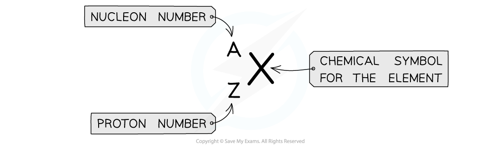

# Nucleon & Proton Number

## Nucleon & Proton Number

> **Spec point** — `spcpt_NGP9c5k9QBGjTrmV`

## Nucleon & Proton Number

- Atomic symbols are written in a specific notation as shown below:

***Atomic symbols show the proton number and nucleon number***

- The top number A represents the **nucleon **number or the **mass** number

  - **Nucleon number (A)** = total number of **protons and neutrons** in the nucleus
- The lower number Z represents the **proton** or **atomic** number

  - **Proton number (Z) **= total number of **protons** in the nucleus

- Note: In Chemistry, the nucleon number is referred to as the mass number and the proton number as the atomic number. The periodic table is ordered by atomic number

#### Isotopes

- Although all atoms of the same element always have the same number of protons (and hence electrons), the number of neutrons can vary
- An isotope is an atom (of the same element) that has an equal number of protons but a **different number of neutrons**

  - For example, hydrogen has two isotopes: **deuterium** and **tritium**. Both isotopes have a proton number of 1
  - Deuterium has one neutron, so its nucleon number is 2
  - Tritium has two neutrons, so its nucleon number is 3

> **Worked Example**
> 
> 
> 

> **Exam Hint**
> Remember which number in the chemical notation is the nucleon number and proton number is **vital** for many topics involving particle decays e.g. radioactivity. The most common mistake is thinking the nucleon number is the number of neutrons, the number of neutrons is calculated by:
> 
> number of neutrons = nucleon number – proton number
> 
> In all neutral (uncharged) atoms, the number of protons = number of electrons.
