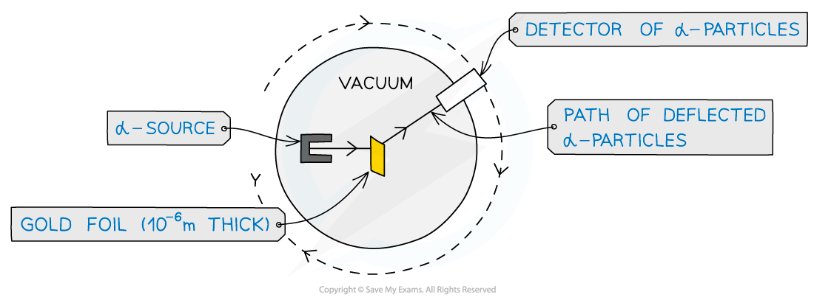
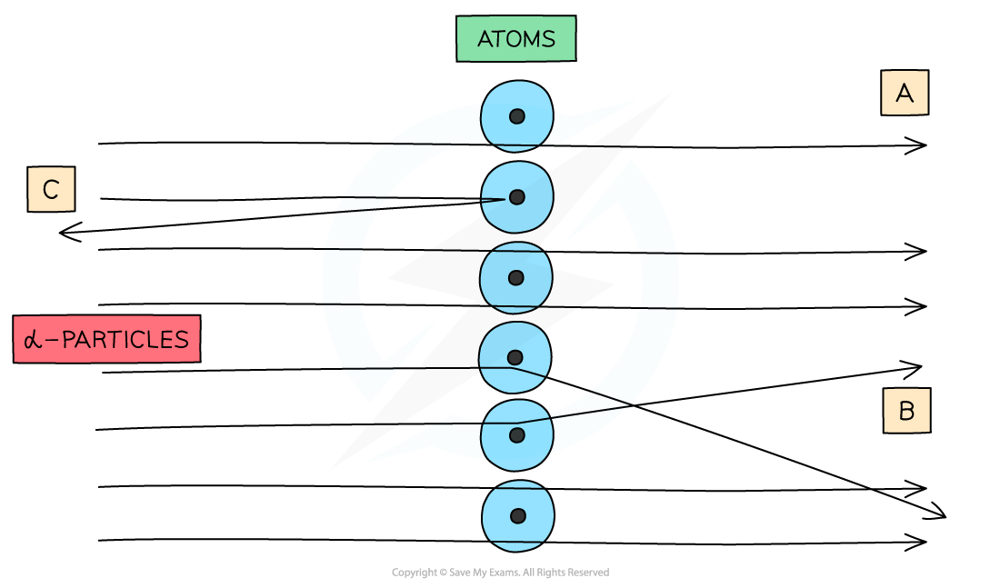
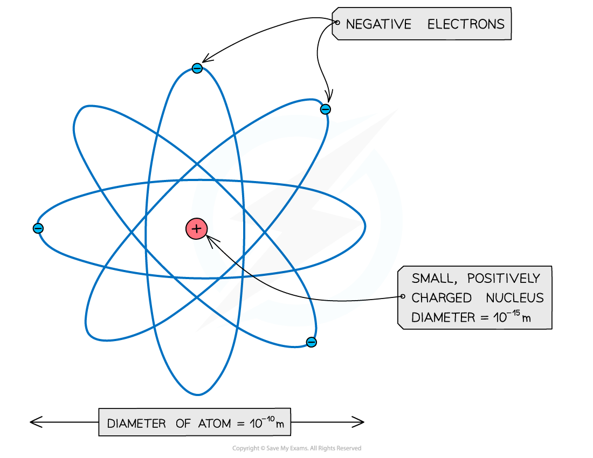
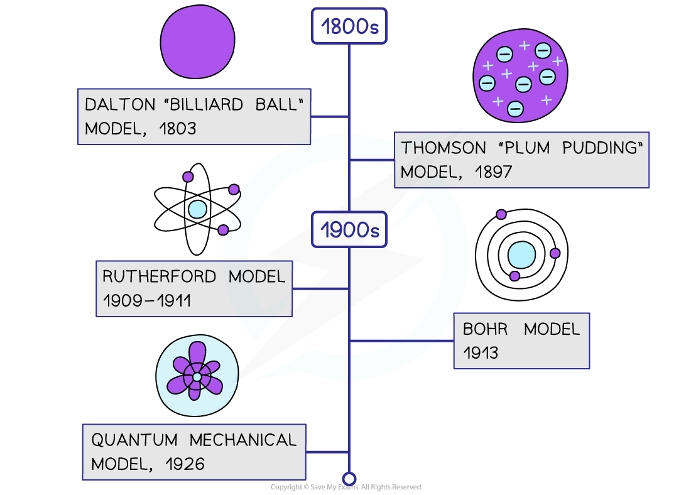

# The Nuclear Model of the Atom

## Alpha Particle Scattering

> **Spec point** — `spcpt_cBw8wSz3Wch7vBfz`

## Alpha Particle Scattering

- Evidence for the structure of the atom was discovered by Ernest Rutherford in the beginning of the 20th century from the study of **alpha** **particle scattering**

  - This structure is commonly referred to as the 'nuclear model' of the atom
- The experimental setup consists of alpha particles fired at thin gold foil and a detector on the other side to detect how many particles deflected at different angles

***Alpha particle scattering experiment set up***

- α-particles are the nucleus of a helium atom and are positively charged

***When α-particles are fired at thin gold foil, most of them go straight through but a small number bounce straight back***

- The results from this experiment are summarised as follows:
- **The majority of α-particles went straight through the gold foil without deflection (A)**

  - This suggested the atom is mainly empty space
- **Some α-particles deflected through small angles of < 10****o**** (B)**

  - This suggested there is a positive nucleus at the centre (since two positive charges would repel)
- **Only a small number of α-particles deflected straight back at angles of > 90****o**** (C)**

  - This suggested the nucleus is extremely small and this is where the mass and charge of the atom is concentrated
  - It was therefore concluded that atoms consist of ***small dense charged nuclei ***(this could be positive or negative)

- Since atoms were known to be neutral, the negative electrons were thought to be on a positive sphere of charge (plum pudding model) before the nucleus was theorised
- Now it is known that the negative electrons are orbiting the nucleus. Collectively, these make up the atom

***An atom: a small, dense, positive nucleus, surrounded by negative electrons***

- Note: The atom is around 100,000 times larger than the nucleus!

> **Worked Example**
> In an α-particle scattering experiment, a student set up the apparatus below to determine the number n of α-particle incident per unit time on a detector held at various angles θ.
> 
> 
> 
> Which of the following graphs best represents the variation of n with θ from 0 to 90°?
> 
> 
> 
> **Answer: A**
> 
> - The Rutherford scattering experiment directed parallel beams of α-particles at gold foil
> - The observations were:
> 
>   - Most of the α-particles went straight through the foil
>   - The largest value of n will therefore be at small angles
>   - Some of the α-particles were deflected through small angles
>   - n drops quickly with increasing angle of deflection θ
> - These observations fit with graph **A**

**     **

> **Exam Hint**
> Make sure you can recall all the different results from the experiment and what they have told us about the structure of the atom, as this is a common exam question.

## Changing Models of Atomic Structure

> **Spec point** — `spcpt_BNJfsygCCGKhZ9qX`

## Changing Models of Atomic Structure

- Our understanding of atomic structure has changed over time in the following ways:

**John Dalton’s Model (1803)**

- Dalton imagined that all matter was made of tiny solid particles called atoms
- Dalton’s model proposed:

  - Atoms are the smallest constituents of matter and cannot be broken down any further
  - Atoms of a given element are **identical** to each other and atoms of different elements are **different **from one another
  - When chemical reactions occur, the atoms rearrange to make different substances

**J.J. Thomson’s Model (1897)**

- Thomson discovered the electron
- He then went on to propose the ‘plum pudding’ model of the atom
- In this model:

  - The atom consists of positive and negative charges in equal amounts so that it is neutral overall
  - They were modelled as spheres of positive charge with uniformly distributed charge and density. The negatively charged electrons were thought to be stuck to the sphere like currants in a plum pudding

**Rutherford’s Gold Foil Experiment (1909 – 1911)**

- Hans Geiger and Ernest Marsden set out to test the plum pudding model
- They aimed beams of positively charged particles (alpha particles) at very thin gold foil
- According to the plum pudding model, these particles should have passed straight through, However, many of them were backscattered
- Ernest Rutherford explained these results in his ‘planetary model of atom’ which states:

  - Atoms have a central, positively charged nucleus containing the majority of the mass
  - Electrons orbit the nucleus, like planets around a star

**Neils Bohr’s Model (1913)**

- Bohr improved upon Rutherford’s planetary model
- Using mathematical ideas, he showed that electrons occupy **shells** or **energy levels **around the nucleus

  - These are at particular distances from the nucleus

**Quantum Mechanical Model (1926)**

- Erwin Schrödinger took Bohr's model further and used equations to calculate the likelihood of finding an electron in a certain position
- This model can be portrayed as a nucleus surrounded by an electron cloud. Where the cloud is most dense, the probability of finding the electron is greatest and vice versa
- The atom was thought to only have a positively charged nucleus surrounded by negatively charged electrons. James Chadwick then discovered the neutron in 1932, which completes the model of the atom we know today

***Timeline of the changing models of the atom***

> **Exam Hint**
> Although you won't be expected to memorise specific dates or names of the scientists, it is good to know the rough order of the types of models and how they differ from each other.
