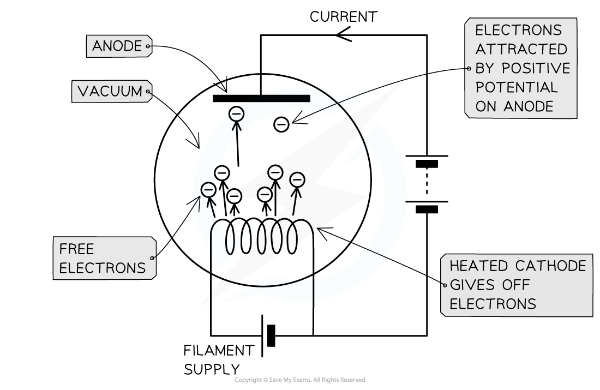

# Thermionic Emission

## Thermionic Emission

> **Spec point** — `spcpt_kPQDChz2tJDvXzh4`

## Thermionic Emission

- When metals are **heated**, the conduction electrons within them gain **energy**
- If these electrons gain sufficient energy, they are able to leave the surface of the metal

  - This is known as **thermionic emission**
  - This is **similar** to the **photoelectric** **effect**, but the energy absorbed by electrons in this case is due to **thermal** energy, rather than the energy absorbed by incident **photons**
- Once electrons are released from a metal surface they may be accelerated by **electric** or** magnetic fields**

***Electrons are emitted from the (negative) cathode and accelerated to the (positive) anode***

> **Worked Example**
> Electron guns use electric fields to accelerate electrons to very high speeds.
> 
> Show that an electron accelerated from rest across a potential difference of 5.0 kV attains a speed of 4.2 × 107 m s–1.
> 
> Use the following data:
> 
> - Mass of an electron *m*e = 9.11 × 10–31 kg
> - Electron charge *e* = 1.6 × 10–19 C
> 
> **Answer:**
> 
> **Step 1: List the known quantities**
> 
> - Potential difference = 5 kV = 5000 V
> - Mass of an electron, *m*e = 9.11 × 10–31 kg
> - Electron charge *e* = 1.6 × 10–19 C
> 
> **Step 2: Equate the kinetic energy gained by the electron to the energy transferred across the potential difference**
> 
> - Potential difference *V* is the energy transferred *W* per unit of charge *Q*, or $V=\frac{W}{Q}$
> - Since the charge in this case is an electron, *Q* = *e* and so *W *= *eV*
> - Therefore, the kinetic energy gained is equal to *eV *so we can write:
> 
> $\frac{1}{2}mv^{2}=eV$
> 
> **Step 3: Make speed *****v***** the subject of the equation**
> 
> - Rearranging this equation for *v* gives:
> 
> $mv^{2}=2eV$
> 
> $v^{2}=\frac{2eV}{m}$
> 
> $v=\sqrt{\frac{2eV}{m}}$
> 
> **Step 4: Substitute quantities and calculate the speed *****v***
> 
> - Substituting known quantities gives:
> 
> $v=\sqrt{\frac{2\times(1.6\times10^{-19})\times5000}{(9.11\times10^{-31})}}$= 41 908 313... = 4.2 × 107 m s–1

> **Exam Hint**
> Examiners commonly test if candidates can equate the energy gained across a potential difference with the kinetic energy of a particle, as we did here. Make sure you can combine the equations for kinetic energy and potential energy in order to calculate speed like we did here!
