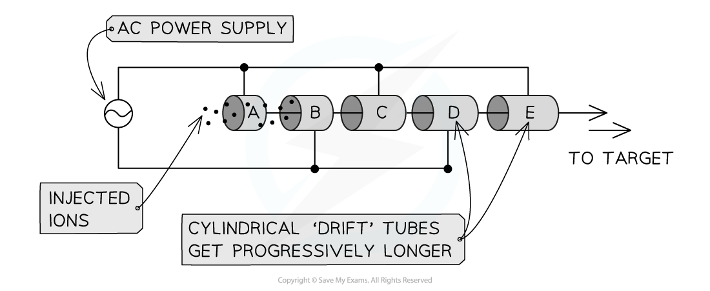
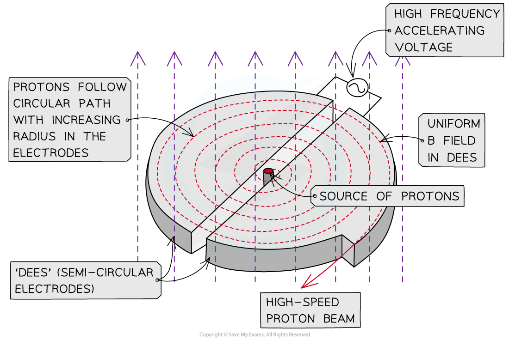

# Particle Accelerators & Detectors

## Particle Accelerators & Detectors

> **Spec point** — `spcpt_VPnV2r5dMr8FZXQT`

## Particle Accelerators & Detectors

#### Linear Accelerators

- A linear accelerator (LINAC) is a type of particle accelerator that accelerates ions (charged particles) to very high speeds in **straight lines**
- LINACs use **electric fields** within and between metallic tubes which act as oppositely charged **electrodes**
- The high-energy ions produced are used in collider experiments

  - These experiments enable the internal structure of atoms and subatomic particles to be investigated

- LINACs are comprised of a series of hollow cylindrical tubes

***Linacs accelerate ions through progressively longer tubes, connected to an alternating power supply. This ensures they are always accelerating from one tube to the next***

- An **AC power** **supply **is connected across each tube to ensure ions are always **accelerated **from one to the next

  - The ions will be **attracted** to the **midpoint** of a tube
  - At this point, the AC supply will **switch** such that the ions are **repelled **to the exit, and attracted to the next tube
  - This process continues in a **straight line** all the way to the end of the accelerator

- The **frequency** of the AC supply is fixed

  - This means the polarity (positive or negative charge) of each tube switches at a **constant rate**
- Therefore, each tube must be built **successively longer**

  - This is because the ions are **speeding** **up**
  - Hence, this ensures ions spend the same amount of **time** under acceleration in each tube

#### Cyclotrons

- A cyclotron is a type of particle accelerator that accelerates ions from a central entry point around a **spiral** path
- They are used for medical research such as:

  - Producing medical isotopes (**tracers**)
  - Creating high-energy beams of radiation for **radiotherapy**
- Cyclotrons are comprised of:

  - Two hollow semicircular electrodes called '**dees**'
  - A uniform **magnetic field** applied **perpendicular** to the electrodes
  - An **AC power supply** applied across each dee, which creates an **electric field** in the **gap** between them

***A cyclotron uses magnetic fields and electric fields to accelerate charged particles, like protons. The magnetic fields keep protons in a circular path, and the electric field increases their speed***

- The process of accelerating an ion in a cyclotron is:

  - A source of charged particles is placed at the **centre** of the cyclotron and they are fired into one of the dees
  - The magnetic field in the electrode makes them follow a **circular path**, since it is perpendicular to their motion until they eventually leave the electrode
  - The potential difference applied between the electrode **accelerates** the ions across the gap to the next dee (since there is an **electric field** in the gap)
  - In the next dee, the ions continue moving in a circular path within the magnetic field
  - The potential difference is then reversed so the ions again accelerate across the gap
  - This process is repeated as the particles spiral outwards and eventually have a speed large enough to exit the cyclotron
- The alternating potential difference is needed to accelerate the particles across the gap between opposite electrodes

  - Otherwise, the ions would only speed up in one direction

#### Particle Detectors

- When charged particles move through any medium, such as a **gas**, they transfer **energy** to it
- This is usually through the process of ***ionisation***

  - High-energy ions transfer some of their energy to surrounding atoms, removing electrons
  - The ions and electrons produced are then **accelerated** by applied **electric fields**
  - Once these are **discharged** they form pulses of electric **current**
- Each pulse of electricity is **counted** by electronic counters connected by electrodes

  - 'Counts' are then interpreted as detection of individual particles

- Ionisation is the principle by which many particle detectors operate, such as in:

  - Geiger-Muller tubes
  - Spark chambers
  - Gas and cloud chambers

- The particles are sometimes **deflected** meaning they are also  scattered

  - This can cause multiple scattering of the particle in the material

> **Exam Hint**
> Make sure you can distinguish between the two types of particle accelerator: remember, LINACs **only** use electric fields (to accelerate ions in straight lines) whereas **cyclotrons **use both electric fields and magnetic fields.
> 
> In particle detectors, you only need to describe the two key principles which allow scientists to detect particles: **ionisation** and **deflection** (by applied electric fields).
