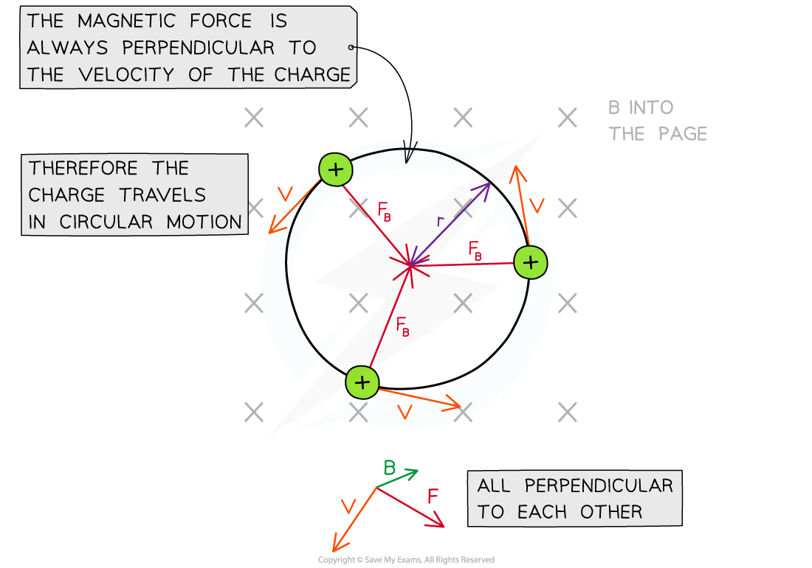

# Radius of a Charged Particle in a Magnetic Field

## Radius of a Charged Particle in a Magnetic Field

> **Spec point** — `spcpt_v3cTqZrQFSV83wgt`

## Radius of a Charged Particle in a Magnetic Field

- A charged particle in uniform ***magnetic field*** which is perpendicular to its direction of motion travels in a **circular** path
- This is because the ***magnetic force*** *F* is always perpendicular to its velocity *v*

  - *F* will always be directed towards the centre of orbit

***A charged particle travels in a circular path in a magnetic field***

- The magnetic force *F* provides the ***centripetal force*** on the particle
- The equation for centripetal force is:

- Where:

  - *F* = centripetal force (N)
  - *m* = mass of the particle (kg)
  - *v* = linear velocity of the particle (m s–1)
  - *r* = radius of orbit (m)

- Equating this to the magnetic force on a moving charged particle gives the equation:

- Rearranging for the radius *r* obtains the equation for the radius of the orbit of a charged particle in a perpendicular magnetic field:

- The product of mass *m* and velocity *v* is momentum *p*

  - Therefore, the radius of the charged particle in a magnetic field can also be written as:

$r=\frac{p}{Bq}$

- Where:

  - *r* = radius of orbit (m)
  - *p* = momentum of charged particle (kg m s–1)
  - *B* = magnetic field strength (T)
  - *q* = charge of particle (C)

- This equation shows that:

  - Particles with a larger momentum (either larger mass *m* or speed *v*) move in larger circles, since*** r ∝ p***
  - Particles with greater charge *q* move in smaller circles:*** r ***∝ **1 /** ***q***
  - Particles moving in a strong magnetic field *B* move in smaller circles: ***r ***∝ **1 / *****B***

> **Worked Example**
> An electron with charge-to-mass ratio of 1.8 × 1011 C kg-1 is travelling at right angles to a uniform magnetic field of flux density 6.2 mT. The speed of the electron is 3.0 × 106 m s-1.
> 
> Calculate the radius of the circular path travelled by the electron.
> 
> **Answer:**
> 
> 

> **Exam Hint**
> Make sure you're comfortable with deriving the equation for the radius of the path of a charged particle travelling in a magnetic field, as this is a common exam question.
> 
> Crucially, the **magnetic** **force** is **always** perpendicular to the velocity of a charged particle. Hence, it is a **centripetal **force and the equations for circular motion can be applied.
