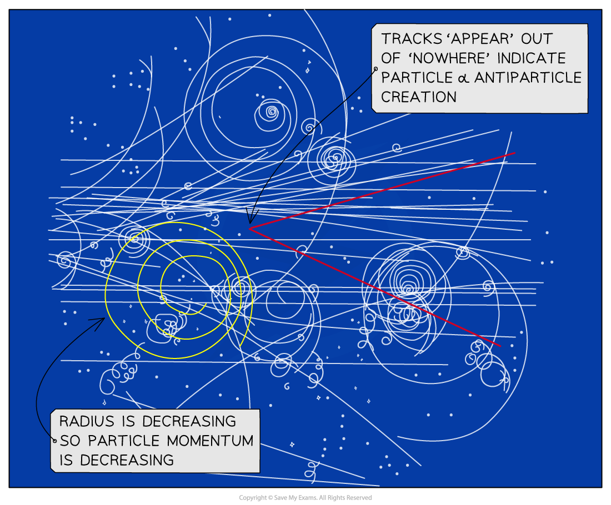

# Interpreting Particle Tracks

## Interpreting Particle Tracks

> **Spec point** — `spcpt_7wXHsgZ7JxKJFxWx`

## Interpreting Particle Tracks

- Particle detectors that count particles, like Geiger-Muller tubes, are useful but they cannot distinguish different types of particle
- Modern detectors can show the **paths** of charged particles, from which physicists are able to interpret the characteristics of the particle

- The **curvature **of the particle tracks gives an indication of its momentum

  - A **smaller** **radius **means the particle has a **smaller momentum**
  - A **larger** **radius** means the particle has a **larger momentum**

- This is due to the equation for the radius of a charged particle in a magnetic field:

$r=\frac{mv}{BQ}=\frac{p}{BQ}$

- Where:

  - *r* = orbital radius of charged particle (m)
  - *p* = momentum of charged particle (kg m s–1)
  - *B* = magnetic field strength (T)
  - *Q* = charge of particle (C)
  - *m *= mass of the particle (kg)
  - *v *= velocity of the particle (m s-1)

- If the **radius** of a track is decreasing (i.e., it is spiralling closer inwards)

  - This means the particle's momentum is **decreasing**
  - This is because *r* ∝ *p*
  - Therefore, the **velocity** of the particle is **decreasing**
  - Hence, the **kinetic energy** of the particle is also decreasing, due to **ionising** other particles in its path

***The radius and direction of particle tracks is used to determine momentum and charge. Creation and annihilation is also observable***

- The **direction** of a track's curvature gives an indication of the particle's **charge**

  - **Fleming's Left Hand Rule** can be used to determine the sign of the particle's charge

- Sometimes, particle tracks appear to start out of 'nowhere'

  - This indicates particle-antiparticle **creation**
  - These paths are in **opposite directions** because the particle-antiparticle pair is **oppositely charged**
  - Therefore, the magnetic force on them is **oppositely directed**
  - However they have the same **radius** because they each have the same **mass** (and hence, **momentum**)
- Therefore charge, energy and momentum are always conserved in interactions between particles

> **Worked Example**
> The image shows red and yellow tracks in a cloud chamber. The magnetic field goes into the page.
> 
> 
> 
> a) Explain how you can tell from the image that a particle-antiparticle pair is being created.
> 
> b) Identify which track represents a negatively charged particle.
> 
> **Answer:**
> 
> **Part (a)**
> 
> **Step 1: Comment on the source of the tracks**
> 
> - The red and yellow tracks begin together out of 'nothing'
> - This indicates an uncharged particle is creating charged particles
> 
> **Step 2: Comment on the radius of the tracks**
> 
> - Both the red and yellow tracks have the same radius
> - This indicates both particles have the same momentum, and mass, which is true for creation of a particle-antiparticle pair
> 
> **Step 3: Comment on the direction of the tracks**
> 
> - Both tracks spiral in opposite directions
> - This indicates each particle is oppositely charged, because the (centripetal) magnetic force acts on them in the opposite directions
> 
> **Part (b)**
> 
> **Step 1: Determine the direction of particle velocity and centripetal force**
> 
> - The centripetal force on each particle must be toward the centre of orbit
> - The tracks begin from a point and spiral away from each other, so the particle velocity must be as indicated in the image below:
> 
> 
> 
> **Step 2: Apply Fleming's Left Hand Rule for the red track**
> 
> - Fleming's Left Hand Rule gives the direction of the magnetic force on a **positively** charged particle in a magnetic field
> - The first finger should point into the page, along the direction of the magnetic field
> 
>   - On the red track, the thumb should point toward the centre of orbit (the direction of the force)
>   - The second finger points **downward**, but the actual particle velocity is **upward**
>   - Therefore, the red track must indicate a **negatively** charged particle
> 
> **Step 3: Check Fleming's Left Hand Rule for the yellow track**
> 
> - The first finger should again point into the page
> 
>   - On the yellow track, the thumb should also point toward the centre of orbit (the direction of the force)
>   - The second finger points **downward**, which is in agreement with the actual particle velocity
>   - Therefore, the yellow track must indicate a **positively** charged particle

> **Exam Hint**
> Sometimes, examiners will ask you to explain whether particles are simply moving upward or downward across an image. The first thing to consider should be the **radius** of the particle track: you expect the radius to be **decreasing**, because charged particles will tend to continue ionising other particles around them - hence **losing kinetic energy**.
> 
> As their kinetic energy decreases, so does their **momentum** - and hence, track **radius** will also decrease. This should be enough to determine which direction the particle is coming from and heading towards!
