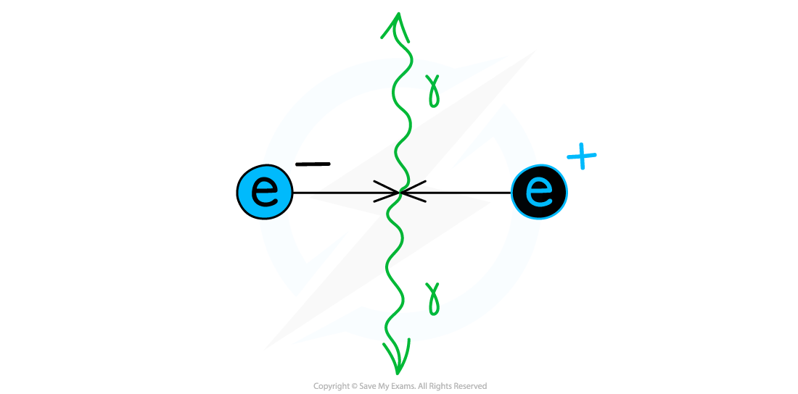
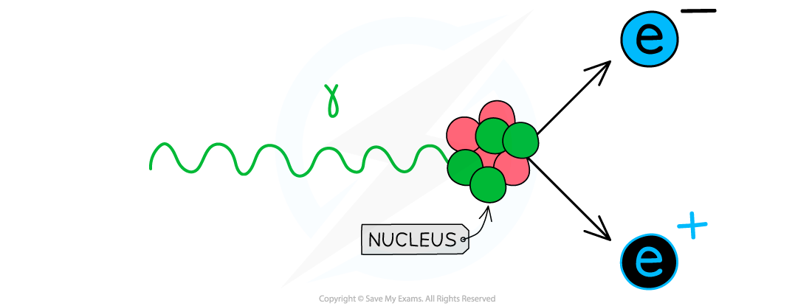

# Annihilation of Matter & Antimatter

## Annihilation of Matter & Antimatter

> **Spec point** — `spcpt_PqJr6PrrzrQHkndK`

## Annihilation of Matter & Antimatter

#### Annihilation

- When a particle meets its antiparticle partner, the two will **annihilate**
- Annihilation is: **When a particle meets its equivalent anti–particle they both are destroyed and their mass is converted into energy in the form of two gamma ray photons**

***When an electron and positron collide, their mass is converted into energy in the form of two photons emitted in opposite directions***

#### Pair Production

- Pair production is the opposite of annihilation
- Pair production is: **When a photon interacts with a nucleus or atom and the energy of the photon is used to create a particle–antiparticle pair**
- The presence of a nearby neutron is essential in pair production so that the process conserves both energy and momentum
- A single photon alone cannot produce a particle–anti-particle pair or the conservation laws would be broken
- Pair creation is a case of energy being converted into matter

***When a photon with enough energy interacts with a nucleus it can produce an electron-positron pair***

- This means the energy of the photon must be above a certain value to provide the **total** **rest** **mass** **energy** of the particle–antiparticle pair
- Einstein's famous mass-energy relation showed that **energy** can be converted into **mass**, and vice versa
- It is given by:

Δ*E* = *c*2 Δ*m*

- Where:

  - Δ*m *= rest mass of the particle (kg)
  - *c* = speed of light (m s–1)
  - Δ*E *= rest mass energy of the particle (J)

- Therefore, in order to create a particle & anti-particle pair, the energy carried by a single photon must be **at least** twice the rest-mass energy required, i.e.

**2Δ*****E***** = 2(*****c*****2**** Δ*****m*****)**

- This also means if a particle meets its anti-particle and annihilates, the energy carried away by **each** of the two photons *E*photon is given by:

***E*****photon**** = *****hf *****= **$\frac{hc}{λ}$**= *****c*****2**** Δ*****m***

> **Worked Example**
> Calculate the maximum wavelength of one of the photons produced when a proton and antiproton annihilate each other.
> 
> **Answer:**
> 
> 

> **Exam Hint**
> Since the Planck constant is in Joules (**J **s) remember to always convert the rest mass-energy from MeV to J.
> 
> Remember that the equation *E* = *hf* is only relevant for **photons**, not for all particles!
