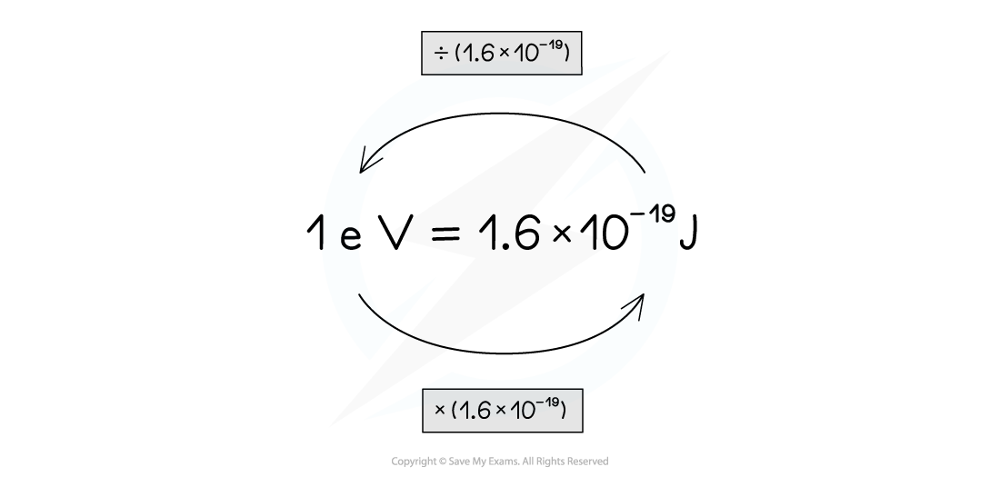

# Unit Conversions for Energy & Mass

## Unit Conversions for Energy & Mass

> **Spec point** — `spcpt_rXk8zSfzH68m3m7t`

## Unit Conversions for Energy & Mass

#### Units of Energy

- The electronvolt is a unit of **energy**
- It is equivalent to the amount of energy transferred to an electron accelerated across a potential difference of 1 V:

**1 eV = 1.6 × 10****–19**** J**

- In order to convert between electronvolts and joules:

  - **Multiply** electronvolts by** **1.6 × 10–19 to get the equivalent energy in joules
  - **Divide **joules by 1.6 × 10–19 to get the equivalent energy in electronvolts

***Converting between electronvolts and joules***

- Sometimes, units of MeV or GeV are used

  - These are given by:

**1 MeV = 1 × 10****6**** eV = 1.6 × 10****–13**** J**

**1 GeV = 1 × 10****9**** eV = 1.6 × 10****–10**** J**

#### Units of Mass

- Energy and mass are related by Einstein's energy-mass relation

$ΔE=c^{2}Δm$

$Δm=\frac{ΔE}{c^{2}}$

- Therefore, units of** mass** can be related to units of energy by **division **of *c**2*

  - This provides particle physicists convenient units of calculation to work with
  - This is especially useful in experiments involving particle collisions, where **annihilation** and **creation** is common

- Possible units of mass are therefore:

$\frac{MeV}{c^{2}}$, or, $\frac{GeV}{c^{2}}$

- The following conversions are used to convert into S.I. units:

$1\frac{MeV}{c^{2}}$= 1.78 × 10–30 kg

$1\frac{GeV}{c^{2}}$= 1.78 × 10–27 kg

> **Worked Example**
> Show that the rest mass of a proton, 1.67 × 10–27 kg, is roughly equivalent to 1 GeV/c2.
> 
> **Answer:**
> 
> **Step 1: Write the known quantities**
> 
> - Rest mass of a proton, *m*p = 1.67 × 10–27 kg
> - Speed of light *c* = 3 × 108 m s–1
> 
> **Step 2: Substitute quantities into Einstein's energy-mass relation**
> 
> *E* = *m*p*c*2
> 
> *E* = (1.67 × 10–27) × (3 × 108)2 = 1.50 × 10–10 J
> 
> **Step 3: Convert joules to electronvolts**
> 
> - To convert a quantity of energy in joules to electronvolts, divide by 1.6 × 10–19
> 
> $\frac{1.50\times10^{-10}}{1.6\times10^{-19}}$= 9.4 × 108 eV = 0.94 GeV
> 
> **Step 4: Convert electronvolts to GeV/c****2**
> 
> - 0.94 GeV is equivalent to a mass of 0.94 GeV/c2, which is roughly 1 GeV/c2

> **Exam Hint**
> In this worked example, we could have used the direct conversion between GeV/c2 and kg, because 1 GeV/c2 = 1.78 × 10–27 kg, but you should be super comfortable with using Einstein's energy-mass relation to find quantities of mass/energy in standard units, and converting to eV and eV/c2 the 'long way round'. Exam questions may require you to do this when the conversions are not so straightforward.
