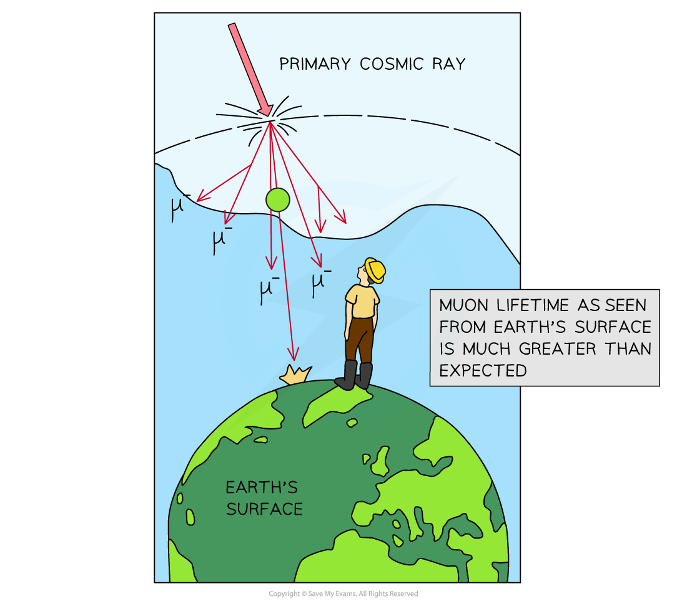

# Relativistic Situations

## Relativistic Situations

> **Spec point** — `spcpt_x7x2PbMjVNxQWQjW`

## Relativistic Situations

- Accelerated particles often reach speeds that are very close to the **speed of light**
- At such high velocities and energies, **relativistic effects** begin to become important
- These are effects such as:

  - Time dilation
  - Length contraction

#### Time Dilation

- Clocks run slower for moving particles

  - This means that unstable particles, with a **short lifetime**, actually survive for **much longer** in a laboratory if they are moving very quickly
  - This is useful because they will leave **longer tracks** in particle detectors (making detection easier)

- For example, muons created high up in the atmosphere, have a lifetime of about 2 μs

  - The time required to travel to sea-level is **too great** to survive the journey
  - However, they are detected at sea-level in large numbers
  - This is because they are travelling at **relativistic speeds **(e.g. 0.98*c*) so **time** **dilation** means their lifetime is dilated to times much longer than 2 μs

***Because muons travel so quickly, time dilation stretches muon lifetime to much longer than when they are at rest***

#### Length Contraction

- Moving rulers are shorter than stationary rulers

  - This means that particles moving at very high velocities travel much further through detectors than expected
  - Unstable particles with very short lifetimes would not travel for appreciable distances without **relativistic **effects like length contraction

- For example, if exotic particles produced in particle accelerators decayed within the particle chamber before escaping it, none would be detectable

  - In fact, **many** types of exotic particles are detected
  - This is evidence of length contraction

> **Worked Example**
> Muons, which normally have a lifetime of 2.2 × 10–6 s, are created in the upper atmosphere at a height of about 10 km above sea level.
> 
> a) Calculate the distance a muon would travel towards the ground if it was moving at 0.99 *c. *
> 
> b) Comment on the relativistic effects necessary if muons are to be detected at sea level.
> 
> **Answer:**
> 
> **Part (a)**
> 
> **Step 1: Write the known quantities**
> 
> - Muon lifetime, *t* = 2.2 × 10–6 s
> - Speed of light, *c *= 3 × 108 m s–1
> - Speed of muons, *v* = 0.99 *c* = 0.99 × (3 × 108) = 2.97 × 108 m s–1
> 
> **Step 2: Calculate distance travelled**
> 
> - Speed *v* = distance *d* ÷ time *t*
> - Therefore, the distance travelled by muons travelling at 0.99 *c* is given by:
> 
> *d* = *vt* = (2.97 × 108) × (2.2 × 10–6) = 653.4 m
> 
> **Part (b)**
> 
> **Step 1: Compare the distance calculated to the distance required**
> 
> - The distance a muon travels with a lifetime of 2.2 × 10–6 s is only 653.4 m
> 
>   - This is much less than the 10 km required to sea level
> 
> **Step 2: Conclude that relativistic effects must be at play**
> 
> - Therefore, time dilation must be allowing the muons to last much longer than 2.2 × 10–6 s
> 
>   - This is because they are detected in large numbers at sea level

> **Exam Hint**
> For your exam, you are only required to understand the situations in which a **relativistic increase** particle lifetime would be significant. As seen in the worked example, this is a combination of time dilation and length contraction. This is when, as we have seen, particles are moving **very close** to the speed of light. This is normally at velocities greater than 90% the speed of light.
