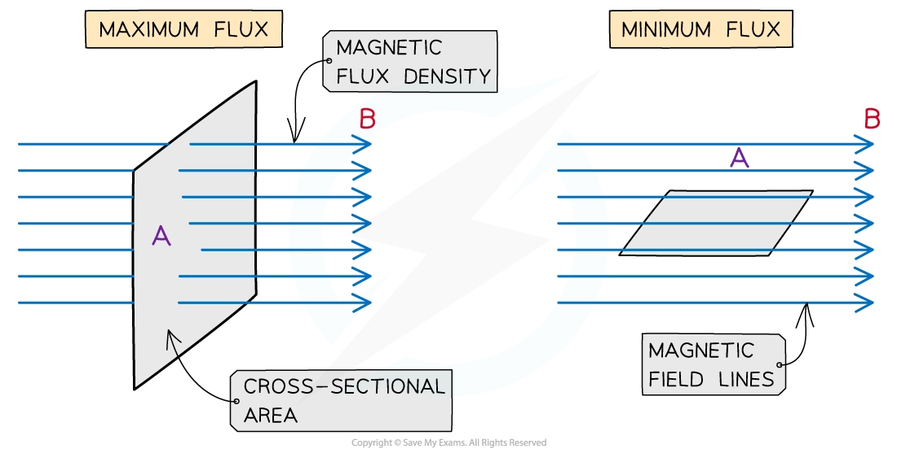
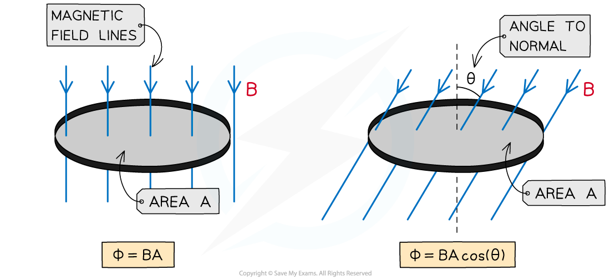

# Magnetic Flux Density, Flux & Flux Linkage

## Magnetic Flux Density, Flux & Flux Linkage

> **Spec point** — `spcpt_3NkCq4mkQDKy7Cs6`

## Magnetic Flux, Flux Density & Flux Linkage

### Magnetic Flux Density

- The strength of a magnetic field is defined by the density of the magnetic field lines, or **magnetic flux density**, at that point

  - Magnetic flux density is defined by the symbol *B*
  - It is measured in **Tesla **(T)

- Rearranging the equation for magnetic force on a wire, the magnetic flux density is defined by the equation:

- Where:

  - *B* = magnetic flux density (T)
  - *F* = magnetic force on a current-carrying wire (N)
  - *I = *current (A)
  - *L* = length of the wire (m)

- For reference, the Earth's magnetic flux density is around 0.032 mT and an ordinary fridge magnet is around 5 mT
- The magnetic flux density is sometimes referred to as the **magnetic field strength**

### Magnetic Flux

- Magnetic flux is a quantity which signifies how much of a magnetic field passes **perpendicularly** through some area
- For example, the amount of magnetic flux through a rotating coil will vary as the coil rotates in the magnetic field

  - It is a maximum when the magnetic field lines are **perpendicular** to the coil area
  - It is at a minimum when the magnetic field lines are **parallel** to the coil area

- The **magnetic flux **is defined as: **The product of the magnetic flux density and the cross-sectional area perpendicular to the direction of the magnetic flux density**
- *Magnetic flux* is defined by the symbol Φ (greek letter ‘phi’)
- It is measured in units of **Webers (Wb)**
- Magnetic flux can be calculated using the equation:

**Φ = BA**

- Where:

  - Φ = magnetic flux (Wb)
  - B = *magnetic flux density* (T)
  - A = cross-sectional area (m2)

***The magnetic flux is maximised when the magnetic field lines and the area through which they are passing through are perpendicular***

- When magnetic flux is not completely perpendicular to the area *A*, then the component of magnetic flux density *B* perpendicular to the area is taken

- The equation then becomes:

**Φ = BA cos(θ)**

- Where:

  - θ = angle between *magnetic field* lines and the line **perpendicular **to the plane of the area (often called the normal line) (degrees)

***The magnetic flux increases as the angle between the field lines and the normal decreases***

- This means the magnetic flux is:

  - **Maximum** = BA when cos(θ) =1 therefore **θ = 0****o**. The magnetic field lines are perpendicular to the plane of the area
  - **Minimum** = 0 when cos(θ) = 0 therefore **θ = 90****o**. The magnetic fields lines are parallel to the plane of the area
- An e.m.f is induced in a circuit when the magnetic flux linkage changes with respect to time
- This means an e.m.f is induced when there is:

  - A changing magnetic flux density *B*
  - A changing cross-sectional area *A*
  - A change in angle *θ*

### Magnetic Flux Linkage

- The **magnetic flux linkage** is a quantity commonly used for solenoids which are made of *N* turns of wire
- The flux linkage is defined as: **The product of the magnetic flux and the number of turns of the coil**
- It is calculated using the equation:

**Flux linkage = Φ*****N***** = *****BAN***

- Where:

  - Φ = *magnetic flux* (Wb)
  - *N* = number of turns of the coil
  - *B* = magnetic flux density (T)
  - *A* = cross-sectional area (m2)

- The flux linkage Φ*N* has the units of **Weber turns** **(Wb turns)**

> **Worked Example**
> An aluminium window frame has a width of 40 cm and length of 73 cm as shown in the figure below
> 
> 
> 
> The frame is hinged along the vertical edge AC. When the window is closed, the frame is normal to the Earth’s magnetic field with magnetic flux density 1.8 × 10-5 T
> 
> Calculate the magnetic flux through the window when it is closed
> 
> **Answer:**
> 
> **Step 1: Write out the known quantities**
> 
> Cross-sectional area, A = 40 cm × 73 cm = (40 × 10-2) × (73 × 10-2) = 0.292 m2
> 
> Magnetic flux density, B = 1.8 × 10-5 T
> 
> **Step 2**:** Write down the equation for magnetic flux**
> 
> Φ = BA
> 
> **Step 3: Substitute in values**
> 
> Φ = (1.8 × 10-5) × 0.292 = 5.256 × 10-6 = 5.3 × 10-6 Wb

> **Worked Example**
> A solenoid of circular cross-sectional radius 0.40 m and 300 turns is placed perpendicular to a magnetic field with a magnetic flux density of 5.1 mT.
> 
> Determine the magnetic flux linkage for this solenoid.
> 
> **Answer:**
> 
> **Step 1: Write out the known quantities**
> 
> - Cross-sectional area, *A* = πr2 = π(0.4)2 = 0.503 m2
> - Magnetic flux density, *B* = 5.1 mT
> - Number of turns of the coil, *N* = 300 turns
> 
> **Step 2: Write down the equation for the magnetic flux linkage**
> 
> ΦN = *BAN*
> 
> **Step 3:** **Substitute in values and calculate**
> 
> ΦN = (5.1 × 10-3) × 0.503 × 300 = 0.7691 = 0.8 Wb turns (2 s.f)

> **Exam Hint**
> Consider carefully the value of θ, it is the angle between the field lines and the line **normal** (perpendicular) to the plane of the area the field lines are passing through. If it helps, drawing the normal on the area provided will help visualise the correct angle.
