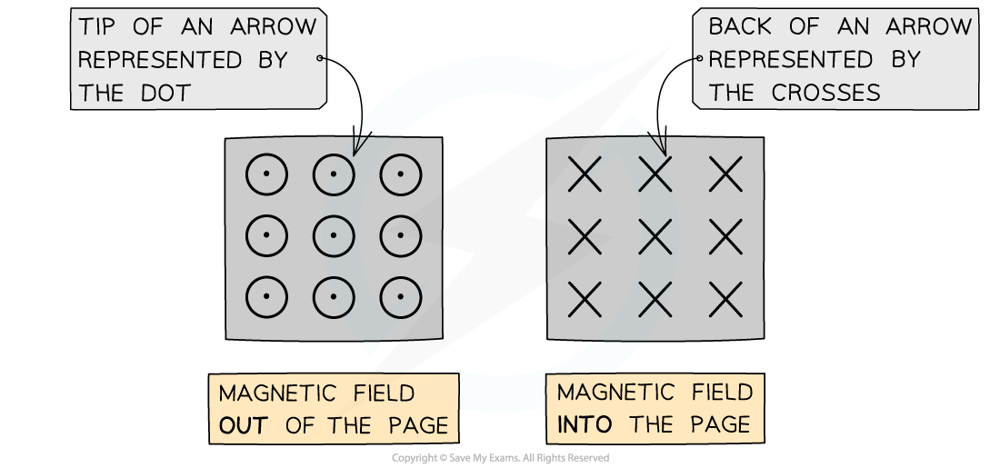
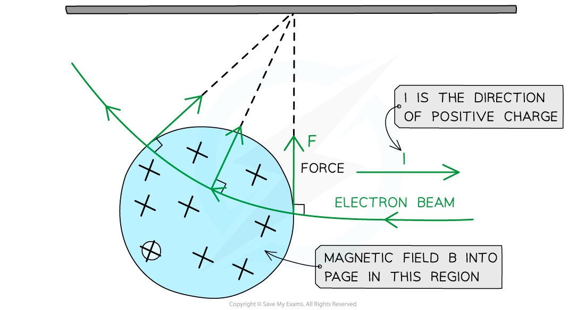
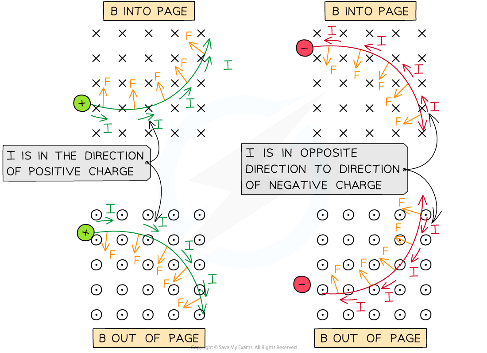

# Magnetic Force on a Charged Particle

## Magnetic Force on a Charged Particle

> **Spec point** — `spcpt_gjGF8ZW24cjRtgHt`

## Magnetic Force on a Charged Particle

- The magnetic force on an isolated moving charged particle, such as a proton, is given by the equation:

***F***** = *****BQv***

- Where:

  - *F* = magnetic force on the particle (N)
  - *B* = *magnetic flux density* (T)
  - *Q* = charge of the particle (C)
  - *v* = speed of the particle (m s-1)
- This is the maximum force on the charged particle, when *F*,* B* and *v* are mutually perpendicular

  - Therefore if a particle travels **parallel** to a magnetic field, it will not experience a magnetic force

- Current is the rate of flow of **positive** charge

  - This means that the direction of the 'current' for a flow of negative charge (e.g. an electron beam) is in the opposite direction to its motion
- If the charged particle is moving at an angle *θ *to the magnetic field lines, then the size of the magnetic force *F* is given by the equation:

***F = BQv *****sin***** θ***

- This equation shows that:

  - The size of the magnetic force is **zero** if the angle *θ *is **zero** (i.e. the particle moves **parallel** to the field lines)
  - The size of the magnetic force is **maximum** if the angle *θ *is **90° **(i.e. the particle moves **perpendicular **to field lines)

> **Worked Example**
> A beta particle is incident at 70° to a magnetic field of flux density 0.5 mT, travelling at a speed of 1.5 × 106 m s–1.
> 
> 
> 
> Calculate:
> 
> a) The magnitude of the magnetic force on the beta particle
> 
> b) The magnitude of the maximum possible force on a beta particle in this magnetic field, travelling with the same speed
> 
> **Answer:**
> 
> **Part (a)**
> 
> **Step 1: Write out the known quantities**
> 
> - Magnetic flux density *B* = 0.5 mT = 0.5 × 10–3 T
> - Speed *v* = 1.5 × 106 m s–1
> - Angle *θ *between the flux and the velocity = 70°
> 
> **Step 2: Substitute quantities into the equation for magnetic force on a charged particle**
> 
> - A beta particle is an electron
> - Therefore, the **magnitude** of electron charge *Q* = 1.6 × 10–19 C
> - Substituting values gives:
> 
> *F *= *BQv *sin *θ*
> 
> *F* = (0.5 × 10–3) × (1.6 × 10–19) × (1.5 × 106) × sin (70)
> 
> *F* = 1.1 × 10–16 N
> 
> **Part (b)**
> 
> **Step 1: Write out the known quantities**
> 
> - Magnetic flux density *B* = 0.5 mT = 0.5 × 10–3 T
> - Speed *v* = 1.5 × 106 m s–1
> 
> **Step 2: Determine the angle to the flux lines**
> 
> - Angle *θ *between the flux and the velocity = 90° if the magnetic force is a maximum
> 
> **Step 3: Substitute quantities into the equation for magnetic force on a charged particle**
> 
> - The **magnitude** of electron charge *Q* = 1.6 × 10–19 C
> - Substituting values gives:
> 
> *F *= *BQv *sin *θ *= *BQv *when sin 90 = 1
> 
> *F* = (0.5 × 10–3) × (1.6 × 10–19) × (1.5 × 106)
> 
> *F* = 1.2 × 10–16 N

> **Exam Hint**
> Remember not to mix this up with *F* = *BIL *sin *θ*!
> 
> - ***F***** = *****BIL *****sin *****θ*** is the force on a current-carrying conductor
> - ***F***** = *****BQv *****sin *****θ*** is the force on an isolated moving charged particle (which may be inside a conductor)
> 
> Another super important fact to remember for typical exam questions is that the magnetic force on a charged particle is **centripetal, **because it **always acts at 90° **to the particle's velocity. You should practise using Fleming's Left Hand Rule to determine the exact direction!

## Fleming's Left Hand Rule for a Charged Particle

> **Spec point** — `spcpt_Z2CYVwdqn788R37T`

## Fleming's Left Hand Rule for a Charged Particle

- ***Fleming’s left hand rule*** can be used to determine the direction of the magnetic force on a moving charged particle in a magnetic field

  - The **First Finger** = direction of the magnetic field
  - The **Second Finger** = direction of conventional current (i.e. the velocity of a moving **positive charge**)
  - The **Thumb** = direction of the magnetic force

- Fleming's Left Hand Rule is illustrated in the image below:

***Fleming's Left Hand Rule shows the magnetic force, magnetic field and conventional current (flow of positive charge) are all perpendicular to each other ***

- Since this is represented in 3D space, sometimes the flow of charge, magnetic force or magnetic field could be directed into or out of the page, not just left, right, up and down
- The direction of the magnetic field **into** or **out of** the page in 3D is represented by the following symbols:

  - **Dots** (sometimes with a circle around them) represent the magnetic field directed **out** of the plane of the page
  - **Crosses** represent the magnetic field directed **into** the plane of the page

***The magnetic field into or out of the page is represented by circles with dots or crosses***

- The way to remember this is by imagining an arrow used in archery or darts:

  - If the arrow is approaching **head-on**, such as out of a page, only the very tip of the arrow can be seen (a dot)
  - When the arrow is **moving away**, such as into a page, only the cross of the feathers at the back can be seen (a cross)

#### An Electron Moving in a Magnetic Field

- The maximum magnetic force on a moving charged particle is always perpendicular to its velocity

  - This means magnetic forces cause charged particles to move in a **circle**

- The **direction** of magnetic force on the charged particle can be determined using Fleming's Left Hand Rule

  - The image below shows an electron incident on a uniform magnetic field *B* directed into the page:

***An electron moving to the left as shown is equivalent to a conventional positive charge or current moving to the right. Using Fleming's Left Hand Rule, the direction of the force can be determined***

- According to Fleming's Left Hand Rule:

  - *B* is directed into the page, therefore the first finger should point **into** the page
  - The conventional current (or velocity of a **positive** **charge**) is directed to the **right** (because an electron is moving to the left), therefore the second finger should point to the **right**
  - Therefore, the force on the electron as shown by the thumb is initially **upwards **as it enters the magnetic field

- The force due to the magnetic field i**s always perpendicular to the velocity** of the electron

  - **Note:** this is equivalent to *circular motion*
  - Therefore, the magnetic force on a moving charge is a **centripetal force**
- The centripetal force is what keeps moving charges following a **circular** trajectory
- Examples of the direction of the magnetic force on positive and negative particles are:

***The direction of the magnetic force F on positive and negative particles in a B field in and out of the page***

- Fleming’s Left Hand Rule can be used again to find the direction of the force, magnetic field and velocity

  - The key difference is that the second finger, representing current *I* (direction of positive charge), can now be used as the **direction of velocity *****v***** **of a **positive** charge

> **Exam Hint**
> The most important point when using Fleming's left hand rule is the direction of the **charge** (or **current** flow). This is always the direction of **positive** charge. Therefore, for electrons, or negatively charged ions, you should point your second finger for the current in the **opposite** direction to its motion.
