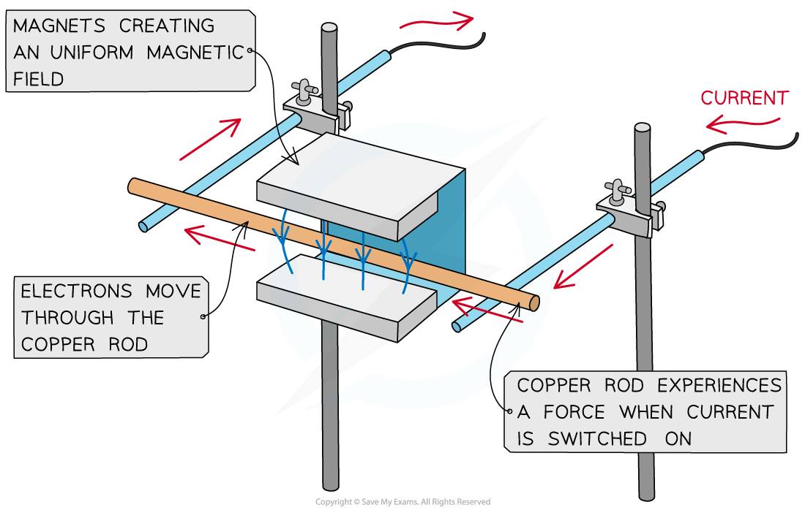
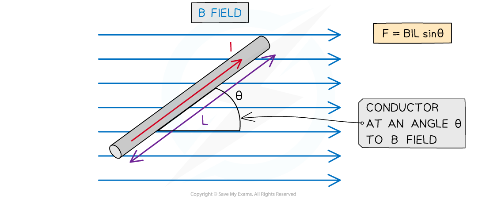
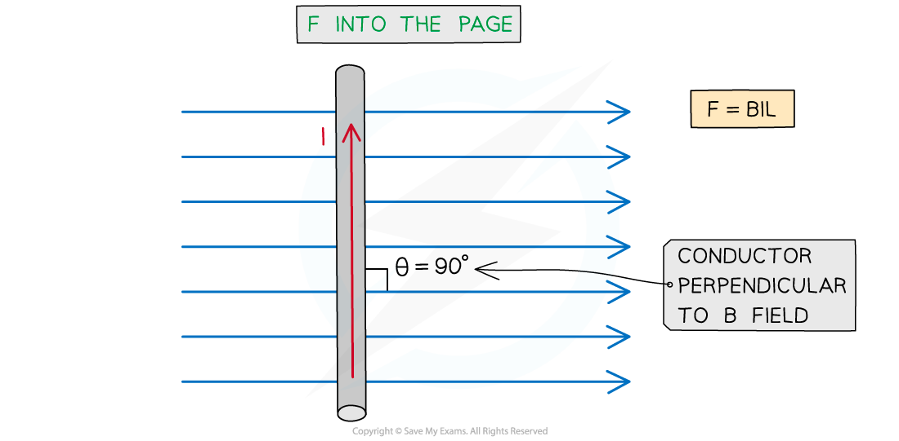

# Magnetic Force on a Current-Carrying Conductor

## Magnetic Force on a Current-Carrying Conductor

> **Spec point** — `spcpt_jq3q3SGR7YHqw3xf`

## Magnetic Force on a Current-Carrying Conductor

- A current-carrying conductor produces its own ***magnetic field***

  - An **external magnetic field **will therefore exert a **magnetic** **force** on it
- A current-carrying conductor (eg. a wire) will experience the **maximum** magnetic force if the current through it is **perpendicular **to the direction of the magnetic flux lines

  - A simple situation would be a copper rod placed within a uniform magnetic field
  - When current is passed through the copper rod, it experiences a **force** which makes it accelerate

***A copper rod moves within a magnetic field when current is passed through it***

- The force *F* on a conductor carrying current *I* in a magnetic field with flux density *B* is defined by the equation

***F***** = *****BIL***** sin *****θ***

- Where:

  - *F* = magnetic force on the current-carrying conductor (N)
  - *B* = magnetic flux density of external magnetic field (T)
  - *I* = current in the conductor (A)
  - *L* = length of the conductor in the field (m)
  - *θ* = angle between the conductor and external flux lines (degrees)

- This equation shows that the magnitude of the magnetic force *F* is **proportional **to:

  - Current *I*
  - Magnetic flux density *B*
  - Length of conductor in the field *L*
  - The sine of the angle *θ *between the conductor and the magnetic flux lines

***Magnitude of the force on a current carrying conductor depends on the angle of the conductor to the external B field***

- The **maximum** force occurs when sin θ = 1

  - This means θ = 90o and the conductor is **perpendicular **to the B field
  - This equation for the magnetic force now becomes:

***F***** = *****BIL***

- The **minimum** force (0) is when sin θ = 0

  - This means θ = 0o and the conductor is **parallel** to the B field
- It is important to note that a current-carrying conductor will experience **no** force if the current in the conductor is parallel to the field

> **Worked Example**
> A current of 0.87 A flows in a wire of length 1.4 m placed at 30o to a magnetic field of flux density 80 mT.
> 
> Calculate the force on the wire.
> 
> **Answer:**
> 
> **Step 1: Write down the known quantities**
> 
> - Magnetic flux density, *B* = 80 mT = 80 × 10-3 T
> - Current, *I* = 0.87 A
> - Length of wire, *L* = 1.4 m
> - Angle between the wire and the magnetic flux lines, *θ* = 30o
> 
> **Step 2: Write down the equation for the magnetic force on a current-carrying conductor**
> 
> *F* = *BIL* sin *θ*
> 
> **Step 3: Substitute in values and calculate**
> 
> *F* = (80 × 10-3) × (0.87) × (1.4) × sin (30) = 0.04872 = 0.049 N (2 s.f)

> **Exam Hint**
> Remember that the direction of current is the flow of **positive** charge (i.e. conventional current) and this is in the **opposite direction** to the flow of electrons (i.e. electron flow)!

## Fleming's Left Hand Rule for a Current-Carrying Conductor

> **Spec point** — `spcpt_VGMPZ8zqwk2kVbwc`

## Fleming's Left Hand Rule for a Current-Carrying Conductor

- Fleming's Left Hand Rule was previously used to determine the direction of the magnetic force on a moving **charged** **particle** in a magnetic field
- It can also be used to determine the direction of the magnetic force on a **current-carrying conductor** in a magnetic field

  - This is because inside a conductor (e.g. a wire) there are **many **charged particles flowing as a current

- As a reminder, the image representing Fleming's Left Hand Rule is shown below:

***Fleming's Left Hand Rule. Remember, current is the flow of conventional current (i.e. positive to negative)***

- Using the conventional symbols representing vectors like magnetic flux density ***B*** and force ***F*** that go into the page (arrows) or out of the page (dots) we can apply Fleming's Left Hand Rule to problems in 3D

> **Worked Example**
> A current flows perpendicularly to a uniform magnetic field as shown in the diagram below.
> 
> 
> 
> As a result, the conductor carrying the current experiences a magnetic force, *F*.
> 
> Determine the direction of the current flowing in the conductor.
> 
> **Answer:**
> 
> **Step 1: Apply the instructions for Fleming's Left Hand Rule**
> 
> - Using Fleming’s Left Hand Rule for the quantities given:
> 
> First finger is the magnetic field, *B* = into the page (or screen!)
> 
> Thumb is the direction of the magnetic force *F* = vertically downwards
> 
> **Step 2: Determine the direction of the conventional current**
> 
> - The first finger should be pointing into the page (or screen!) along the direction of the field
> - Rotating the entire hand allows the thumb to point downwards, along the direction of force
> - The second finger should be pointing towards the left of the page (or screen!)
> - This is the direction of conventional current in the wire, i.e., from **right to left**
> 
> 

> **Exam Hint**
> You will certainly need to apply Fleming's Left Hand Rule in your examination, at some point, whenever there is a current or charge flowing in a magnetic field. Remember, it is used to give the **direction** of either the magnetic force *F*, the magnetic field *B*, or the conventional current (or flow of positive charge) *I*.
> 
> As ever, you will gain more confidence twisting your arm in funny positions with three fingers at right-angles the more questions you practise: the more, the better!
