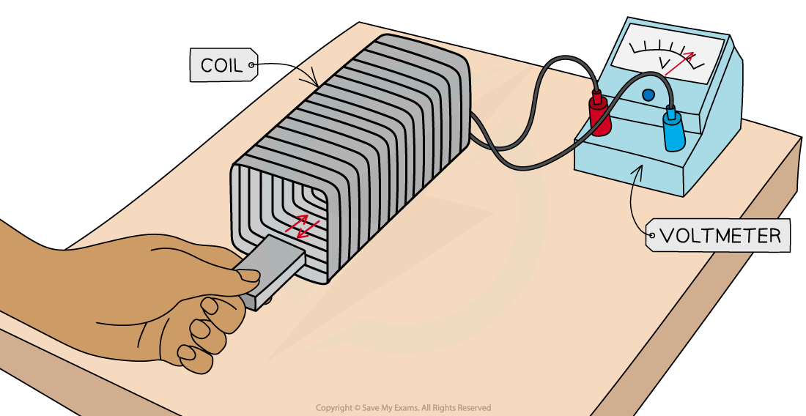
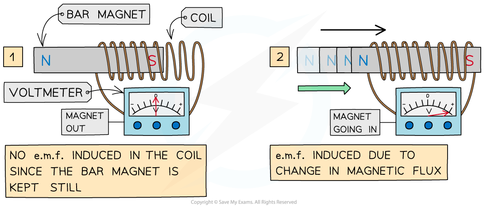
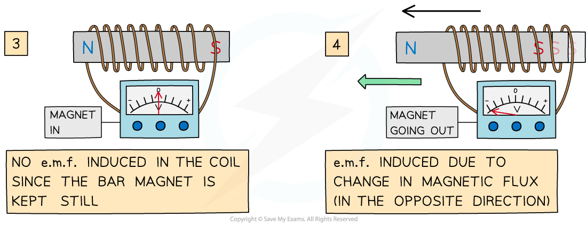
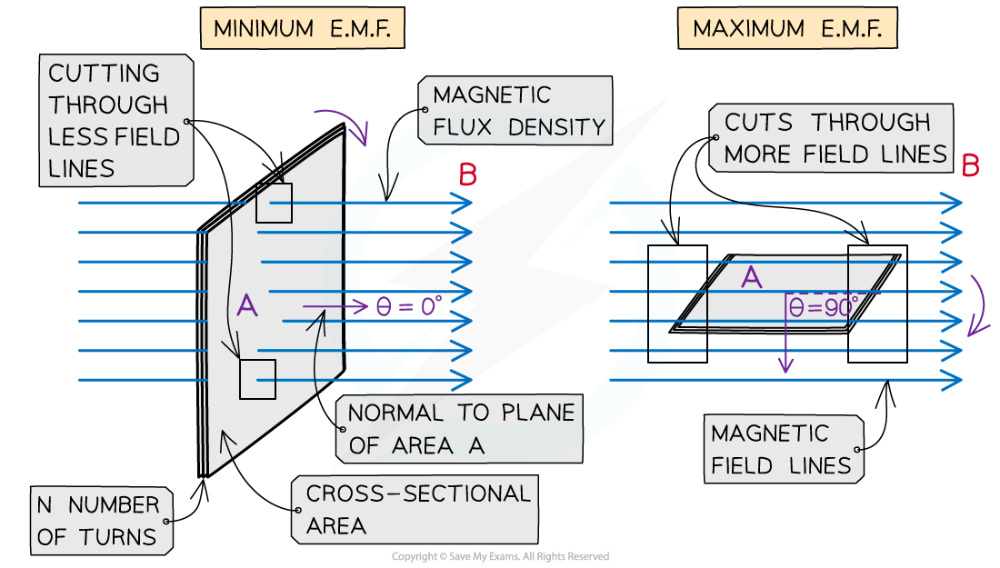

# Induced E.M.F in a Moving Coil

## Induced E.M.F in a Moving Coil

> **Spec point** — `spcpt_CbtrpKxNvT3kH9pW`

## Induced E.M.F in a Moving Coil

- Electromagnetic induction is a phenomenon which occurs when an *e.m.f* is induced when a conductor moves through a magnetic field
- If there is a change in ***magnetic flux***** **Φ or magnetic flux linkage *N*Φ

  - **Mechanical work **(from moving the conductor in the field) is transformed into **electrical energy**
- Therefore, if attached to a complete circuit, a current will be induced in the conductor
- This is known as **electromagnetic induction** and is defined as: **The process in which an e.m.f is induced in a closed circuit due to changes in magnetic flux (linkage)**
- This can occur either when:

  - A conductor cuts through a ***magnetic field***
  - The magnetic flux (linkage) through a coil changes, e.g. becomes more or less dense, or changes direction
- Electromagnetic induction is used in:

  - Electrical **generators** which convert mechanical energy to electrical energy
  - **Transformers** which are used in electrical power transmission
- This phenomenon can easily be demonstrated with a magnet and a coil, or a wire and two magnets

#### Relative Motion between a Coil and a Magnet

- When a coil is connected to a sensitive voltmeter, a bar magnet can be moved in and out of the coil to induce an e.m.f in the coil

***A bar magnet is moved through a coil connected to a voltmeter to induce an e.m.f***

The observations are:

- When the bar magnet is **not moving**, the voltmeter shows a** zero reading**

  - When the bar magnet is held still inside, or outside, the coil, the rate of change of flux is zero, so, there is **no e.m.f induced**
- When the bar magnet begins to move inside the coil, there is a reading on the voltmeter

  - As the bar magnet moves, its magnetic field lines ‘cut through’ the coil, generating a **change in magnetic flux **(ΔΦ)
  - This induces an **e.m.f** within the coil, shown momentarily by the reading on the voltmeter
- When the bar magnet is taken back out of the coil, an e.m.f is induced in the **opposite direction**

  - As the magnet changes direction, the direction of the current changes
  - The voltmeter will momentarily show a reading with the opposite sign
- Increasing the **speed** of the magnet induces an e.m.f with a **higher magnitude**

  - As the speed of the magnet increases, the rate of change of flux increases
- The direction of the electric current, and e.m.f, induced in the conductor is such that it **opposes** the change that produces it

***An e.m.f is induced only when the bar magnet is moving through the coil***

- Factors that will increase the induced e.m.f are:

  - Moving the magnet **faster** through the coil
  - Adding more **turns** to the coil
  - Increasing the **strength** of the bar magnet

#### Rotating Coils

- When a coil rotates in a uniform magnetic field, the **magnetic** **flux** through the coil will vary as it rotates
- Therefore, since the *flux linkage* through the coil also varies, this will induce an e.m.f that also varies

  - The maximum e.m.f is when the coil **cuts through** the most field lines
  - The varying e.m.f induced is called an **alternating** **voltage**

***Even though the flux linkage through the coil is maximum when θ = 0°, the change in flux linkage is minimal as the coil rotates, so the induced e.m.f is a minimum. The opposite is true when θ = 90°***

- Increasing the coil's frequency of rotation increases:

  - The **frequency** of the alternating voltage
  - The **amplitude** of the alternating voltage
