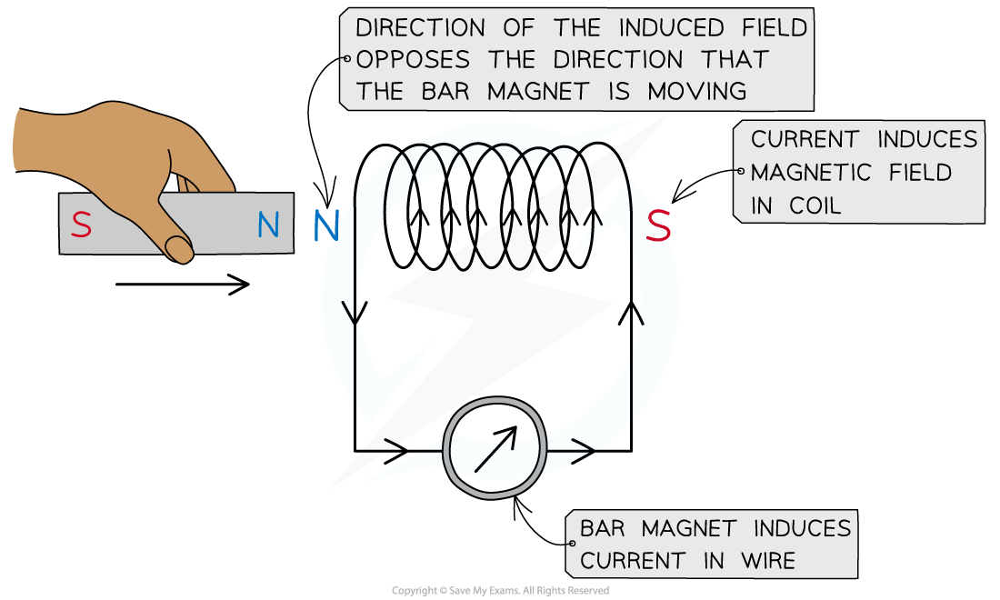

# Faraday & Lenz's Law

## Faraday & Lenz's Law

> **Spec point** — `spcpt_GvnKHzvQCwRQNjcc`

## Faraday and Lenz's Law

#### Faraday's Law

- Faraday's Law connects the **rate** of change of *flux linkage* with induced e.m.f
- It is defined in words as: **The magnitude of the induced e.m.f is directly proportional to the rate of change of magnetic flux linkage**
- Faraday's Law as an equation is defined as:

$ε=\frac{Δ(NΦ)}{Δt}$

- Where:

  - *ε* = induced *e.m.f* (V)
  - Δ(*N*ɸ) = change in *flux linkage* (Wb turns)
  - Δ*t* = time interval (s)

- If the interval of time becomes very small (i.e., in the limit of Δ*t* → 0) the equation for Faraday's Law can be written as:

$ε=\frac{d(NΦ)}{dt}$

#### Lenz's Law

- Lenz’s Law is used to predict the **direction** of an induced e.m.f in a coil or wire
- Lenz's Law is summarised below: **The induced e.m.f is set up in a direction to produce effects that oppose the change causing it**
- Lenz's Law can be experimentally verified using:

  - A bar magnet
  - A coil of wire
  - A sensitive ammeter

***Lenz’s law can be verified using a coil connected in series with a sensitive ammeter and a bar magnet***

- A known pole (either north or south) of a bar magnet is pushed into the coil

  - This induces an e.m.f in the coil
  - The induced e.m.f drives a current (because it is a complete circuit)
- Lenz's Law dictates:

  - The direction of the e.m.f, and hence the current, must be set up to **oppose** the incoming magnet
  - Since a **north pole** approaches the coil face, the e.m.f must be set up to create an induced **north pole**
  - This is because two north poles will **repel **each other

- The direction of the current is therefore as shown in the image above

  - The direction of current can be verified using the right hand grip rule
  - Fingers curl around the coil in the direction of current and the thumb points along the direction of the flux lines, from north to south
  - Therefore, the current flows in an anti-clockwise direction in the image shown, in order to induce a north pole opposing the incoming magnet

#### Combining Lenz's Law and Faraday's Law

- Combining Lenz's Law into the equation for Faraday's Law is written as:

$ε=-\frac{d(NΦ)}{dt}$

- The **negative** **sign** represents Lenz's Law

  - This is because it shows the induced e.m.f *ε *is set up in an '**opposite** **direction**' to oppose the changing flux linkage

- This equation also shows that the **gradient** of the graph of magnetic flux (linkage) against time, $\frac{Δ(NΦ)}{Δt}$ represents the **magnitude** of the induced e.m.f

  - Note: the negative sign means if the gradient is **positive**, the induced e.m.f is **negative**
  - This is again due to Lenz's Law, which says the e.m.f is set up to **oppose **the effects of the changing flux linkage

> **Worked Example**
> A small rectangular coil contains 350 turns of wire. The longer sides are 3.5 cm and the shorter sides are 1.4 cm.
> 
> 
> 
> The coil is held between the poles of a large magnet so that it can rotate about an axis through its centre. The magnet produces a uniform magnetic field of flux density 80 mT between its poles. The coil is positioned horizontally and then turned through an angle of 90° in a time of 0.18 s.
> 
> Calculate the magnitude of the average e.m.f induced in the coil.
> 
> **Answer:**
> 
> **Step 1: Write down the known quantities**
> 
> - Magnetic flux density, *B* = 80 mT = 80 × 10-3 T
> - Area, *A* = 3.5 × 1.4 = (3.5 × 10-2) × (1.4 × 10-2) = 4.9 × 10-4 m2
> - Number of turns, *N* = 350
> - Time interval, Δ*t* = 0.18 s
> 
> ** Step 2:** **Write out the equation for Faraday’s law:**
> 
> $ε=\frac{Δ(NΦ)}{Δt}$
> 
> **Step 3: Write out the equation for the change in flux linkage:**
> 
> - The number of turns *N* and the coil area *A* stay constant
> - The flux through the coil changes as it rotates
> - Therefore, the change in flux linkage can be written as:
> 
> Δ(*NΦ*) = *NA*(Δ*B*)
> 
> **Step 4: Determine the change in magnetic flux linkage**
> 
> - The initial flux through the coil is zero (flux lines are parallel to the coil face)
> - The final flux through the coil is 80 mT (flux lines are perpendicular to the coil face)
> - This is because the coil begins horizontally in the field and is rotated 90°
> - Therefore, the change in flux linkage is:
> 
> Δ(*NΦ*) = *NA*(Δ*B*) = 350 × (4.9 × 10-4) × (80 × 10-3) = 0.014 Wb turns
> 
> **Step 5: Substitute change in flux linkage and time into Faraday’s law equation:**
> 
> $ε=\frac{0.014}{0.18}$= 0.076 V

> **Exam Hint**
> The 'magnitude' of the e.m.f just means its size, rather than its direction. This is often what is required in exam questions, so the minus sign in Lenz's law is not necessarily required in calculations. However, you may be expected to explain the significance of the negative sign in the equation, so be prepared to interpret it as an expression of Lenz's Law!
> 
> Remember that 'd' and the greek letter delta, 'Δ', simply mean 'change in'.
