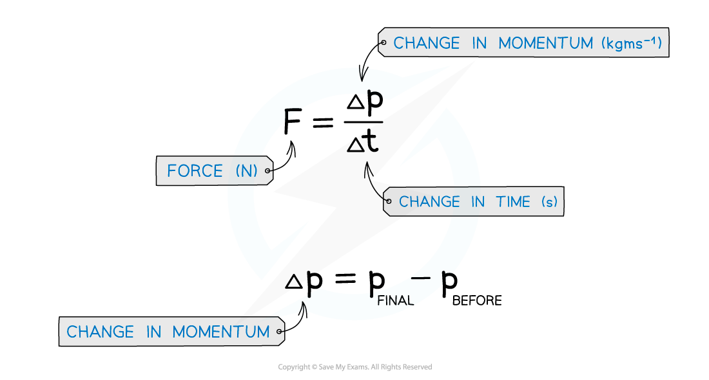
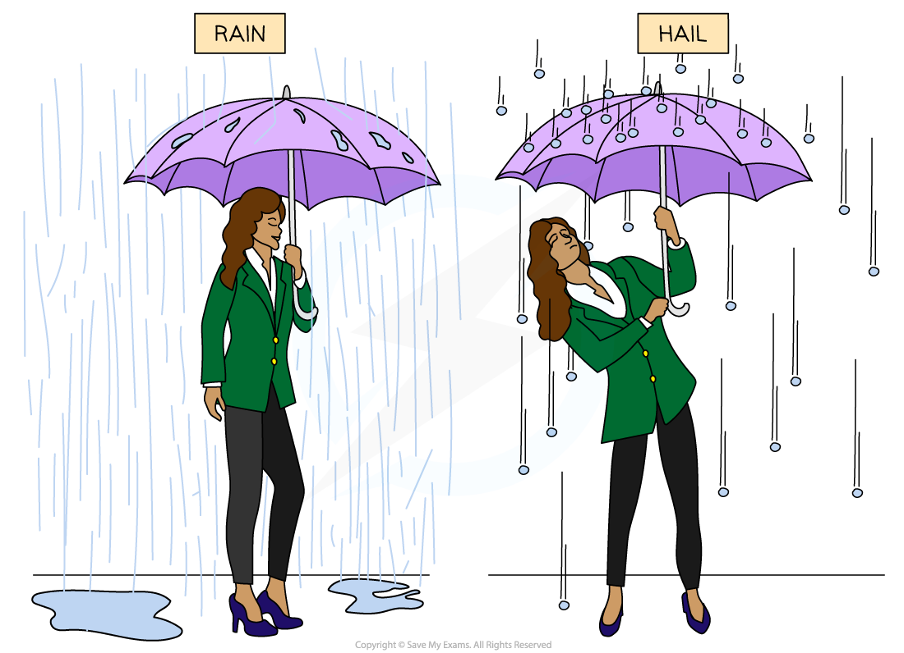

# Impulse

## Impulse

> **Spec point** — `spcpt_5VZMXb2bqjgsb66b`

## Impulse

- Force is defined as the** rate of change of momentum** on a body

  - The change in momentum is defined as the final momentum minus the initial momentum
- These can be expressed as follows:

#### Defining Impulse

- The force and momentum equation can be rearranged to find the **impulse of a force**
- Impulse, *I*, is equal to the **change in momentum: **

***I***** = *****FΔt***** = Δp =***** mv *****–***** mu***

- Where:

  - *I =* impulse (N s)
  - *F* = force (N)
  - *t = *time (s)
  - Δ*p* = change in momentum (kg m s–1)
  - *m* = mass (kg)
  - *v* = final velocity (m s–1)
  - u = initial velocity (m s–1)

- This equation is only used when the force is **constant**

  - Since the impulse is proportional to the force, it is also a vector
  - The impulse is in the same direction as the force
- The unit of impulse is **N s**
- The impulse quantifies the effect of a force acting over a time interval

  - This means a **small force acting over a long time** has the same effect as a **large force acting over a short time**

#### Examples of Impulse

- An example in everyday life of impulse is when standing under an umbrella when it is raining, compared to hail (frozen water droplets)

  - When rain hits an umbrella, the water droplets tend to splatter and fall off it and there is only a very **small** change in momentum
  - However, hailstones have a **larger mass** and tend to bounce back off the umbrella, creating a **greater** change in momentum
  - Therefore, the impulse on an umbrella is **greater** in hail than in rain
  - This means that **more force** is required to hold an umbrella upright in hail compared to rain

***Since hailstones bounce back off an umbrella, compared to water droplets from rain, there is a greater impulse on an umbrella in hail than in rain***

> **Worked Example**
> A 58 g tennis ball moving horizontally to the left at a speed of 30 m s–1 is struck by a tennis racket which returns the ball back to the right at 20 m s–1.
> 
> (i) Calculate the impulse delivered to the ball by the racket.
> 
> (ii) State which direction the impulse is in.
> 
> **Answer:**
> 
> **Part (i) **
> 
> **Step 1**: **Write the known quantities**
> 
> - Taking the initial direction of the ball as positive (the left)
> - Initial velocity, *u* = 30 m s–1
> - Final velocity, *v* = –20 m s–1
> - Mass, *m* = 58 g = 58 × 10–3 kg
> 
> **Step 2: Write down the impulse equation**
> 
> Impulse *I* = Δ*p* = *m*(*v* – *u*)
> 
> **Step 3: Substitute in the values**
> 
> *I* = (58 × 10–3) × (–20 – 30) = –2.9 N s
> 
> **Part (ii) **
> 
> **Direction of the impulse**
> 
> - Since the impulse is **negative**, it must be **in the opposite direction** to which the tennis ball was initial travelling (since the left is taken as positive)
> - Therefore, the direction of the impulse is **to the right**

> **Exam Hint**
> Remember that if an object changes direction, then this must be reflected by the change in sign of the velocity. As long as the magnitude is correct, the final sign for the impulse doesn't matter as long as it is consistent with which way you have considered positive (and negative). For example, if the left is taken as positive and therefore the right as negative, an impulse of 20 N s to the right is equal to -20 N s.
