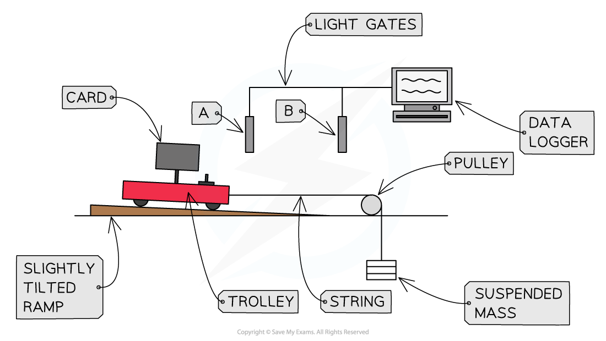
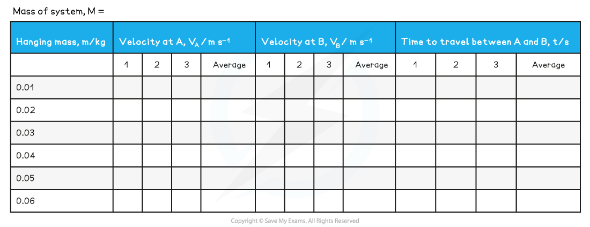
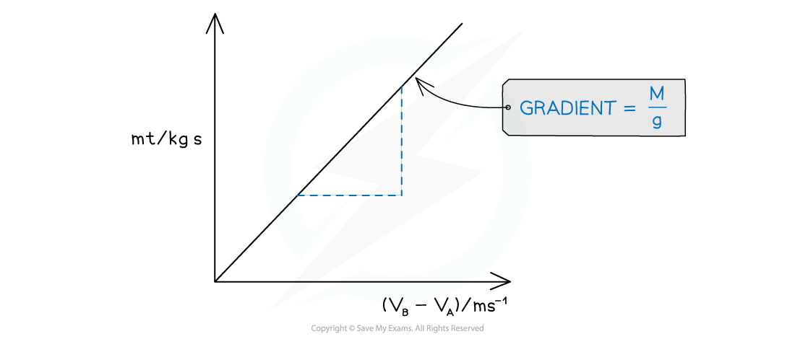

# Core Practical 9: Investigating Impulse

## Core Practical 9: Investigating Impulse

> **Spec point** — `spcpt_6Dttzmg957szTwtP`

## Core Practical 9: Investigating Impulse

#### Aims of the Experiment

- To determine the change in momentum of a trolley due to a force acting on it

  - This is known as the impulse

#### Variables

- *Independent variable* = accelerating mass, *m*
- *Dependent variable* = time taken to pass between two light gates, *t*
- Control variables

  - Overall mass of the system (trolley + accelerating masses)
  - Tilt angle of the ramp
  - Trolley and ramp used
  - Size of interrupter card

#### Equipment List

| **Apparatus** | **Purpose** |
|---|---|
| Dynamics trolley | Momentum change of the trolley is being investigated |
| Ramp, slightly tilted | For the trolley to travel down |
| Bench pulley | To pull trolley using the suspended masses |
| String | To connect the suspended mass and the trolley over the pulley |
| 5 slotted masses (10 g) and hanger | To create the force to accelerate the trolley |
| Light gates and computer or datalogger | To measure the time taken and velocity of the trolley passing through it |
| Balance | To measure the masses |
| Interrupt card | For the data logger to detect the motion of the trolley |

- *Resolution* of measuring equipment

  - Balance = 0.01 g

#### Method

1. Measure the total mass, *M*, of the trolley and the five 10 g masses using the balance

2. Set up the equipment:

- Secure the bench pulley to one end of the runway allowing one end to project over the end of the bench
- Tilt the ramp slightly

  - This is to compensate for friction
- Place the mass hanger (without the masses on them) on the floor and move the trolley backwards until the string becomes tight, with the mass on the floor
- Place the light gates at either end of the ramp

  - There should be enough space on the ramp to allow the trolley to clear the light gate at the bottom before hitting the pulley

3. Set the start position for the experiment

- Move the trolley further backwards until the mass hanger is closer to the pulley (it will fall to the floor as the trolley moves on the runway)
- Put the five 10 g masses on the trolley so that they will not slide off

4. Record the total hanging mass, *m* in the results table

5. Release the trolley and start the timing software

- The computer will record the velocity through each gate, and the the time taken for the trolley to travel between them
- Record the values in the results table

6. Repeat the readings and calculate the mean time and velocity for this value of *m*

7. Move one 10 g mass from the trolley to the hanger and repeat steps 4 and 5

- Repeat this process, moving one 10 g mass at a time
- The last reading is when all of the masses are on the hanger

#### Table of Results:

#### Analysing the Results

- The momentum of the trolley can be represented by two equations:

$Δp=M(v_{B}--v_{A})$ (equation 1)

- Where:

  - *Δp* = change in momentum (kg m s−1)
  - *M* = mass of the system (kg)
  - *v*B = velocity at light-gate B
  - *v*A = velocity at light-gate A

$Δp=mgt$ (equation 2)

- Where:

  - *m* = mass on the hanger (kg)
  - *g* = acceleration due to gravity, (9.81 m s−1)
  - *t = *time taken between light-gates A and B

- Combing equations 1 and 2 gives:

$mgt=M(v_{B}--v_{A})$

- This can be rearranged to give:

$mt=\frac{M}{g}(v_{B}-v_{A})$

- This is in the form of* y *=* mx *+* c*, where:

  - *y* = *mt*
  - *x* = (*v*B − *v*A)
  - *m* = $\frac{M}{g}$
  - *c *= 0

- Therefore, a graph can be plotted of *mt* against (*v*B − *v*A)

  - This should be a straight line graph to prove the relationship
  - The gradient should be equal to $\frac{M}{g}$

***A straight line with gradient M/g confirms the relationship between the variables***

#### Evaluating the Experiment

***Systematic errors:***

- The interrupt card may be a different width to that recorded in the data logger

  - Measure it three times and calculate an average value
- The interrupt card may not be of sufficient height to trigger the light gate

  - Move the light gates down, or use a taller card
- Mass of the system, *M*,* *may not be measured correctly

  - Measure it three times and calculate an average value
- The overall mass, *M*, of the system may not be kept constant

  - Ensure each hanging mass, *m*, which is removed is transferred to the trolley so the overall mass of the system (trolley + hanging masses) stays the same

***Random errors:***

- The trolley may not travel in a straight line

  - Discard this result
- The trolley may hit one of the light gates when passing through

  - Discard this result

#### Safety Considerations

- Stand well away from the masses in case they fall onto the floor
- Place a crash mat or any soft surface, such as a small cushion, under the masses to break their fall
- Keep liquids away from the data logger and other electronic equipment
- Make sure no other objects are obstructing the motion of the trolley throughout the experiment

> **Exam Hint**
> This practical can be completed with one light gate, where a card of known length, *L* is passed through a light gate. The time is recorded and *v* is found using $v=\frac{L}{t}$. The overall time is taken from the trolley at rest and the stop watch is started when the trolley is released.
> 
> A graph is then plotted as above, but with *v* not (vB − vA) on the x-axis as initial velocity is 0.
