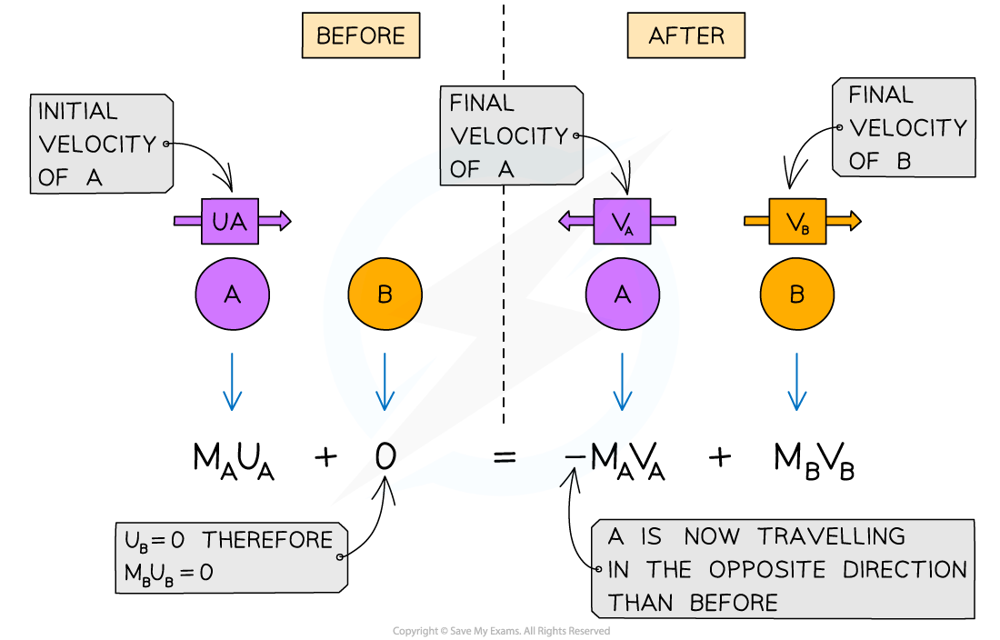
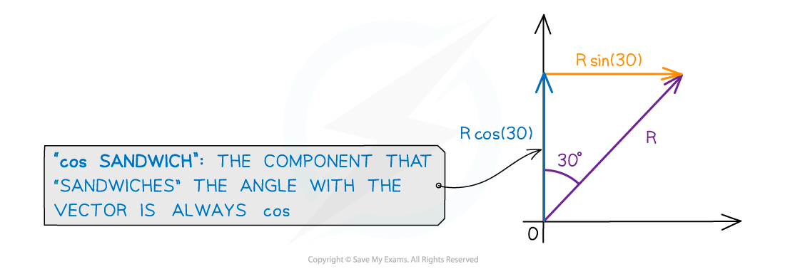

# Applying Conservation of Linear Momentum

## Applying Conservation of Linear Momentum

> **Spec point** — `spcpt_V2c8pWmTpqH74k6X`

## Applying Conservation of Linear Momentum

- The principle of conservation of linear momentum states:

**The total momentum before a collision = the total momentum after a collision provided no external force acts**

- Linear momentum is the momentum of an object that only moves in a straight line
- Momentum is a **vector** quantity

  - This means oppositely-directed vectors can cancel each other out, resulting in a net momentum of zero
  - If, after a collision, an object starts to move in the opposite direction to which it was initially travelling, its velocity will now be **negative**
- Momentum, just like energy, is** always conserved**

#### Conservation of Linear Momentum in 1D

***The conservation of momentum in 1D, for two objects A and B colliding then moving apart***

> **Worked Example**
> Trolley **A** of mass 0.80 kg collides head-on with stationary trolley **B** whilst travelling at 3.0 m s–1. Trolley **B** has twice the mass of trolley **A**. On impact, the trolleys stick together.
> 
> Using the conservation of momentum, calculate the common velocity of both trolleys after the collision.
> 
> **Answer:**
> 
> 

> **Exam Hint**
> Momentum is a **vector** quantity, therefore, you should always define a direction to be 'positive' when applying the principle of conservation of momentum. In this worked example, we implicitly took velocity 'to the right' as the positive direction.
> 
> Sometimes, however, you might encounter two objects moving **towards** each other before colliding. If both objects have the same mass *m* and speed *v*, then the total momentum (before collision) is **zero**, because *p*total = (*mv*) + (–*mv*) = 0. Note the negative sign indicates a body travelling in the opposite direction.

#### Conservation of Linear Momentum in 2D

- For objects moving in 2D, there are components of momentum to consider

  - This is similar to projectile motion in 2D, in which we consider horizontal and vertical components of motion

***Vector R***** *****split into its vertical, R cos (30) and horizontal, R sin (30), components***

- Each **component** of momentum is conserved separately

  - Since momentum is a vector, it can be **resolved** into horizontal and vertical components
  - The **sum** **of horizontal components** will be equal before and after a collision
  - The **sum of vertical components **will be equal before and after a collision

> **Worked Example**
> A red snooker ball, travelling at 2.5 m s–1, collides with a green snooker ball, which is at rest. Both snooker balls have the same mass *m*.
> 
> The angle of collision is such that the red ball moves off at 28° below the horizontal at 2.1 m s–1 and the green ball moves off at 55° above the horizontal, with a speed *v, *as shown.
> 
> 
> 
> Determine the size of *v*.
> 
> **Answer:**
> 
> **Step 1: Apply the conservation of linear momentum in both directions**
> 
> - Since no external forces act during the collision, momentum is conserved in both the:
> 
>   - horizontal direction (x)
>   - vertical direction (y)
> - This means that either of the following could be used:
> 
> Total **horizontal **momentum **before **= total **horizontal **momentum **after**
> 
> Total **vertical **momentum **before **= total **vertical **momentum **after**
> 
> **Step 2: Resolve the final velocities of the balls into components: **
> 
> - For the red ball
> 
>   - horizontal velocity = 2.1 cos 28°
>   - vertical velocity = -2.1 sin 28°
> - For the green ball
> 
>   - horizontal velocity = *v* cos 55°
>   - vertical velocity = *v* sin 55°
> 
> **Step 3: Set up a momentum equation in one of the directions**
> 
> - The equation will be simpler in the vertical direction since the total initial vertical momentum is zero
> 
> Total vertical momentum before = total vertical momentum after
> 
> $mu_{y\mathrm{red}}+mu_{y\mathrm{green}}=mv_{y\mathrm{red}}+mv_{y\mathrm{green}}$
> 
> `0 space plus space 0 space equals space m open parentheses negative 2.1 space sin space 28 degree close parentheses space plus space m open parentheses v space sin space 55 degree close parentheses`
> 
> $0=-2.1\mathrm{sin}28^{\circ}+v\mathrm{sin}55^{\circ}$
> 
> **Step 4: Simplify and rearrange to calculate *****v***
> 
> $v\mathrm{sin}55^{\circ}=2.1\mathrm{sin}28^{\circ}$
> 
> $v=\frac{2.1\mathrm{sin}28^{\circ}}{\mathrm{sin}55^{\circ}}=1.2ms^{-1}$

> **Exam Hint**
> Generally speaking, whenever you see any vector given at an angle to the horizontal or the vertical (e.g. velocity, or momentum), think "**resolve**"! It's extremely likely you will need to consider the separate components of motion for a projectiles question or for a conservation of momentum question.
> 
> Questions which ask you to use the principle of conservation of linear momentum in 2D are usually worth a lot of marks, so make sure you practise lots of questions involving resolving vectors!
