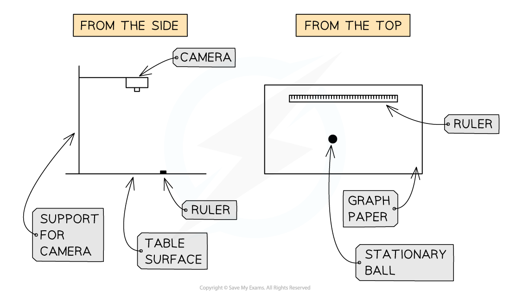
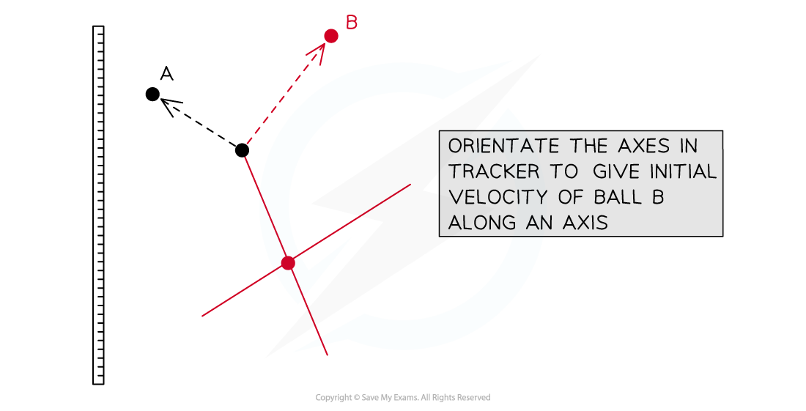
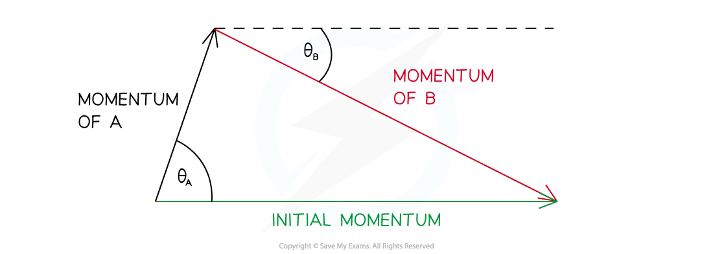

# Core Practical 10: Investigating Collisions using ICT

## Core Practical 10: Investigating Collisions using ICT

> **Spec point** — `spcpt_KVvY6KnsHTRgyPvy`

## Core Practical 10: Investigating Collisions using ICT

#### Aims of the Experiment

- To investigate conservation of momentum in two directions

  - Considering if collisions are elastic
  - Constructing a diagram of 2D collisions
- Use of ICT software is required

  - 'Tracker' is recommended by Edexcel

#### Equipment List

- Small spheres

  - Of two different diameters (ball bearings are ideal)
- Digital camera able to record video

  - Support to allow it to be positioned directly above the collision
- Computer with *Tracker *installed
- 30 cm ruler
- Micrometer or calipers
- Balance
- Graph paper

#### Method

1. Measure the mass of the spheres using the balance and record

2. Measure the diameter of the spheres using a micrometer or Vernier calipers

3. Mark an approximately central point on the graph paper

- This will be where the stationary sphere is placed

4. Start the camera recording

5. Within the area of the graph paper, roll a sphere into the stationary one

6. Replace the stationary sphere in its initial place and repeat the experiment up to three times

- A slightly different angle of approach should be used for each collision

7. Download the video file from the camera to the computer that runs *Tracker *

- Load the clip into the program.

#### Analysing the Results

- Use *Tracker *to analyse the video clips.

  - Input the mass and diameter of each sphere when prompted
  - Use the ‘velocity overlay’ feature so that the software can analyse velocities
- The *Tracker *software allows for frame-by-frame analysis of the movement of the spheres

  - Orientate the axes to make the velocity of the moving ball along one of the axes
  - Record the momentum of each ball as indicated in *Tracker*

- Construct a vector diagram from the results

#### Evaluating the Experiment

- ICT is used in this experiment because

  - The events happen to swiftly for the unaided eye to take readings
  - ICT generally provides more precise and reliable data

***Systematic errors:***

- Parallax error from camera to the table
- The precision of the balance may give a wide range of possible values for mass

  - If possible use a more precise balance
- The spheres may have damage

  - Check there is no damage to the surface of each sphere before using

- The *Tracker *axes may not be correctly aligned when analysing

***Random errors:***

- The collision event may happen between frames
- From variations in the table surface

  - This could cause loss or gain of kinetic energy due to friction or slopes
- The sphere may not travel far enough to hit the second stationary sphere

  - Discard this result and release with greater initial velocity

> **Exam Hint**
> It can be helpful to practice a few collisions before making your final readings. This will help you become familiar with how fast to release the sphere.
