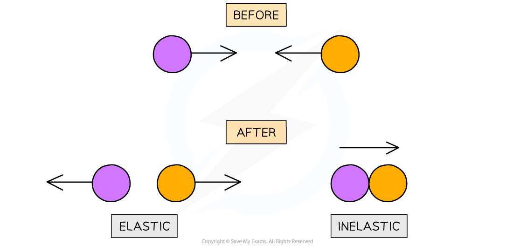

# Elastic & Inelastic Collisions

## Elastic & Inelastic Collisions

> **Spec point** — `spcpt_d2F46fV9w627sCK7`

## Elastic & Inelastic Collisions

- In both collisions and explosions, momentum is **always** conserved
- However, **kinetic energy** might not always be
- A collision (or explosion) is either:

  - **Elastic** – if the kinetic energy **is** conserved
  - **Inelastic** – if the kinetic energy is **not** conserved

- Collisions happen when objects strike against each other

  - **Elastic** collisions are commonly those where objects colliding do not stick together; instead, they strike each other then **move away in opposite directions**
  - **Inelastic** collisions are commonly those where objects collide and **stick together** after the collision

***Elastic collisions are those following which objects move away in opposite directions. Inelastic collisions are where two objects stick together***

- An explosion is commonly to do with **recoil**

  - For example, a gun recoiling after shooting a bullet or an unstable nucleus emitting an alpha particle and a daughter nucleus
- To find out whether a collision is elastic or inelastic, **compare the kinetic energy before and after the collision**
- The equation for kinetic energy is:

> **Worked Example**
> Trolley A of mass 0.80 kg collides head-on with stationary trolley B at speed 3.0 m s–1. Trolley B has twice the mass of trolley A.
> 
> The trolleys stick together and travel at a velocity of 1.0 m s–1. Determine whether this is an elastic or inelastic collision.
> 
> **Answer:**
> 
> 
> 
> 

> **Worked Example**
> Discuss whether a head-on collision between two cars is likely to be an elastic or inelastic collision.
> 
> **Answer:**
> 
> **Step 1: Define an elastic and inelastic collision**
> 
> - An elastic collision is one in which kinetic energy is conserved
> - An inelastic collision is one in which kinetic energy is not conserved, but is transferred to other forms, e.g. heat and sound
> 
> **Step 2: Describe the effects of head-on car collisions**
> 
> - When cars collide, a large amount of kinetic energy is transferred due to work by internal forces
> - This is mainly due to **crumpling **where the collision of the car causes **plastic defamation** of the car's bodywork
> - Other energy transfers will include kinetic energy into **heat **and **sound**
> 
> **Step 3: Link the effects to energy transfers**
> 
> - Since the cars are brought to rest by the collision, the total KE before the collision does not equal the total KE after
> - Therefore, the collision is inelastic

> **Exam Hint**
> If an object is stationary or at rest, its velocity equals **0**, therefore, the momentum and kinetic energy are also equal to 0.
> 
> When a collision occurs in which two objects stick together, treat the final object as a single object with a mass equal to the **sum** of the two individual objects.
