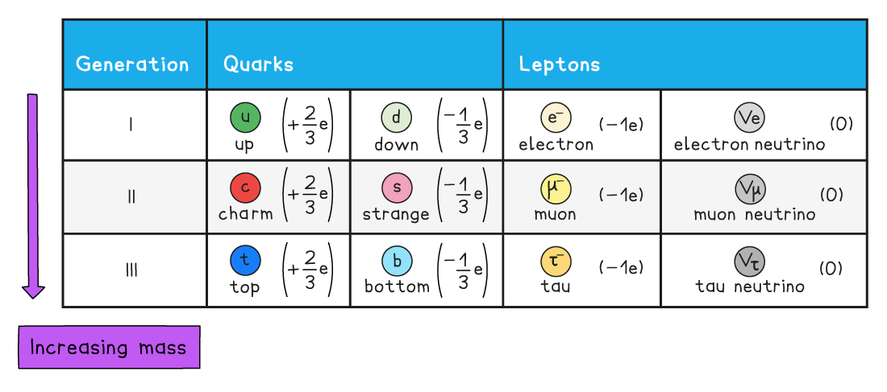
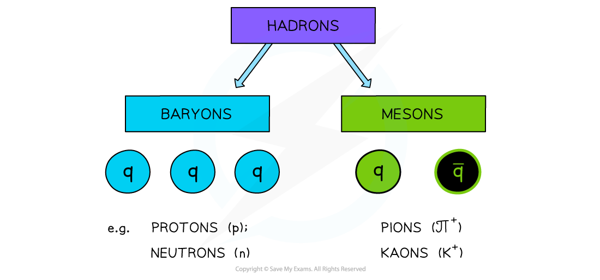
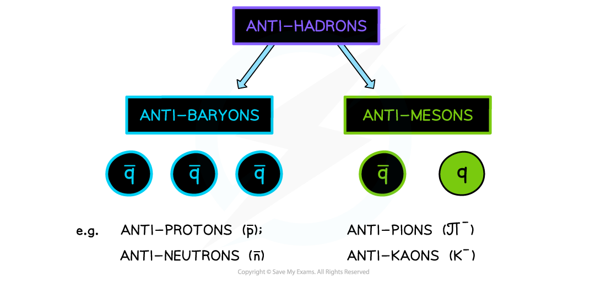
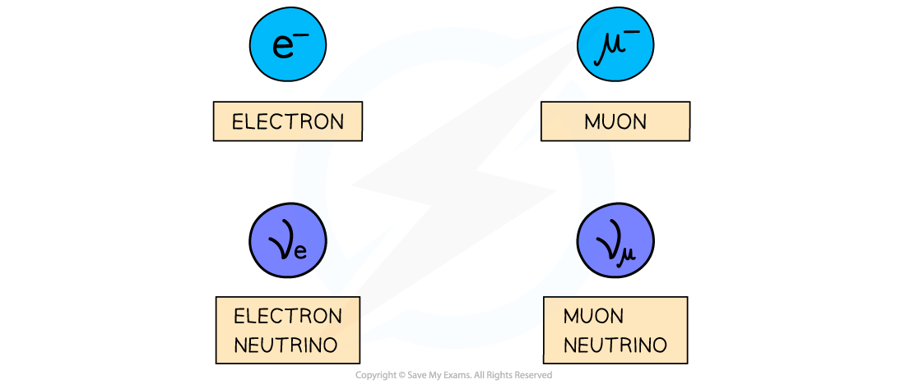
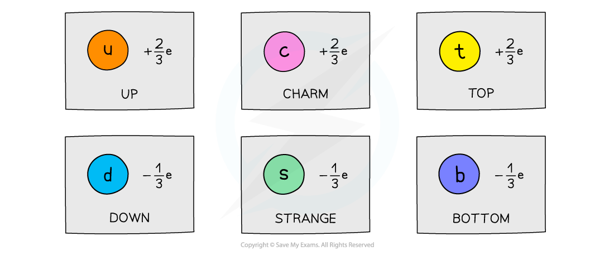
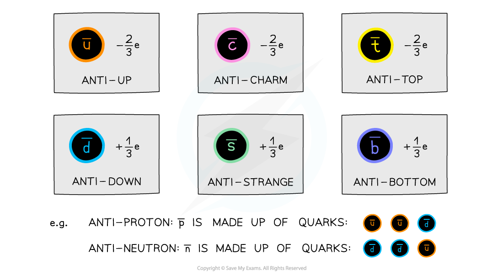

# The Standard Model

## Baryons & Mesons

> **Spec point** — `spcpt_wdc86xgGDdvwCsVH`

## Baryons & Mesons

- All particles of **matter** are made up of either **quarks** and/or **leptons**

  - The **standard** **model** of particle physics categorises quarks and leptons by charge and mass

***Quarks and leptons form the standard model of particle physics. The first generation of particles make up all ordinary matter***

- **Hadrons **are made up of **quarks **and interact with the **strong nuclear force**
- **Baryons** and **mesons** are types of hadron

  - **Baryons **consist of **3 quarks**
  - **Mesons **consist of a **quark-antiquark pair**
- The most common baryons are protons and neutrons
- The most common mesons are pions and kaons

***Hadrons may be either a baryon or a meson. Both baryons and mesons interact with the strong nuclear force***

***Anti-hadrons may be either an anti-baryon or an anti-meson***

- Quarks have never been discovered on their own, always in pairs or groups of three
- Note that all baryons or mesons have integer (whole number) charges eg. +1e, -2e etc.
- This means quarks in a baryon are either all quarks or all anti–quarks. Combination of quarks and anti–quarks don’t exist in a baryon

  - e.g. 
- The anti–particle of a meson is still a quark and anti–quark pair. The difference being the quark becomes the anti–quark and vice versa

> **Worked Example**
> The baryon Δ++ was discovered in a particle accelerator using accelerated positive pions on hydrogen targets.
> 
> Which of the following is the quark combination of this particle?
> 
> 
> 
> 

> **Exam Hint**
> - Remembering quark combinations is useful for the exam
> - However, as long as you can remember the charges for each quark, it is easy to figure out the combination by making sure the combination of quarks adds up to the total charge of the particle (just like in the worked example!)

## Leptons & Photons

> **Spec point** — `spcpt_JVXMkS9p733BzQjx`

## Leptons & Photons

#### Leptons

- **Leptons **are a group of **fundamental** (elementary) particles

  - This means they are not made up of any other particles (no quarks)
- Leptons interact with other particles via the **weak**, **electromagnetic **or **gravitational **interactions

  - Unlike hadrons (baryons & mesons), leptons **do** **not** interact via the strong nuclear force

- The most common leptons are:

  - The electron, e–
  - The electron neutrino, ve
  - The muon, μ–
  - The muon neutrino, vμ

***The most common leptons are the electron and muon, along with their associated neutrinos***

- The muon is similar to the electron but is 200 times more **massive**
- Electrons and muons **both **have a charge of -1*e*
- Electrons have a mass of 0.0005 u
- Muons have a mass of 0.11 u
- Neutrinos are the most abundant leptons in the universe and have** no charge **and** negligible **mass (almost 0)
- Although quarks are fundamental particles too, they are not classed as leptons

> **Worked Example**
> Circle all the anti-leptons in the following decay equation.
> 
> 
> 
> **Answer:**
> 
> 

#### Photons

- Photons are a group of particles which mediate the **electromagnetic interaction**

  - They are **uncharged**
  - They have zero **mass**

- They are sometimes called "exchange bosons" because they mediate one of the fundamental forces (electromagnetism)

  - For example, the electrostatic repulsion between two electrons is understood in terms of **exchanging photons **

> **Exam Hint**
> In some topics, you may need to use the **energy** of a photon. This is given by the equation *E* = *hf* = $\frac{hc}{λ}$.

## Symmetry of the Standard Model

> **Spec point** — `spcpt_GNSBQyxxXgFQVQMs`

## Symmetry of the Standard Model

- The first four quarks discovered were:

  - The up quark
  - The down quark
  - The strange quark
  - The charm quark

- The **symmetry **of the standard model predicted a **third generation** of particles, namely the **top **and **bottom **quark

  - Experiments were carried out to discover these, and eventually they were found as predicted
- Therefore, the three generations of quarks are and their respectively charges are:

***The three generations of quarks. e is the charge of an electron.***

- They each have their own anti-quark, which has the opposite charge

***Three generations of anti-quarks. These have the same properties as the quarks except opposite charges.***

> **Exam Hint**
> You will **not **be expected to describe the strong nuclear force in your exam, but you **should** understand that photon is the exchange particle for the electromagnetic force and that it has zero charge and mass.
