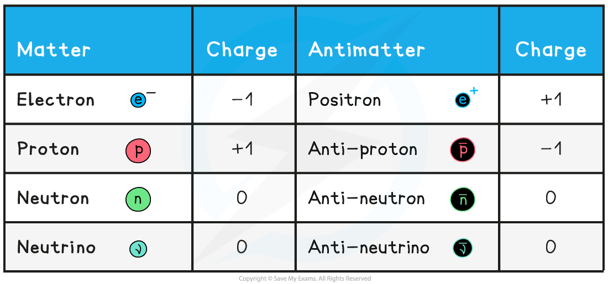
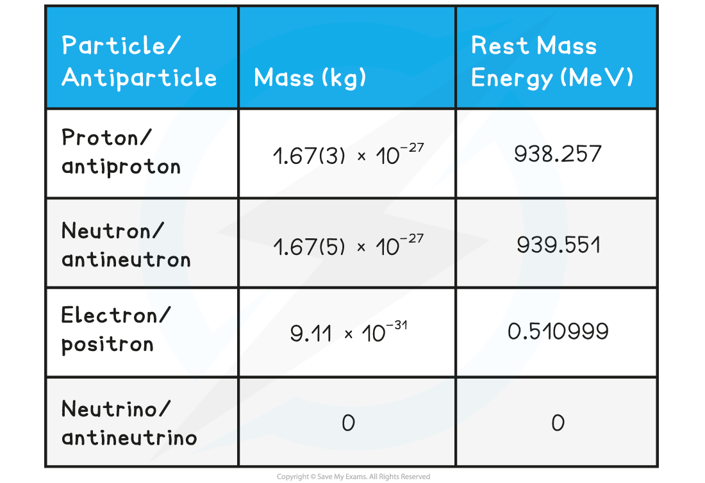

# Antimatter

## Properties of Antimatter

> **Spec point** — `spcpt_srvBNzdz6nH2ZJw3`

## Properties of Antimatter

- The universe is made up of **matter** particles (protons, neutrons, electrons etc.)
- All matter particles have antimatter counterparts

  - Antimatter particles are **identical** to their matter counterpart but with the **opposite** charge
- This means if a particle is positive, its antimatter particle is negative and vice versa
- Common matter-antimatter pairs are shown in the diagram below:

***This table summarises the electric charge for typical particle-antiparticle pairs***

- Apart from electrons, the corresponding antiparticle pair has the same name with the prefix **‘anti-’ **and a line above the corresponding matter particle symbol
- A neutral particle, such as a neutron or neutrino or photon, **is its own antiparticle**

#### Mass of Matter & Antimatter

- Although antimatter particles have the opposite charges to their matter counterparts, they still have **identical mass and rest mass-energy**

  - The rest mass-energy of a particle is the energy equivalent to the mass of the particle at rest

***This table summarises typical particle-antiparticle pair masses and rest mass energies***

> **Exam Hint**
> Though you will not need to memorise individual masses or rest-mass energies, you are expected to remember the mass of a particle-antiparticle pair is **identical **but they have the **opposite** electric charge.
