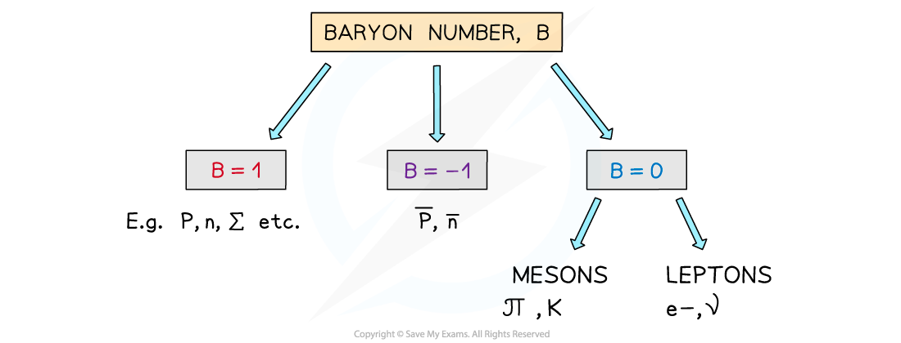

# Conservation Laws in Particle Physics

## Applying Conservation Laws

> **Spec point** — `spcpt_rxb3mhy7ZDzr3ZsX`

## Applying Conservation Laws

- When particles interact, they must obey a set of laws associated to the type of particles involved

  - These laws are governed by numbers called **quantum numbers**

- Quantum numbers that are **always conserved **(i.e., they are the same before and after an interaction) are:

  - Charge, *Q*
  - Baryon number, *B*
  - Lepton number, *L*

- Using these quantum numbers, physicists are able to determine whether certain interactions are **possible** or not

  - In other words, an interaction that does **not** conserve charge, baryon or lepton number is **not allowed** by the laws of physics

#### Conservation of Charge

- The charge of a particle ***Q****,* is the charge carried by that particle

  - Protons have a charge ***Q*** **= +1**
  - Electrons have a charge ***Q***** = –1**
  - Up quarks have a charge ***Q***** = +2/3**
  - Neutral particles, like photons and neutrinos, have a charge ***Q***** = 0**

#### Conservation of Baryon Number

- The baryon number, ***B***, is the number of baryons in an interaction
- ***B*** depends on whether the particle is a baryon, anti-baryon or neither

  - Baryons have a baryon number ***B***** = +1**
  - Anti-baryons have a baryon number ***B***** = –1**
  - Particles that are not baryons have a baryon number ***B***** = 0**

***The baryon number of a particle depends if it is a baryon, anti–baryon or neither ***

- The up (u), down (d) and strange (s) quark have a baryon number of 1/3 each
- This means that the anti–up, anti–down and anti–strange quarks have a baryon number of –1/3 each
- **Note:** The baryon number of each quark is provided on the datasheet

- The implication of this is that baryons are made up of all quarks and anti-baryons are made up of all anti-quarks
- There are no baryons (yet) that have a combination of quarks and anti-quarks e.g. up, anti-down, down
- The reason being that this would equate to a baryon number that is not a whole number (integer)

#### Conservation of Lepton Number

- Similar to baryon number, the lepton number,*** L*** is the number of leptons in an interaction
- ***L*** depends on whether the particle is a lepton, anti-lepton or neither

  - Leptons have a lepton number ***L*** = +1
  - Anti-leptons have a lepton number*** L*** = –1
  - Particles that are not leptons have a lepton number*** L*** = 0

- Lepton number is a quantum number and is conserved in all interactions
- This is helpful for knowing whether an interaction is able to happen

***The lepton number depends on if the particle is a lepton, anti-lepton, or neither***

> **Worked Example**
> Show that baryon number is conserved in β– decay.
> 
> **Answer:**
> 
> 

> **Worked Example**
> If the lepton number is conserved in the following decay, identify whether particle X should be a neutrino or anti-neutrino
> 
> 
> 
> **Answer:**
> 
> **Step 1: Determine the lepton number of all the particles on both sides of the equation**
> 
> - 0 + (–1) = 0 + X
> 
> **Step 2: Identify the lepton number of X**
> 
> - If the lepton number must be conserved, X must also have a lepton number of –1
> 
> **Step 3: State the identity of particle X**
> 
> - Particle X is an anti-neutrino

> **Exam Hint**
> Identifying the charge, baryon number or lepton number of an unknown particle can be some of the easiest questions if the correct values for each particle are memorised! The most common mistake is thinking that the electron has a lepton number of –1 because it's charge is negative, it has a lepton number of +1 and it's the **positron** that has a lepton number of -1.
