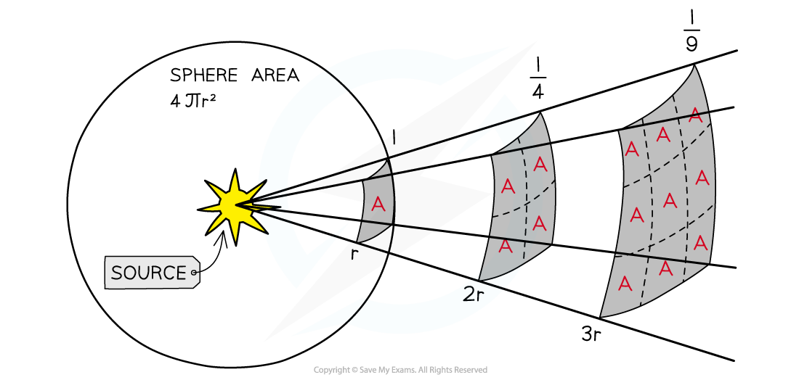

# Inverse Square Law of Flux

## Inverse Square Law of Flux

> **Spec point** — `spcpt_G9JySwvHJhkSv4JC`

## Inverse Square Law of Flux

- The moment the light leaves the surface of the star, it begins to spread out uniformly through a spherical shell

  - Light sources which are further away appear fainter because the emitted light has been spread over a greater area
- The surface area of a sphere is equal to **4πr****2**

  - The radius *r* of this sphere is equal to the distance *d* between the star and the Earth
  - Therefore the radiation received at Earth has been spread over an area of 4πd2

- The inverse square law of flux can therefore be calculated using:

$F=\frac{L}{4πd^{2}}$

- Where:

  - *F* = radiant flux intensity, or observed intensity on Earth (W m-2)
  - *L* = *luminosity* of the source (W)
  - *d* = distance between the star and the Earth (m)
- This equation assumes:

  - The power from the star radiates uniformly through space
  - No radiation is absorbed between the star and the Earth

- This equation tells us:

  - For a given star, the luminosity is constant
  - The radiant flux follows an inverse square law
  - The greater the radiant flux (larger *F*) measured, the closer the star is to the Earth (smaller *d*)

***Inverse square law; when the light is twice as far away, it has spread over four times the area, hence the intensity is four times smaller***

> **Worked Example**
> A star has a luminosity that is known to be 4.8 × 1029 W. A scientist observing this star finds that the radiant flux intensity of light received on Earth from the star is 2.6 nW m–2. Determine the distance of the star from Earth.
> 
> **Answer:**
> 
> **Step 1: Write down the known quantities**
> 
> Luminosity, *L* = 4.8 × 1029 W
> 
> Radiant flux intensity, *F* = 2.6 nW m–2 = 2.6 × 10–9 W m–2
> 
> ** Step 2: Write down the inverse square law of flux**
> 
> $F=\frac{L}{4πd^{2}}$
> 
> **Step 3: Rearrange for distance *****d*****, and calculate**
> 
> $d=\sqrt{\frac{L}{4πF}}=\sqrt{\frac{4.8\times10^{29}}{4π\times(2.6\times10^{-9})}}=3.8\times10^{18}m$
