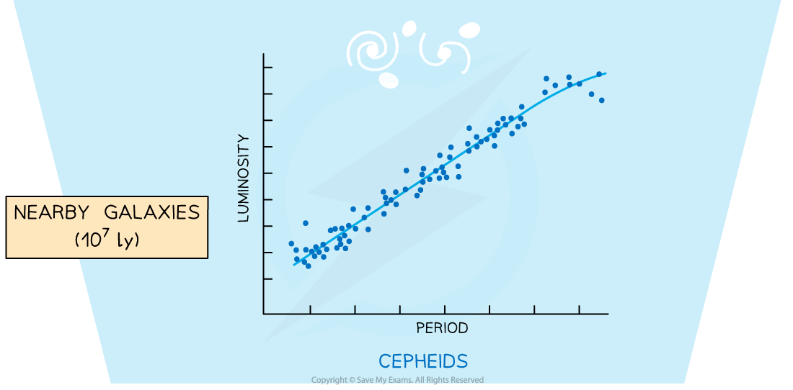
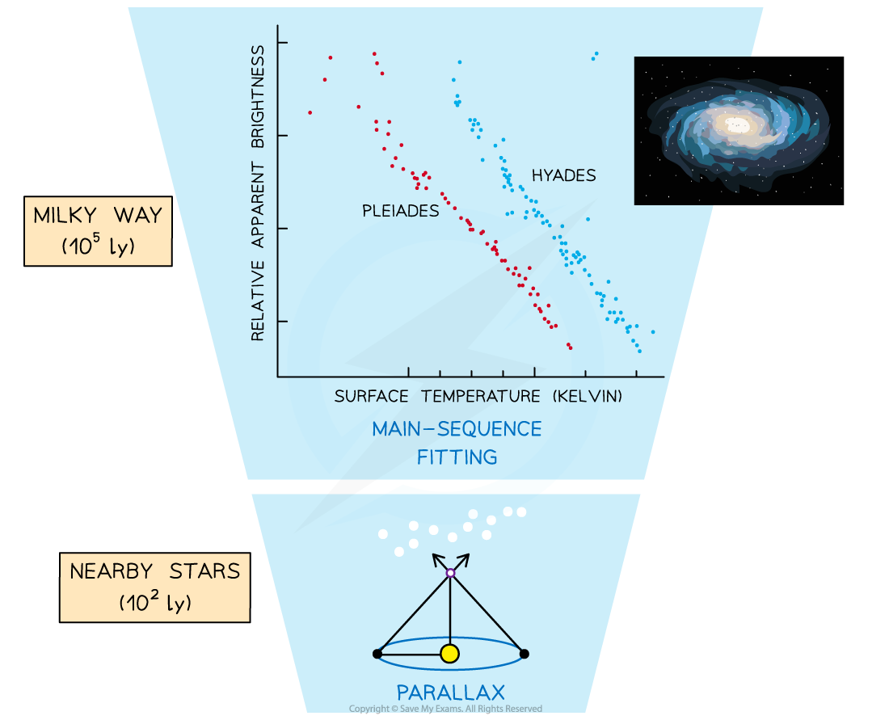
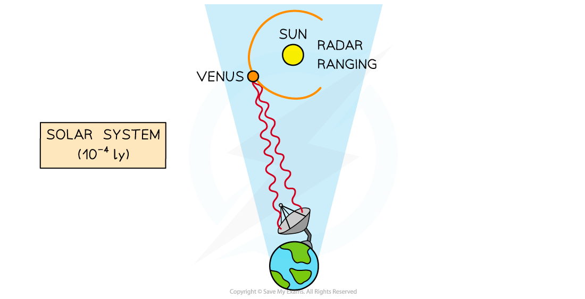

# Standard Candles

## Determining Distance using Standard Candles

> **Spec point** — `spcpt_gCwFXgxqc8mQbTwT`

## Determining distance using standard candles

#### Standard Candles

- A standard candle is defined as: ***An astronomical object which has a known luminosity due to a characteristic quality possessed by that class of object***
- Examples of standard candles are:
- Cepheid variable stars

  - A type of pulsating star which increases and decreases in brightness over a set time period
  - This variation has a well defined relationship to the luminosity
- Type 1a supernovae

  - A *supernova* explosion involving a white dwarf
  - The luminosity at the time of the explosion is always the same

#### Determining distances using standard candles

- Measuring astronomical distances accurately is an extremely difficult task
- A direct distance measurement is only possible if the object is close enough to the Earth
- For more distant objects, indirect methods must be used - this is where standard candles come in useful
- If the *luminosity* of a source is known, then the distance can be estimated based on how bright it appears from Earth

  - Astronomers measure the *radiant flux intensity*, of the electromagnetic radiation arriving at the Earth
  - Since the luminosity is known (as the object is a standard candle), the distance can be calculated using the *inverse square law of flux*
- Each standard candle method can measure distances within a certain range
- Collating the data and measurements from each method allows astronomers to build up a larger picture of the scale of the universe

  - This is known as the **cosmic distance ladder**

***A combination of methods involving standard candles allows astronomers to build up a cosmic distance ladder from nearby stars to distant galaxies***
