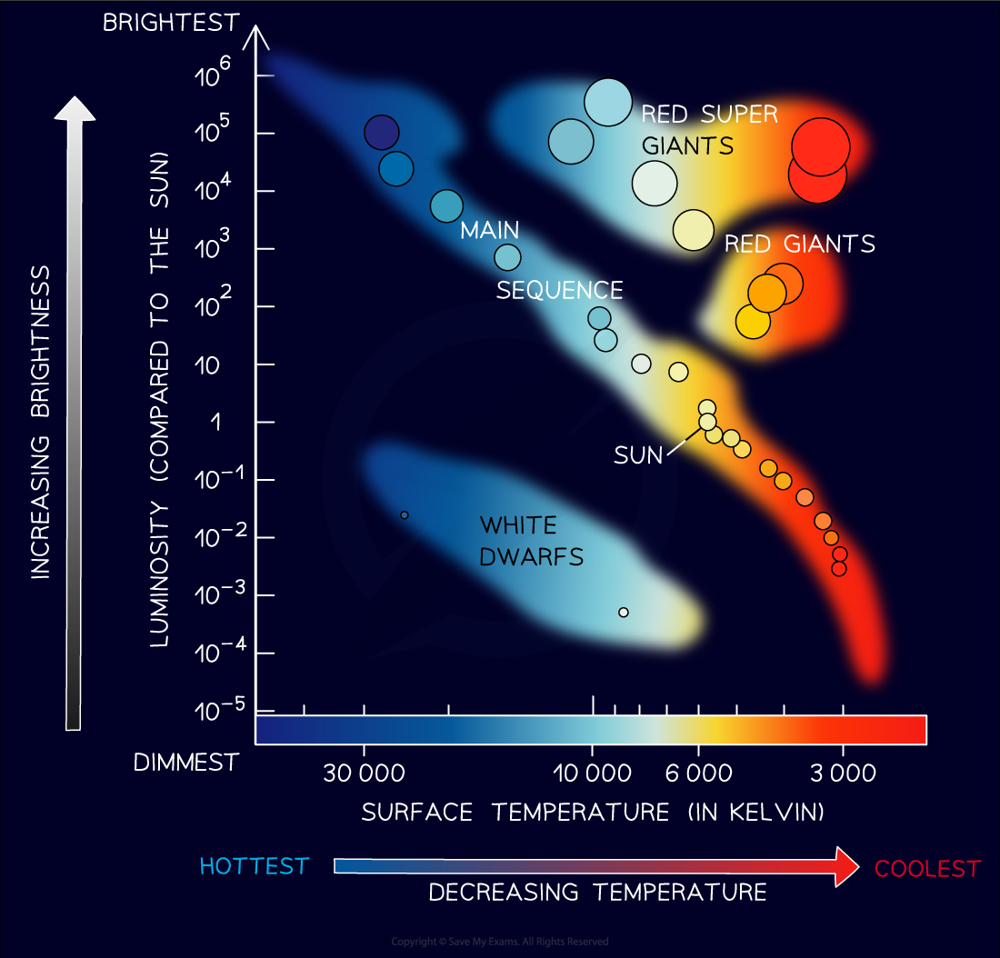

# The Hertzsprung-Russell Diagram

## The Hertzsprung-Russell Diagram

> **Spec point** — `spcpt_pPRkNsMNC8vHZg7z`

## The Hertzsprung - Russell Diagram

- Danish astronomer Ejnar Hertzsprung, and American astronomer Henry Noris Russell, independently plotted the** *****luminosity***** **of different stars against their **temperature**

  - Luminosity relative to the Sun, on the y-axis, goes from dim (at the bottom) to bright (at the top)
  - Temperature in degrees kelvin, on the x-axis, goes from **hot** (on the left) **to cool** (on the right)

***The Hertzsprung-Russell Diagram***

- Hertzsprung and Russel found that the stars clustered in **distinct areas**
- Most stars are clustered in a band called the **main sequence**

  - For main sequence stars, luminosity increases with surface temperature
- A smaller number of stars clustered above the main sequence in two areas, **red giants,** and **red super giants**

  - These stars show an increase in luminosity at cooler temperatures
  - The only explanation for this is that these stars are much **larger** than main sequence stars
- Below and to the left of the main sequence are the **white dwarf stars**

  - These stars are hot, but not very luminous
  - Therefore, they must be much **smaller** than main sequence stars
- The Hertzsprung-Russell Diagram only shows stars that are in **stable phases**

  - Transitory phases happen quickly in relation to the lifetime of a star
  - Black holes cannot be seen since they emit no light

> **Worked Example**
> Stars can be classified using the Hertzsprung-Russell Diagram.
> 
> 
> 
> (a) State the types of stars found in areas A, B, C and D.
> 
> (b) Star X has a surface temperature of 20 000 K and a luminosity 10 000 times greater than the Sun. Plot star X’s place on the Hertzsprung-Russell diagram and label it Star X.
> 
> **Answer:**
> 
> **Part (a)**
> 
> **Step 1: Identify the main sequence on the Hertzsprung-Russell diagram**
> 
> - The main sequence is the long band diagonally central to the diagram where the majority of stars are found
> 
>   - The main sequence is region** B**
> 
> **Step 2: Identify the white dwarf region on the HR diagram**
> 
> - White dwarf stars are hot, but not very luminous
> - Identify the area with a **lower luminosity** than the main sequence
> 
>   - The white dwarf region is area **A**
> 
> **Step 3: Identify the red giant and red supergiant regions on the HR diagram**
> 
> - Red giants and super red giants have a greater luminosity than main sequence stars at a lower temperature
> - Super red giants are **more luminous** than the red giants and will appear **above** them on the graph
> 
>   - The super red giant region is area **C**
>   - The red giant region is area **D**
> 
> **Part (b)**
> 
> **Step 1: List the known quantities given in part b**
> 
> - Surface temperature of Star X = 20 000 K
> - Luminosity of Star X = 10 000 times that of the Sun
> 
> **Step 2: Use the graph to find the value for the luminosity of the Sun**
> 
> - Use a ruler and pencil to draw a line from the position of the Sun to the luminosity axis (y-axis)
> - The Sun’s luminosity on this scale is 1 because the luminosities given are relative to the luminosity of the Sun
> 
> 
> 
> **Step 3: Calculate the luminosity of Star X**
> 
> - Star X is 10 000 times that of the Sun
> - The luminosity of the Sun is 1
> 
> 10 000 × 1 = 10 000 or 104
> 
> **Step 4: Plot the position of Star X on the HR diagram**
> 
> - Locate the surface temperature of Star X at 20 000 K
> - Locate the luminosity of Star X at 104  
> 
>   - Plot the point and label it star X

> **Exam Hint**
> The worked example is testing your ability to identify the distinct areas of the Hertzsprung-Russell diagram out of context.
> 
> When sketching for your revision notes practice considering what each region of the diagram describes in terms of temperature and luminosity and linking those descriptions to your knowledge of different types of stars.
