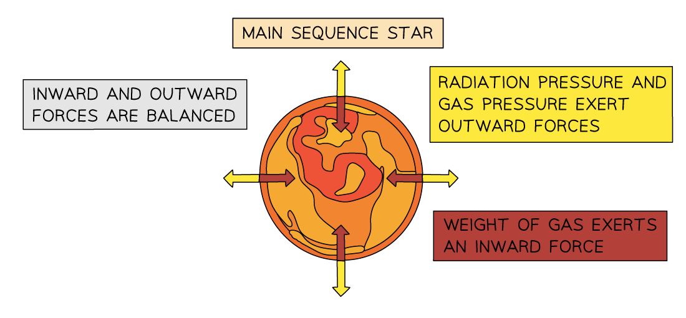
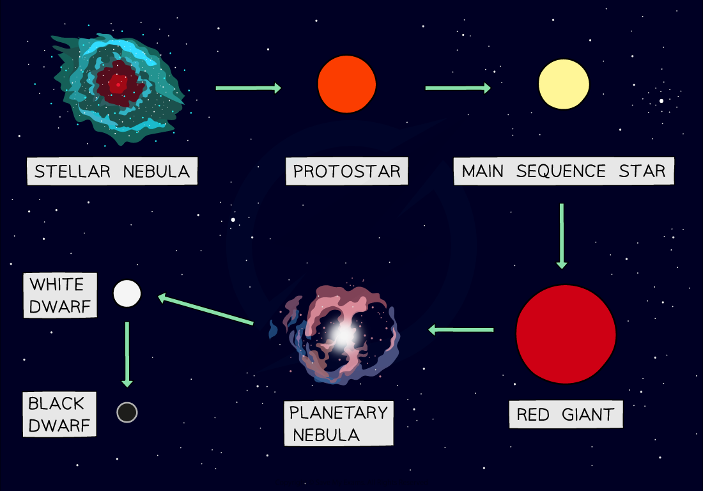
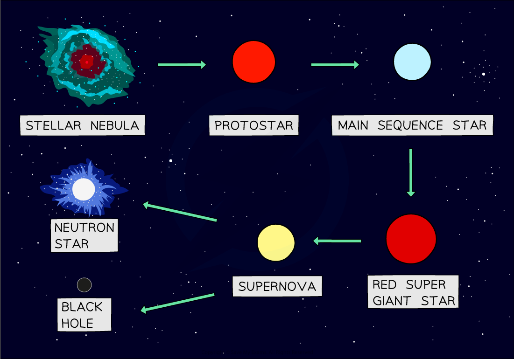

# The Life Cycle of Stars

## The Life Cycle of Stars

> **Spec point** — `spcpt_KDynqgyx5Dh4w6WQ`

## The Life Cycle of Stars

- The life cycle of stars follows a series of predictable stages
- The exact route a star's development takes depends on its **initial mass**

#### Initial Stages for All Masses

- The first four stages in the life cycle of stars are the same for stars of all masses
- After these stages, the life-cycle branches depending on whether the star is:

  - **Low mass**: stars with a mass **less** than about 8 times the mass of the Sun (< 8 MSun)
  - **High mass**: stars with a mass **more** than about 8 times the mass of the Sun (> 8 MSun)

#### 1. Nebula

- All stars form from a giant cloud of **hydrogen gas** and **dust **called a **nebula**

  - **Gravitational attraction** between individual atoms forms denser clumps of matter
  - This inward movement of matter is called **gravitational collapse**

#### 2. Protostar

- The gravitational collapse causes the gas to heat up and glow, forming a **protostar**

  - Work done on the particles of gas and dust by collisions between them causes an increase in their kinetic energy, and therefore, temperature
  - Protostars can be detected by telescopes that can observe **infrared radiation**

#### 3. Nuclear Fusion

- Eventually the temperature will reach millions of ***degrees Kelvin*** and the fusion of hydrogen nuclei to helium nuclei begins

  - The protostar’s gravitational field continues to attract more gas and dust, increasing the temperature and pressure of the core
  - With more frequent collisions, the kinetic energy of the particles increases, increasing the probability that fusion will occur

#### 4. Main Sequence Star

- The star reaches a **stable state** where the inward and outward **forces** are in **equilibrium**

  - As the temperature of the star increases and its volume decreases due to gravitational collapse, the **gas pressure** increases
- A star will spend most of its life on the **main sequence**

  - 90% of stars are on the main sequence
  - Main sequence stars can vary in mass from ~10% of the mass of the Sun to 200 times the mass of the Sun
  - The Sun has been on the main sequence for 4.6 billion years and will remain there for an estimated 6.5 billion years

#### Next Stages for Low Mass Stars

- The fate of a star beyond the main sequence depends on its **mass**

  - The cut-off point is about **8 times the mass of the Sun**
  - A star is classed as a low-mass star if it has a mass less than about 8 times the mass of the Sun
  - A low-mass star will become a **red giant** before turning into a **white dwarf**

#### 5. Red Giant

- Hydrogen fuelling the star begins to run out

  - Most of the hydrogen nuclei in the core of the star have been fused into helium
  - *Nuclear fusion*** slows**
  - Energy released by fusion decreases
- The star initially shrinks and then swells and cools to form a **red giant**
- Fusion continues in the **shell** around the core

#### 6. Planetary Nebula

- The **outer layers** of the star are** released**

  - Core helium burning releases massive amounts of energy in the fusion reactions

#### 7. White Dwarf

- The solid **core collapses** under its own mass, leaving a very hot, dense core called a **white dwarf**

***The lifecycle of a low mass star***

#### Next Stages for Massive Stars

#### 5. Red Super Giant

- The star follows the same process as the formation of a red giant

  - The **shell burning** and **core burning** cycle in massive stars goes beyond that of low-mass stars, fusing elements up to** iron**

#### 6. Supernova

- The iron core collapses
- The outer shell is blown out in an explosive **supernova**

#### 7. Neutron Star (or Black Hole)

- After the supernova explosion, the collapsed **neutron core** can remain intact, having formed a **neutron star**

  - If the neutron core mass is greater than 3 times the solar mass, the pressure on the core becomes so great that the core collapses and produces a **black hole**

***Lifecycle of massive stars***

> **Worked Example**
> Stars less massive than our Sun will leave the main sequence and become red giants.
> 
> Describe and explain the next stages of evolution for such stars.
> 
> **Answer:**
> 
> **Step 1: Underline the command words**
> 
> - **Describe** questions require details of the processes occurring
> - **Explain** questions require details of how and why those processes occur
> 
>   - This question requires **both**
> 
> **Step 2: Identify the mass of the star **
> 
> - The stars in the question are less massive than the Sun; therefore, it is referring to **low-mass stars**
> 
> **Step 3: Identify the stage of life cycle being asked about **
> 
> - The question asks for the **next** stage of evolution after **becoming** a red giant
> - It requires an explanation of the processes **during** the red giant phase
> 
> **Step 4: Plan the answer**
> 
> - Make a list of the remaining stages in the evolution of a low-mass star
> 
>   - Red giant
>   - Planetary nebula
>   - White dwarf
> - Add to the list any important points or key words that need to be included in the answer
> 
>   - Red giant
>   
>     - Fuel runs out
>     - Forces no longer balanced
>     - Expands and cools
>     - Fusion continues in shell
>   - Planetary nebula
>   
>     - Carbon-oxygen core not hot enough for further fusion
>     - Outer layers released
>   - White dwarf
>   
>     - Core collapses and leaves remnant core
> 
> **Step 5: Begin writing the answer using words from the question stem**
> 
> - Low-mass stars will leave the main sequence and become red giants…
> 
> **Step 6: Use the plan to keep the answer concise and logically sequenced**
> 
> - Low-mass stars leave the main sequence and become red giants when the hydrogen in the core runs out.
> - Reduced energy released by fusion leads to radiation pressure decreasing
> 
>   - Radiation pressure and gas pressure no longer balance the gravitational pressure, and the core collapses
>   - Fusion no longer takes place inside the core.
> - The outer layers expand and cool to form a red giant
> - Temperatures generated by the collapsing core are high enough for fusion to occur in the shell around the core
> 
>   - Contraction of the core produces temperatures great enough for the fusion of helium into carbon and oxygen inside the core
>   - The carbon-oxygen core is not hot enough for further fusion, so the core collapses
> - The outer layers are ejected forming a planetary nebula
> - The remnant core remains intact leaving a hot, dense, solid core called a white dwarf

> **Worked Example**
> Describe the evolution of a star much more massive than our Sun from its formation to its eventual death.
> 
> **Answer:**
> 
> **Step 1: Underline the command word**
> 
> - Underline the command word ‘describe’
> - A **describe** question does **not **need you to **explain why** the processes happen, but you do need to go into detail about what happens in each stage
> 
> **Step 2: Identify the mass of the star**
> 
> - The star in the question is more massive than the Sun; therefore, it is referring to **high-mass stars**
> 
> **Step 3: Identify the stage of life cycle being asked about **
> 
> - This question is about the whole life cycle from formation to death
> - The common first five steps are needed, and then the steps which only apply to massive stars
> 
> **Step 4: Plan the answer**
> 
> - Use the white space around the question to plan your answer
> - List the stages that a massive star goes through; this will help you form your answer in a logical sequence of events
> 
>   - Nebula
>   - Protostar
>   - Nuclear fusion
>   - Main sequence
>   - Red supergiant
>   - Supernova
>   - Neutron star/black hole
> 
> **Step 5: Add to the list any important points or key words that need to be included for each stage**
> 
> - Nebula – gravitational collapse
> - Protostar – heats up and glows
> - Nuclear fusion – H to He generates energy
> - Main sequence – stable, forces balanced
> - Red supergiant – expands and cools
> - Supernova – core collapses
> - Neutron star/black hole – remnants
> 
> **Step 6: Begin writing the answer using words from the question stem to begin**
> 
> - A star more massive than our Sun will form from…
> 
> **Step 7: Use the plan to keep the answer concise and logically sequenced**
> 
> - A star more massive than our Sun will form from clouds of gas and dust called a nebula
> - The gravitational collapse of matter increases the temperature of the cloud, causing it to glow - this is a protostar
> - Nuclear fusion of hydrogen nuclei to helium nuclei generates massive amounts of energy
> - The outward radiation pressure and gas pressure balance the inward gravitational pressure, and the star becomes stable, entering the main sequence stage
> - When the hydrogen runs out, the outer layers of the star expand and cool, forming a red supergiant
> - Eventually, the core collapses, and the star explodes in a supernova
> - The remnant core either remains intact, forming a neutron star, or the core collapses further, resulting in a black hole
