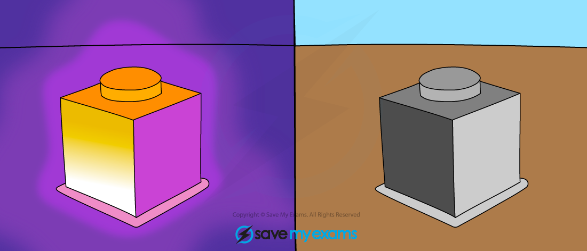
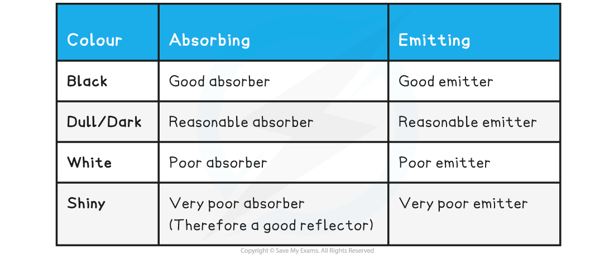
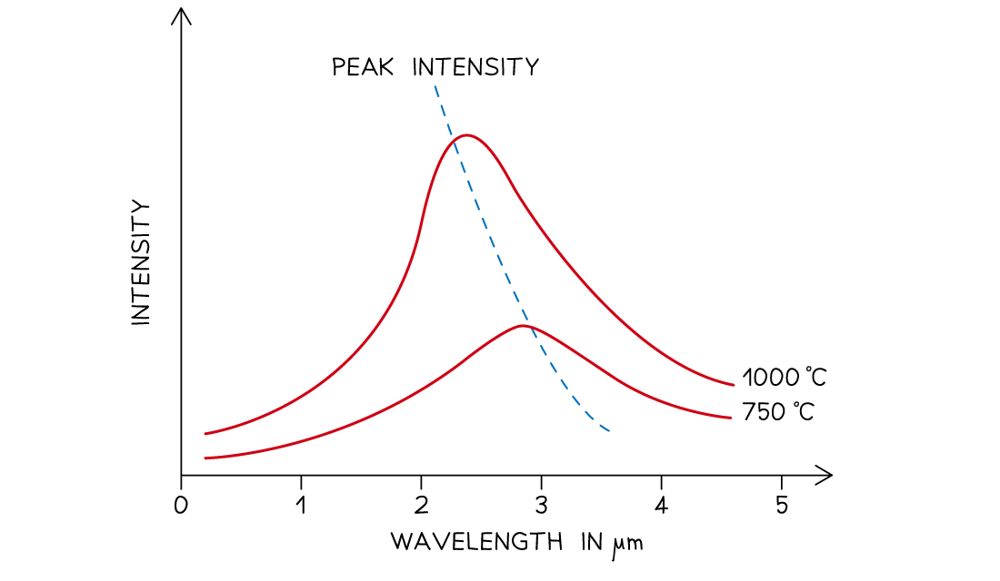
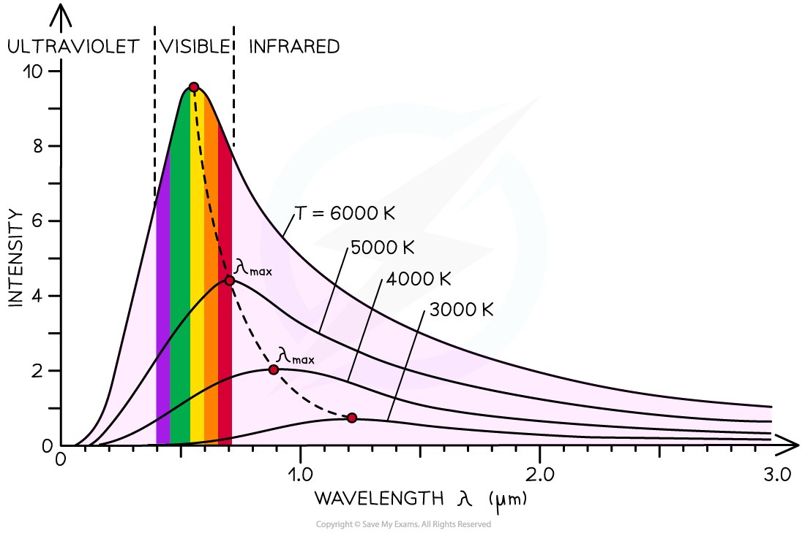

# Black Body Radiation

## Black Body Radiation

> **Spec point** — `spcpt_p64jDc7r6xbTcmPK`

## Black Body Radiation

- Black body radiation is the name given to the **thermal radiation** emitted by all bodies (objects)
- All objects, no matter what temperature, emit black body radiation in the form of electromagnetic waves
- These electromagnetic waves usually lie in the **infrared** region of the spectrum but could be emitted in the form of visible light or other wavelengths, depending on the temperature
- The **hotter** object, the **more** infrared radiation it radiates in a given time

***The infrared emitted from a hot object can be detected using a special camera***

- A perfect black body is defined as: **An object that absorbs (or emits) all of the radiation incident on it and does not reflect or transmit any radiation**
- Since a good absorber is also a good emitter, a perfect black body would be the best possible emitter too
- As a result, an object which perfectly absorbs all radiation will be black

  - This is because the colour black is what is seen when **all** colours from the visible light spectrum are absorbed

**Absorption and Emission For Different Colours Table**

## Black Body Radiation Curves

> **Spec point** — `spcpt_4wWq2NK2Xg9JyNxv`

## Black Body Radiation Curves

- All bodies (objects) emit a spectrum of thermal radiation in the form of electromagnetic waves
- The **intensity** and **wavelength** distribution of any emitted waves depends on the **temperature** of the body
- This is represented on a black body radiation curve

  - As the temperature increases, the peak of the curve moves

***Black body spectrum for objects of different temperatures***

- From the electromagnetic spectrum, waves with a **smaller** wavelength have **higher **energy (e.g. UV rays, X-rays)
- When an object gets hotter, the amount of **thermal radiation** it emits increases

  - This increases the thermal energy emitted and therefore the **wavelength** of the emitted radiation **decreases**

- An ideal black body radiator is one that **absorbs and emits all wavelengths**

  - This idealised black body is a theoretical object
  - However, **stars **are the best approximation there is
- The radiation emitted from a black body has a **characteristic spectrum** that is determined by the temperature alone

***The intensity-wavelength graph shows how thermodynamic temperature links to the peak wavelength for four different bodies***
