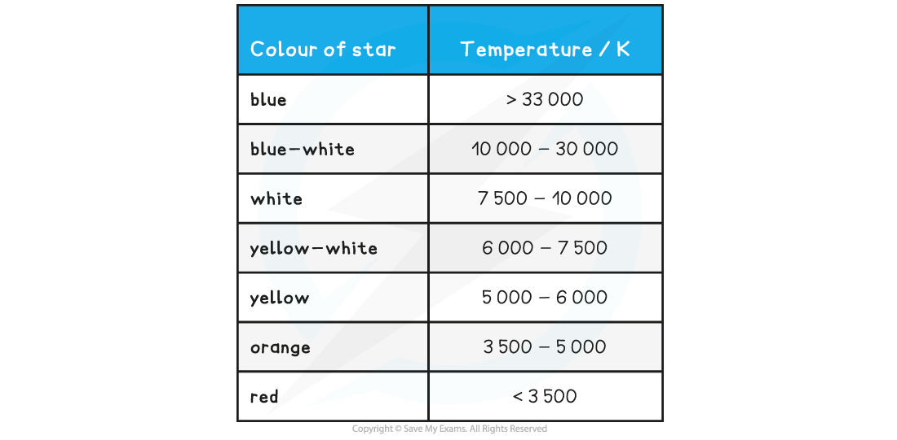

# Wien’s Law

## Wien’s Law

> **Spec point** — `spcpt_xvmVG95NSf663d9S`

## Wien's Law

- Wien’s displacement law relates the observed wavelength of light from an object to its surface temperature, it states: **The black body radiation curve for different temperatures peaks at a wavelength that is inversely proportional to the temperature**
- This relation can be written as:

- λmax is the maximum wavelength (m) emitted by an object at the peak intensity
- *T *is the surface temperature (K) of an object

- Wien's Law equation is given by:

**λ****max****T = 2.9 × 10****−3**** m K**

- This equation tells us the higher the temperature of a body:

  - The shorter the wavelength at the peak intensity, so **hotter** objects tend to be **white or blue,** and **cooler** objects tend to be **red or yellow**
  - The greater the intensity of the radiation at each wavelength

**Table to compare surface temperature and star colour**

> **Worked Example**
> The spectrum of the star Rigel in the constellation of Orion peaks at a wavelength of 263 nm, while the spectrum of the star Betelgeuse peaks at a wavelength of 828 nm. Which of these two stars is cooler, Betelgeuse or Rigel?
> 
> **Answer:**
> 
> **Step 1:** **Write down Wien’s displacement law**
> 
> λmaxT = 2.9 × 10-3 m K
> 
> **Step 2: Rearrange for temperature T**
> 
> 
> 
> **Step 3:** **Calculate the surface temperature of each star**
> 
> 
> 
> 
> 
> **Step 4: Write a concluding sentence**
> 
> Betelgeuse has a surface temperature of 3500 K, therefore, it is much cooler than Rigel
> 
> 
> 
> ***The Orion Constellation; cooler stars, such as Betelguese, appear red or yellow, while hotter stars, such as Rigel, appear white or blue***

> **Exam Hint**
> Note that the temperature used in Wien’s Law is in **Kelvin** (K). Remember to convert from oC if the temperature is given in degrees in the question before using the Wien’s Law equation.
