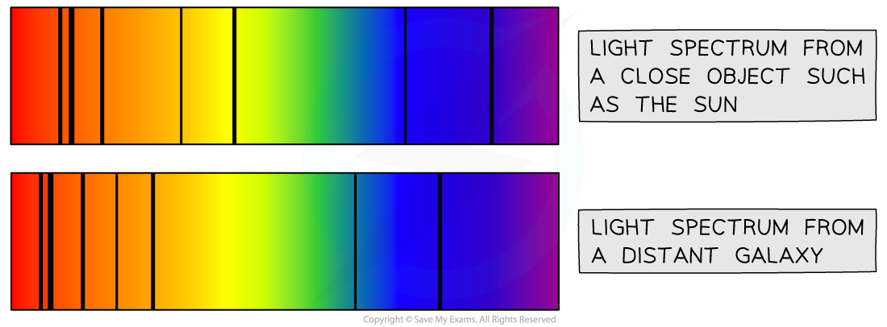

# Doppler Shift

## Doppler Shift

> **Spec point** — `spcpt_VgqSqBV54g4Fdrfj`

## Doppler Shift

- If a wave source is stationary, the wavefronts spread out **symmetrically**
- If the wave source is moving, the waves can become **squashed** together or **stretched** out

  - If the wave source is moving **towards** an observer the wavefronts will appear **squashed**
  - If the wavefront is moving **away** from an observer the wavefronts will appear **stretched** out
- Therefore, when a wave source moves relative to an observer there will be a change in the observed **frequency** and **wavelength**

***Wavefronts are even in a stationary object but are squashed in the direction of the moving wave source***

- A moving object will cause the **wavelength**, λ, (and frequency) of the waves to change:

  - The **wavelength** of the waves** in front** of the source **decreases** (λ – Δλ) and the **frequency** **increases**
  - The wavelength **behind** the source **increases** (λ + Δλ) and the** frequency decreases**
- Note: Δλ means '**change in wavelength**'

  - The actual wavelength emitted by the source remains the same
  - It is only the wavelength that is received by the observer that appears to have changed
- This effect is known as the** Doppler effect** or **Doppler shift**
- The Doppler effect is defined as: ***The apparent shift in wavelength occurring when the source of the waves is moving***
- The Doppler effect, or Doppler shift, can be observed using any form of **electromagnetic radiation**
- It can be observed by comparing the light spectrum produced from a close object, such as our Sun, with that of a distant galaxy

  - The light from the distant galaxy is shifted towards the red end of the spectrum (There are more spectral lines in the red end)
  - This provides evidence that the universe is expanding

***Comparing the light spectrum produced from the Sun and a distant galaxy***
