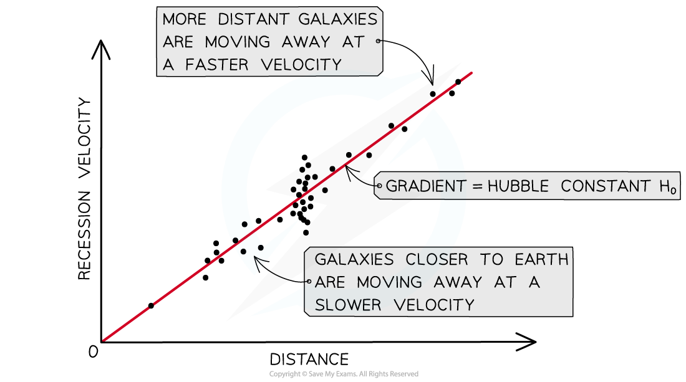
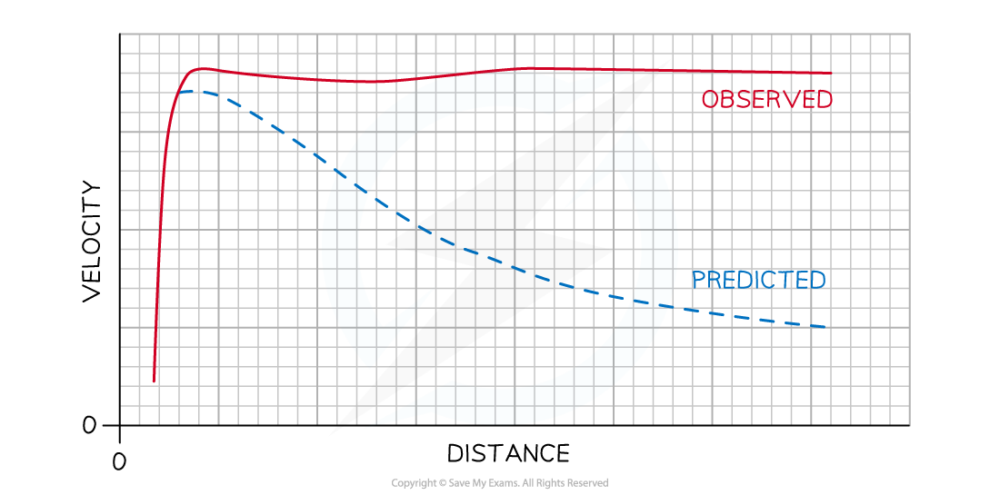

# Cosmology

## The Hubble Constant

> **Spec point** — `spcpt_Z3Nr2qdrKvdGKt9P`

## The Hubble Constant

- By rearranging the equation for Hubble’s law, we can determine that the Hubble constant, *H**0*, is:

$H_{0}=\frac{v}{d}$

- Where:

  - *v* = recessional velocity of an object (km s–1)
  - *d* = distance between the object and the Earth (Mpc)
  - *H**o** *= Hubble constant (km s–1 Mpc–1)

- The value for the Hubble constant has been estimated using data for thousands of galaxies

  - The latest estimate of the Hubble constant based on CMB observations by the Planck satellite is:

***H******0 *****= 67.4 ± 0.5 km s****−1**** Mpc****−1** (Planck Collaboration VI 2020)

- It is difficult to be certain about just how accurate the values for the Hubble constant are

  - This is due to the random and systematic errors involved when calculating the distance to a galaxy or star

> **Worked Example**
> The graph shows how the recessional velocity, *v*, of galaxies varies with their distance, *d*, measured from the Earth.
> 
> 
> 
> Use the graph to determine a value for the Hubble constant and state the unit for this constant.
> 
> **Answer:**
> 
> **Step 1: From the data booklet:**
> 
> Hubble’s Law:* ****v***** ≈ H****0*****d***
> 
> **Step 2: Determine the Hubble constant, *****H******0*****, from the graph:**
> 
> - y–axis = *v *= 20, 000
> - x–axis = *d *= 305
> - gradient = *H**0*
> 
> 
> 
> **Step 3: Calculate the gradient of the graph:**
> 
> - *H**0* = $\frac{y_{2}-y_{1}}{x_{2}-x_{1}}$ = $\frac{20000-0}{305-0}$ = 66 km s–1 Mpc–1
> 
> **Step 4: Confirm your answer:**
> 
> - The Hubble Constant = 66 km s−1 Mpc−1

## Dark Matter

> **Spec point** — `spcpt_rQK3sqwSXV3cbTfr`

## Dark Matter

- We would expect the **velocity** of an object within a galaxy to **decrease** as it moves away from the galaxy's centre because of weakening gravitational field strength

  - This is observed in smaller mass systems, like the solar system where planets orbiting **furthest** from the Sun have the **slowest orbital velocity**
  - This is not the case in bigger mass systems like entire galaxies

- Mass is not actually concentrated in the centre of galaxies; it is **spread out**

  - All the observable mass of a galaxy is, however, concentrated in its centre, so there must be another type of matter we can't see, called **Dark Matter**

- Dark matter is defined as: **Matter which cannot be seen and that does not emit or absorb electromagnetic radiation**
- Dark matter cannot be detected directly through telescopes

  - It should make up 27% of the mass in the universe
  - It is detected based on its gravitational effects relating to either the rotation of galaxies or by the *gravitational lensing* of starlight
